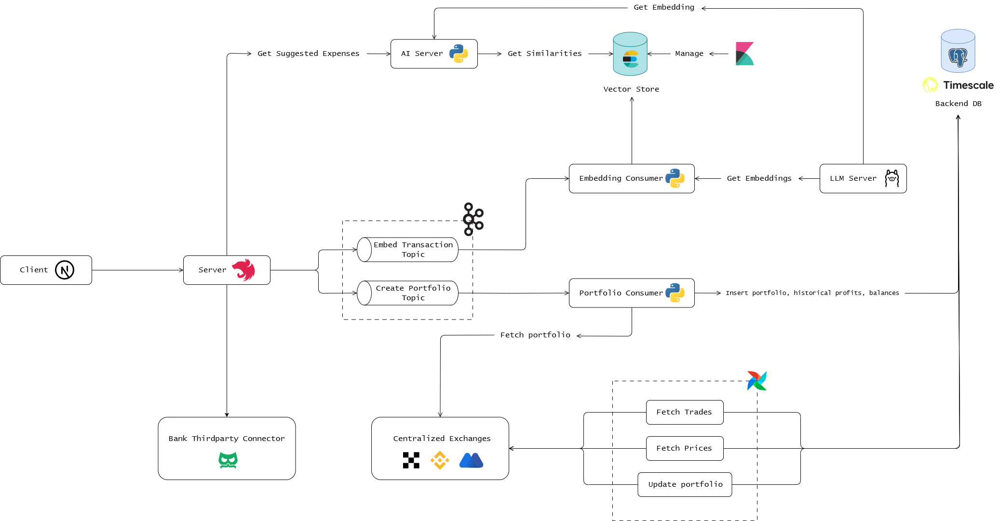

# Finance Management System

## Overview

Real-time cryptocurrency portfolio tracking system with automated data pipelines and analytics. Integrates with major exchanges (Binance, OKX, MEXC) via Airflow DAGs.



## Features

### Crypto Management
- Multi-exchange portfolio aggregation (Binance, OKX, MEXC)
- Real-time asset valuation
- Historical P&L analysis
- Automated trade synchronization

### Banking & Expenses
- Transaction monitoring across bank accounts
- Smart expense categorization
- Budget tracking with monthly targets
- Cash flow analysis
- AI-powered expense suggestions

### Logging & Monitoring
- Centralized logging with ELK Stack (Elasticsearch, Logstash, Kibana)
- Real-time log analytics and visualization
- System health monitoring
- Customizable dashboards for performance tracking

## Tech Stack

**Frontend**: Nextjs + Apollo Client + Shadcn UI  
**Backend**: NestJS + GraphQL + PostgreSQL  
**Data Pipeline**: Apache Airflow + Python  
**Logging**: ELK Stack (Elasticsearch, Logstash, Kibana)  
**Infra**: Docker, Kubernetes

## Deployment Options

### Docker Compose

For local development or simple deployments:

```bash
# Development environment
docker-compose -f docker-compose.dev.yml up -d

# Production environment
docker-compose -f docker-compose.prod.yml up -d
```

### Kubernetes

For scalable, production-grade deployments across multiple environments:

```bash
# Deploy to development environment
cd k8s && ./deploy.sh dev

# Deploy to testing environment
cd k8s && ./deploy.sh test

# Deploy to production environment
cd k8s && ./deploy.sh prod
```

See the [Kubernetes Documentation](./k8s/README.md) for detailed information on the Kubernetes setup.

## Installation
