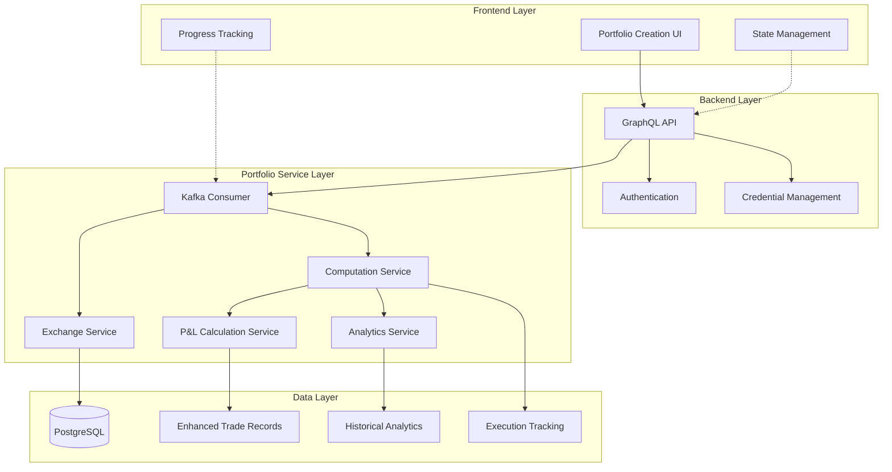

# Crypto Portfolio Creation Flow with Advanced Precomputation

## Overview

The crypto portfolio creation process in Xela Finance Management System is a sophisticated multi-service architecture that handles secure API credential management, real-time portfolio synchronization, comprehensive portfolio analytics precomputation, and advanced error recovery. This document details the complete flow from user interface to comprehensive portfolio data analysis.

## Architecture Overview

The enhanced portfolio creation system consists of four main components:

1. **Frontend (Next.js/React)** - User interface and state management
2. **Backend (NestJS/GraphQL)** - API gateway and credential management
3. **Crypto Portfolio Service (NestJS/Kafka)** - Portfolio synchronization and precomputation
4. **Database (PostgreSQL/Prisma)** - Data persistence with enhanced analytics schema

## Enhanced System Flow



## Detailed Process Flow

### Phase 1: User Initiation and Credential Setup

#### Step 1: Portfolio Creation Request
```typescript
// Frontend initiates portfolio creation
const createPortfolioMutation = gql`
  mutation CreateCryptoPortfolio($input: CreateCryptoPortfolioInput!) {
    createCryptoPortfolio(input: $input) {
      executionId
      status
      progressPercent
      currentStep
      currentMilestone
    }
  }
`;
```

#### Step 2: Credential Validation and Storage
```typescript
// Backend validates and encrypts credentials
async validateAndStoreCredentials(
  exchangeId: string,
  credentials: ExchangeCredentials
): Promise<ValidationResult> {
  // 1. Validate API credentials with exchange
  const isValid = await this.exchangeService.validateCredentials(exchangeId, credentials);
  
  // 2. Encrypt and store credentials securely
  const encryptedCredentials = await this.encryptionService.encrypt(credentials);
  
  // 3. Create execution tracking record
  const execution = await this.createExecutionRecord(userId, exchangeId, encryptedCredentials);
  
  return { isValid, executionId: execution.id };
}
```

### Phase 2: Portfolio Synchronization

#### Step 3: Initial Portfolio Sync
```typescript
// Kafka message triggers portfolio synchronization
interface CreatePortfolioMessage {
  executionId: number;
  userId: number;
  exchangeId: string;
  encryptedCredentials: string;
  portfolioName?: string;
}

async handleCreatePortfolio(message: CreatePortfolioMessage): Promise<void> {
  try {
    // 1. Fetch current balances
    const balances = await this.exchangeService.fetchBalance(
      message.exchangeId,
      await this.decryptCredentials(message.encryptedCredentials)
    );
    
    // 2. Create portfolio record
    const portfolio = await this.createPortfolioRecord(message.userId, balances);
    
    // 3. Trigger precomputation pipeline
    await this.triggerPrecomputation(message.executionId, portfolio.id);
    
  } catch (error) {
    await this.handlePortfolioCreationError(message.executionId, error);
  }
}
```

### Phase 3: Advanced Precomputation Pipeline

#### Step 4: 5-Stage Precomputation Process

**Stage 1: Symbol Discovery**
```typescript
async executeSymbolDiscovery(executionId: number): Promise<SymbolDiscoveryResult> {
  this.logger.log(`🔍 Stage 1: Starting symbol discovery for execution ${executionId}`);
  
  // Discover all historically traded symbols
  const symbols = await this.portfolioComputationService.discoverPortfolioSymbols(
    exchangeId,
    credentials,
    currentBalanceSymbols
  );
  
  // Update execution progress
  await this.updateExecutionProgress(executionId, {
    computationStage: ComputationStage.TRADE_HISTORY_FETCH,
    symbolsDiscovered: symbols.length,
    computationProgress: 20
  });
  
  this.logger.log(`✅ Stage 1 Complete: Discovered ${symbols.length} symbols`);
  return { symbols, totalSymbols: symbols.length };
}
```

**Stage 2: Trade History Retrieval**
```typescript
async executeTradeHistoryFetch(executionId: number, symbols: string[]): Promise<TradeHistoryResult> {
  this.logger.log(`📊 Stage 2: Fetching trade history for ${symbols.length} symbols`);
  
  // Batch process trade history with rate limiting
  const trades = await this.portfolioComputationService.fetchTradeHistory(
    exchangeId,
    credentials,
    symbols,
    1000 // limit per symbol
  );
  
  // Transform to enhanced trade records
  const enhancedTrades = this.transformToEnhancedTrades(trades);
  
  // Update execution progress
  await this.updateExecutionProgress(executionId, {
    computationStage: ComputationStage.PRICE_HISTORY_FETCH,
    tradesProcessed: enhancedTrades.length,
    computationProgress: 40
  });
  
  this.logger.log(`✅ Stage 2 Complete: Processed ${enhancedTrades.length} trades`);
  return { trades: enhancedTrades, totalTrades: enhancedTrades.length };
}
```

**Stage 3: Price History Retrieval**
```typescript
async executePriceHistoryFetch(executionId: number, symbols: string[]): Promise<PriceHistoryResult> {
  this.logger.log(`📈 Stage 3: Fetching price history for ${symbols.length} symbols`);
  
  // Fetch OHLCV data for accurate valuations
  const priceHistory = await this.portfolioComputationService.fetchPriceHistory(
    exchangeId,
    credentials,
    symbols,
    '1d', // daily timeframe
    100   // 100 days of history
  );
  
  // Extract current prices
  const currentPrices = this.extractCurrentPrices(priceHistory);
  
  // Update execution progress
  await this.updateExecutionProgress(executionId, {
    computationStage: ComputationStage.PNL_CALCULATION,
    pricesProcessed: priceHistory.size,
    computationProgress: 60
  });
  
  this.logger.log(`✅ Stage 3 Complete: Fetched price data for ${priceHistory.size} symbols`);
  return { priceHistory, currentPrices, symbolsWithPriceData: priceHistory.size };
}
```

**Stage 4: FIFO P&L Calculations**
```typescript
async executePnLCalculation(
  executionId: number,
  trades: EnhancedTrade[],
  currentPrices: Map<string, number>
): Promise<PnLCalculationResult> {
  this.logger.log(`🧮 Stage 4: Calculating FIFO P&L for ${trades.length} trades`);
  
  // Professional-grade FIFO cost basis calculation
  const pnlResult = await this.pnlCalculationService.calculatePortfolioPnL(
    trades,
    currentPrices
  );
  
  // Store enhanced trade records with P&L data
  await this.storeEnhancedTrades(trades, pnlResult.assetPnLData);
  
  // Update execution progress
  await this.updateExecutionProgress(executionId, {
    computationStage: ComputationStage.ANALYTICS_CALCULATION,
    pnlCalculated: true,
    computationProgress: 80
  });
  
  this.logger.log(`✅ Stage 4 Complete: Calculated P&L for ${pnlResult.assetPnLData.length} assets`);
  this.logger.log(`💰 Total Portfolio P&L: ${pnlResult.portfolioTotalPnL.toFixed(2)}`);
  
  return pnlResult;
}
```

**Stage 5: Portfolio Analytics**
```typescript
async executeAnalyticsCalculation(
  executionId: number,
  trades: EnhancedTrade[],
  currentPrices: Map<string, number>,
  priceHistory: Map<string, any[]>
): Promise<PortfolioAnalyticsResult> {
  this.logger.log(`📊 Stage 5: Computing advanced portfolio analytics`);
  
  // Calculate comprehensive performance and risk metrics
  const analytics = await this.portfolioAnalyticsService.calculatePortfolioAnalytics(
    trades,
    currentPrices,
    priceHistory
  );
  
  // Store historical analytics data
  await this.storeHistoricalAnalytics(executionId, analytics);
  
  // Update execution progress - completion
  await this.updateExecutionProgress(executionId, {
    computationStage: ComputationStage.COMPLETED,
    analyticsCalculated: true,
    computationProgress: 100,
    computationCompletedAt: new Date()
  });
  
  this.logger.log(`✅ Stage 5 Complete: Portfolio analytics computed`);
  this.logger.log(`📈 Portfolio Sharpe Ratio: ${analytics.sharpeRatio.toFixed(3)}`);
  this.logger.log(`📊 Diversification Score: ${analytics.diversificationScore.toFixed(1)}`);
  
  return analytics;
}
```

### Phase 4: Data Persistence and Completion

#### Step 5: Enhanced Data Storage

**Trade Records with P&L Data**
```typescript
async storeEnhancedTrades(trades: EnhancedTrade[], assetPnLData: AssetPnLData[]): Promise<void> {
  const pnlMap = new Map(assetPnLData.map(data => [data.assetSymbol, data]));
  
  for (const trade of trades) {
    const assetPnL = pnlMap.get(trade.symbol);
    
    await this.prisma.trade.create({
      data: {
        userId: trade.userId,
        portfolioId: trade.portfolioId,
        assetInfoId: trade.assetInfoId,
        tradeId: trade.tradeId,
        orderId: trade.orderId,
        symbol: trade.symbol,
        side: trade.side,
        qty: trade.qty,
        price: trade.price,
        time: trade.time,
        realizedPnl: trade.realizedPnl,
        fees: trade.fees,
        feeAsset: trade.feeAsset,
        isBuyer: trade.isBuyer,
        isPrecomputed: true
      }
    });
  }
}
```

**Historical Analytics Storage**
```typescript
async storeHistoricalAnalytics(executionId: number, analytics: PortfolioAnalyticsResult): Promise<void> {
  const execution = await this.getExecutionRecord(executionId);
  
  // Store portfolio-level analytics
  await this.prisma.historicalCryptoBalance.create({
    data: {
      userId: execution.userId,
      portfolioId: execution.portfolioId,
      totalValue: analytics.totalValue,
      totalPnl: analytics.totalPnl,
      totalRealizedPnl: analytics.totalRealizedPnl,
      totalUnrealizedPnl: analytics.totalUnrealizedPnl,
      assetCount: analytics.assetCount,
      diversificationScore: analytics.diversificationScore,
      riskScore: analytics.riskScore,
      volatility: analytics.volatility,
      sharpeRatio: analytics.sharpeRatio,
      maxDrawdown: analytics.maxDrawdown,
      isPrecomputed: true
    }
  });
  
  // Store asset-level analytics
  for (const assetData of analytics.assetAnalytics) {
    await this.prisma.historicalAssetProfit.create({
      data: {
        userId: execution.userId,
        portfolioId: execution.portfolioId,
        assetInfoId: assetData.assetInfoId,
        totalQuantity: assetData.totalQuantity,
        totalValue: assetData.totalValue,
        realizedPnl: assetData.realizedPnl,
        unrealizedPnl: assetData.unrealizedPnl,
        totalPnl: assetData.totalPnl,
        averageCostBasis: assetData.averageCostBasis,
        percentageGain: assetData.percentageGain,
        holdingPeriodDays: assetData.holdingPeriodDays,
        isPrecomputed: true
      }
    });
  }
}
```

## Error Handling and Recovery

### Comprehensive Error Management

```typescript
enum PortfolioCreationError {
  CREDENTIAL_VALIDATION_FAILED = 'CREDENTIAL_VALIDATION_FAILED',
  EXCHANGE_CONNECTION_FAILED = 'EXCHANGE_CONNECTION_FAILED',
  BALANCE_FETCH_FAILED = 'BALANCE_FETCH_FAILED',
  SYMBOL_DISCOVERY_FAILED = 'SYMBOL_DISCOVERY_FAILED',
  TRADE_HISTORY_FAILED = 'TRADE_HISTORY_FAILED',
  PRICE_HISTORY_FAILED = 'PRICE_HISTORY_FAILED',
  PNL_CALCULATION_FAILED = 'PNL_CALCULATION_FAILED',
  ANALYTICS_CALCULATION_FAILED = 'ANALYTICS_CALCULATION_FAILED',
  DATABASE_ERROR = 'DATABASE_ERROR'
}

async handlePortfolioCreationError(
  executionId: number,
  error: PortfolioCreationError,
  details: string
): Promise<void> {
  const execution = await this.getExecutionRecord(executionId);
  
  // Implement retry logic for recoverable errors
  if (this.isRecoverableError(error) && execution.retryCount < 3) {
    await this.scheduleRetry(executionId, error);
    return;
  }
  
  // Update execution record with error details
  await this.updateExecutionRecord(executionId, {
    errorMessage: `${error}: ${details}`,
    currentStep: PortfolioCreationStep.ERROR,
    currentMilestone: PortfolioCreationMilestone.FAILED
  });
  
  // Notify user of failure
  await this.notifyUserOfFailure(execution.userId, executionId, error);
}
```

### Partial Completion Handling

```typescript
async handlePartialCompletion(executionId: number): Promise<void> {
  const execution = await this.getExecutionRecord(executionId);
  
  // Assess what was successfully completed
  const completionStatus = {
    portfolioCreated: execution.currentMilestone >= PortfolioCreationMilestone.PORTFOLIO_CREATED,
    symbolsDiscovered: execution.symbolsDiscovered > 0,
    tradesProcessed: execution.tradesProcessed > 0,
    pricesProcessed: execution.pricesProcessed > 0,
    pnlCalculated: execution.pnlCalculated,
    analyticsCalculated: execution.analyticsCalculated
  };
  
  // Mark portfolio as partially complete if basic sync succeeded
  if (completionStatus.portfolioCreated) {
    await this.markPortfolioAsPartiallyComplete(execution.portfolioId, completionStatus);
  }
  
  // Schedule background completion for missing components
  await this.scheduleBackgroundCompletion(executionId, completionStatus);
}
```

## Real-time Progress Tracking

### WebSocket Progress Updates

```typescript
// Frontend subscribes to real-time progress updates
const progressSubscription = gql`
  subscription PortfolioCreationProgress($executionId: Int!) {
    portfolioCreationProgress(executionId: $executionId) {
      executionId
      currentStep
       currentMilestone
      progressPercent
      computationStage
      computationProgress
      symbolsDiscovered
      tradesProcessed
      pricesProcessed
      pnlCalculated
      analyticsCalculated
      errorMessage
    }
  }
`;

// Backend publishes progress updates
async publishProgressUpdate(executionId: number): Promise<void> {
  const execution = await this.getExecutionRecord(executionId);
  
  await this.pubSub.publish('PORTFOLIO_CREATION_PROGRESS', {
    portfolioCreationProgress: {
      executionId: execution.id,
      currentStep: execution.currentStep,
      currentMilestone: execution.currentMilestone,
      progressPercent: execution.progressPercent,
      computationStage: execution.computationStage,
      computationProgress: execution.computationProgress,
      symbolsDiscovered: execution.symbolsDiscovered,
      tradesProcessed: execution.tradesProcessed,
      pricesProcessed: execution.pricesProcessed,
      pnlCalculated: execution.pnlCalculated,
      analyticsCalculated: execution.analyticsCalculated,
      errorMessage: execution.errorMessage
    }
  });
}
```

## Performance Optimizations

### Batch Processing and Rate Limiting

```typescript
class ExchangeRateLimiter {
  private requestCounts = new Map<string, number>();
  private resetTimes = new Map<string, number>();
  
  async checkRateLimit(exchangeId: string): Promise<boolean> {
    const now = Date.now();
    const resetTime = this.resetTimes.get(exchangeId) || 0;
    
    if (now > resetTime) {
      this.requestCounts.set(exchangeId, 0);
      this.resetTimes.set(exchangeId, now + 60000); // 1 minute window
    }
    
    const currentCount = this.requestCounts.get(exchangeId) || 0;
    const limit = this.getExchangeRateLimit(exchangeId);
    
    return currentCount < limit;
  }
  
  async waitForRateLimit(exchangeId: string): Promise<void> {
    while (!(await this.checkRateLimit(exchangeId))) {
      await new Promise(resolve => setTimeout(resolve, 1000));
    }
    
    const currentCount = this.requestCounts.get(exchangeId) || 0;
    this.requestCounts.set(exchangeId, currentCount + 1);
  }
}
```

### Memory Management for Large Portfolios

```typescript
async processLargePortfolio(trades: EnhancedTrade[]): Promise<void> {
  const chunkSize = 1000;
  
  for (let i = 0; i < trades.length; i += chunkSize) {
    const chunk = trades.slice(i, i + chunkSize);
    
    // Process chunk
    await this.processTradeChunk(chunk);
    
    // Allow garbage collection
    if (i % (chunkSize * 10) === 0) {
      await new Promise(resolve => setImmediate(resolve));
    }
  }
}
```

## Security Considerations

### Credential Security

```typescript
class CredentialManager {
  private readonly encryptionKey: string;
  
  async encryptCredentials(credentials: ExchangeCredentials): Promise<string> {
    const cipher = crypto.createCipher('aes-256-gcm', this.encryptionKey);
    let encrypted = cipher.update(JSON.stringify(credentials), 'utf8', 'hex');
    encrypted += cipher.final('hex');
    return encrypted;
  }
  
  async decryptCredentials(encryptedCredentials: string): Promise<ExchangeCredentials> {
    const decipher = crypto.createDecipher('aes-256-gcm', this.encryptionKey);
    let decrypted = decipher.update(encryptedCredentials, 'hex', 'utf8');
    decrypted += decipher.final('utf8');
    return JSON.parse(decrypted);
  }
}
```

### Data Isolation

```typescript
// Ensure user data isolation in all operations
async validateUserAccess(userId: number, portfolioId: string): Promise<boolean> {
  const portfolio = await this.prisma.cryptoPortfolio.findUnique({
    where: { id: portfolioId },
    select: { userId: true }
  });
  
  return portfolio?.userId === userId;
}
```

## Monitoring and Observability

### Comprehensive Logging

```typescript
class PortfolioCreationLogger {
  private readonly logger = new Logger('PortfolioCreation');
  
  logStageStart(stage: ComputationStage, executionId: number): void {
    this.logger.log(`🚀 Stage ${stage} started for execution ${executionId}`);
  }
  
  logStageComplete(stage: ComputationStage, executionId: number, metrics: any): void {
    this.logger.log(`✅ Stage ${stage} completed for execution ${executionId}`, metrics);
  }
  
  logError(error: Error, context: string): void {
    this.logger.error(`❌ Error in ${context}: ${error.message}`, error.stack);
  }
  
  logPerformanceMetrics(executionId: number, metrics: PerformanceMetrics): void {
    this.logger.log(`📊 Performance metrics for execution ${executionId}:`, {
      totalDuration: metrics.totalDuration,
      apiRequests: metrics.apiRequestCount,
      tradesProcessed: metrics.tradesProcessed,
      memoryUsage: metrics.memoryUsage
    });
  }
}
```

### Health Checks

```typescript
@Controller('health')
export class HealthController {
  @Get('portfolio-creation')
  async checkPortfolioCreationHealth(): Promise<HealthStatus> {
    const activeExecutions = await this.getActiveExecutions();
    const avgCompletionTime = await this.getAverageCompletionTime();
    const errorRate = await this.getErrorRate();
    
    return {
      status: errorRate < 0.05 ? 'healthy' : 'degraded',
      activeExecutions: activeExecutions.length,
      averageCompletionTime: avgCompletionTime,
      errorRate: errorRate
    };
  }
}
```

## Testing Strategy

### Integration Tests

```typescript
describe('Portfolio Creation Flow', () => {
  it('should complete full precomputation pipeline', async () => {
    const mockCredentials = createMockCredentials();
    const executionId = await portfolioService.createPortfolio({
      userId: 1,
      exchangeId: 'binance',
      credentials: mockCredentials,
      portfolioName: 'Test Portfolio'
    });
    
    // Wait for completion
    await waitForCompletion(executionId, 300000); // 5 minutes timeout
    
    const execution = await getExecutionRecord(executionId);
    expect(execution.computationStage).toBe(ComputationStage.COMPLETED);
    expect(execution.analyticsCalculated).toBe(true);
    
    // Verify data was stored correctly
    const portfolio = await getPortfolioById(execution.portfolioId);
    expect(portfolio.trades.length).toBeGreaterThan(0);
    expect(portfolio.historicalAnalytics).toBeDefined();
  });
});
```

### Performance Tests

```typescript
describe('Performance Tests', () => {
  it('should handle large portfolios efficiently', async () => {
    const largePortfolioCredentials = createLargePortfolioMockCredentials();
    const startTime = Date.now();
    
    const executionId = await portfolioService.createPortfolio({
      userId: 1,
      exchangeId: 'binance',
      credentials: largePortfolioCredentials
    });
    
    await waitForCompletion(executionId);
    
    const duration = Date.now() - startTime;
    expect(duration).toBeLessThan(600000); // Should complete within 10 minutes
  });
});
```

This enhanced portfolio creation flow provides comprehensive portfolio analytics, FIFO-based P&L calculations, and advanced performance metrics, delivering a professional-grade portfolio management experience for Xela Finance users.