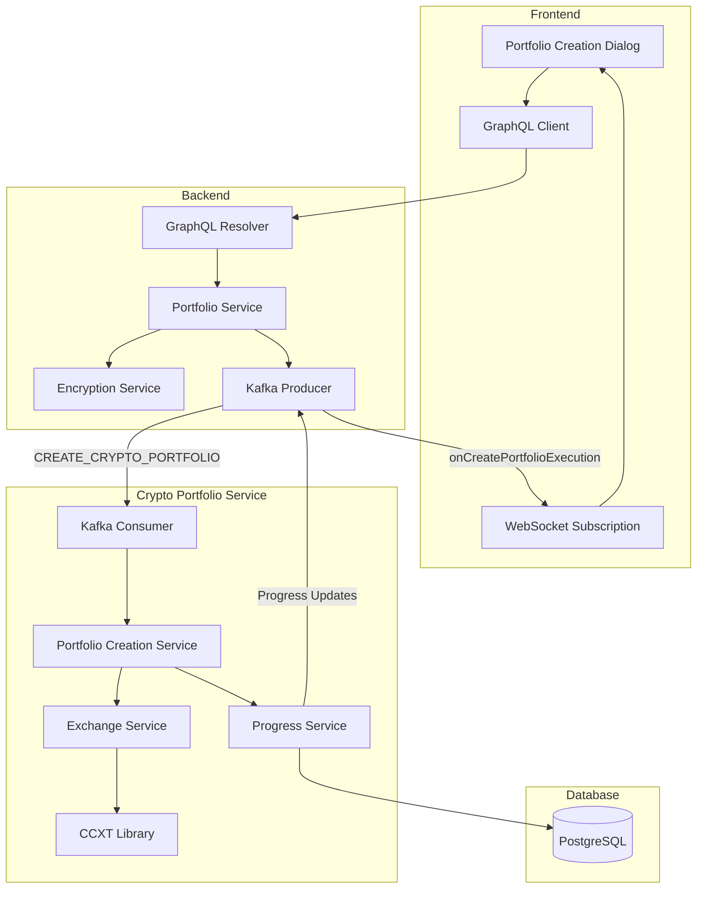
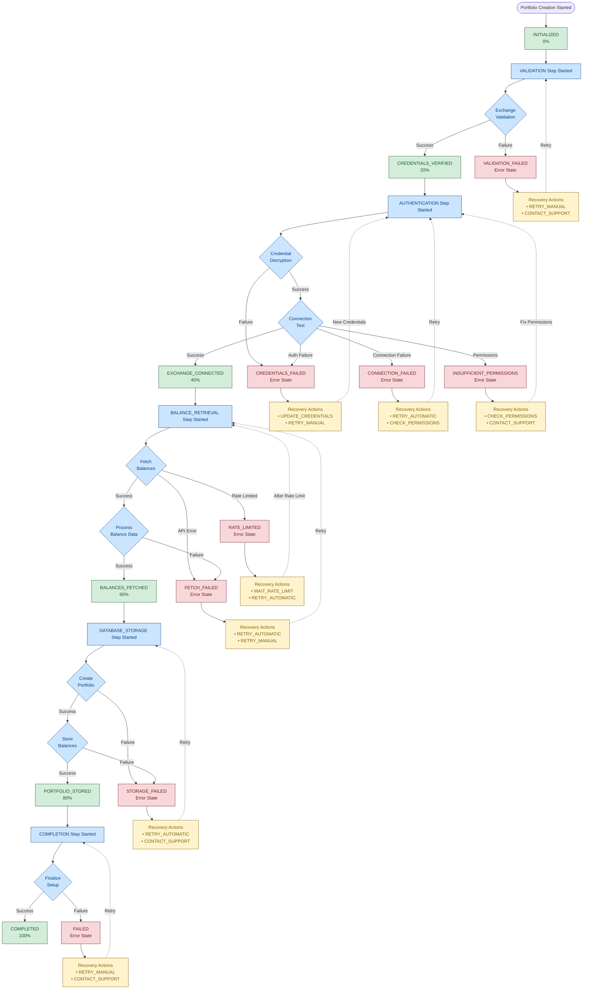
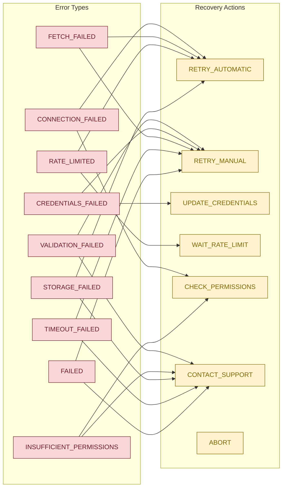

# Crypto Portfolio Creation Flow

## Overview

The crypto portfolio creation process in Xela Finance Management System is a sophisticated multi-service architecture that handles secure API credential management, real-time portfolio synchronization, and comprehensive error recovery. This document details the complete flow from user interface to data persistence.

## Architecture Overview

The portfolio creation system consists of three main components:

1. **Frontend (Next.js/React)** - User interface and state management
2. **Backend (NestJS/GraphQL)** - API gateway and credential encryption
3. **Crypto Portfolio Service (NestJS/Kafka)** - Portfolio synchronization engine



## Portfolio Creation Steps and Milestones

### Complete Execution Flow



### Step and Milestone Mapping

| Step | Success Milestone | Error Milestones | Progress % |
|------|------------------|------------------|------------|
| `VALIDATION` | `CREDENTIALS_VERIFIED` | `VALIDATION_FAILED` | 0% → 20% |
| `AUTHENTICATION` | `EXCHANGE_CONNECTED` | `CREDENTIALS_FAILED`<br/>`CONNECTION_FAILED`<br/>`INSUFFICIENT_PERMISSIONS` | 20% → 40% |
| `BALANCE_RETRIEVAL` | `BALANCES_FETCHED` | `FETCH_FAILED`<br/>`RATE_LIMITED` | 40% → 60% |
| `DATABASE_STORAGE` | `PORTFOLIO_STORED` | `STORAGE_FAILED` | 60% → 80% |
| `COMPLETION` | `COMPLETED` | `FAILED`<br/>`TIMEOUT_FAILED` | 80% → 100% |

### Error Recovery Action Mapping



## Data Flow

### 1. User Input (Frontend)

The user initiates portfolio creation through the portfolio creation dialog by providing:
- **Portfolio Name** (optional): Custom name for the portfolio
- **Exchange Selection**: Choose from 100+ supported exchanges
- **API Credentials**: API key, secret key, and passphrase (if required)
- **Form Validation**: Real-time validation ensures all required fields are completed

### 2. GraphQL Mutation

The frontend sends a GraphQL mutation to create the portfolio, which includes all the user-provided credentials and configuration.

### 3. Backend Processing

#### 3.1 GraphQL Resolver
The GraphQL resolver receives the portfolio creation request and delegates processing to the portfolio service.

#### 3.2 Portfolio Service Operations
The backend service performs several critical operations:

1. **Passphrase Validation**: Validates that passphrase is provided for exchanges that require it (OKX, Coinbase, KuCoin, Bitget)
2. **Credential Encryption**: Encrypts all sensitive credentials using AES-256-GCM encryption
3. **Execution Record Creation**: Creates a tracking record to monitor portfolio creation progress
4. **Kafka Message Emission**: Sends encrypted credentials to the crypto-portfolio-service for processing

### 4. Crypto Portfolio Service Processing

The crypto-portfolio-service handles the actual portfolio creation through five well-defined steps:

#### 4.1 Portfolio Creation Steps

The service processes portfolio creation through these sequential steps:
- **VALIDATION**: Validate exchange support and capabilities
- **AUTHENTICATION**: Test API credentials and connection
- **BALANCE_RETRIEVAL**: Fetch account balances from exchange
- **DATABASE_STORAGE**: Store portfolio data and balances
- **COMPLETION**: Mark as complete and notify frontend

#### 4.2 Step-by-Step Processing

1. **VALIDATION Step**
   - Validates exchange is supported by CCXT library
   - Checks exchange has balance fetching capability
   - Updates progress: `INITIALIZED → CREDENTIALS_VERIFIED`

2. **AUTHENTICATION Step**
   - Decrypts API credentials securely
   - Tests connection to exchange API
   - Verifies API permissions are sufficient
   - Updates progress: `CREDENTIALS_VERIFIED → EXCHANGE_CONNECTED`

3. **BALANCE_RETRIEVAL Step**
   - Fetches all account balances from exchange
   - Processes and validates balance data
   - Creates or finds AssetInfo records for each cryptocurrency
   - Updates progress: `EXCHANGE_CONNECTED → BALANCES_FETCHED`

4. **DATABASE_STORAGE Step**
   - Creates CryptoPortfolio record with encrypted credentials
   - Stores all asset balances in the database
   - Links portfolio to user account
   - Updates progress: `BALANCES_FETCHED → PORTFOLIO_STORED`

5. **COMPLETION Step**
   - Marks execution as successful
   - Emits completion event for real-time updates
   - Updates progress: `PORTFOLIO_STORED → COMPLETED`

### 5. Real-time Progress Updates

The system provides real-time progress updates through GraphQL subscriptions, allowing the frontend to display live progress indicators and error recovery options to users.

Progress milestones track the completion percentage:
- `INITIALIZED` (0%)
- `CREDENTIALS_VERIFIED` (20%)
- `EXCHANGE_CONNECTED` (40%)
- `BALANCES_FETCHED` (60%)
- `PORTFOLIO_STORED` (80%)
- `COMPLETED` (100%)

## Error Handling and Recovery

### Error Recovery Actions

The system provides sophisticated error recovery mechanisms:

```typescript
enum ErrorRecoveryAction {
  RETRY_AUTOMATIC,        // System will retry automatically
  RETRY_MANUAL,          // User can trigger retry
  UPDATE_CREDENTIALS,    // User needs to update API credentials
  WAIT_RATE_LIMIT,      // Wait for rate limit to reset
  CHECK_PERMISSIONS,    // User needs to check API permissions
  CONTACT_SUPPORT,      // Unrecoverable error
  ABORT                 // User can abort the process
}
```

### Error Recovery Flow

1. **Automatic Retry**
   - For transient errors (network, temporary API issues)
   - Maximum 3 retry attempts
   - Exponential backoff between retries

2. **Manual Retry**
   ```graphql
   mutation RetryPortfolioCreation($executionId: Int!) {
     retryPortfolioCreation(executionId: $executionId) {
       id
       currentMilestone
     }
   }
   ```

3. **Update Credentials**
   ```graphql
   mutation UpdatePortfolioCredentials($executionId: Int!, $credentials: UpdateCredentialsInput!) {
     updatePortfolioCredentials(executionId: $executionId, credentials: $credentials) {
       id
       currentMilestone
     }
   }
   ```

4. **Support Ticket**
   ```graphql
   mutation CreateSupportTicket($data: CreateSupportTicketInput!) {
     createSupportTicket(data: $data)
   }
   ```

## Database Schema

### Core Tables

1. **CryptoPortfolio**
   - Stores portfolio configuration and encrypted credentials
   - Links to user and exchange
   - Supports portfolio aggregation (parent/child relationships)

2. **CreatePortfolioExecution**
   - Tracks portfolio creation progress
   - Stores execution context for retry operations
   - Records error information and recovery actions

3. **AssetBalance**
   - Stores current balance for each asset
   - Links to AssetInfo and CryptoPortfolio

4. **AssetInfo**
   - Master list of all cryptocurrency assets
   - Stores symbol, name, logo, and metadata

## Security Considerations

1. **Credential Encryption**
   - All API credentials are encrypted using AES-256-GCM
   - Encryption keys are stored securely in environment variables
   - Credentials are never logged or exposed in plain text

2. **API Permission Validation**
   - System only requires read-only permissions
   - Validates permissions during authentication step
   - Provides clear guidance for API key creation

3. **Rate Limiting**
   - Respects exchange rate limits
   - Implements exponential backoff for retries
   - Tracks rate limit errors for user notification

## Exchange-Specific Considerations

### Passphrase Requirements

The following exchanges require an additional passphrase:
- OKX
- Coinbase (Pro/Advanced Trade)
- KuCoin
- Bitget

The UI dynamically shows/hides the passphrase field based on the selected exchange.

### Exchange Guides

The system provides comprehensive setup guides for 20+ major exchanges, including:
- Step-by-step API key creation instructions
- Required permissions checklist
- Direct links to exchange API settings
- Security best practices

## Performance Optimizations

1. **Asynchronous Processing**
   - Portfolio creation is handled asynchronously via Kafka
   - UI remains responsive during long-running operations

2. **Batch Operations**
   - Asset balances are upserted in batch
   - Reduces database round trips

3. **Caching**
   - AssetInfo records are cached to avoid duplicate lookups
   - Exchange capabilities are cached in memory

## Monitoring and Logging

The system provides comprehensive logging at each step:
- Execution start/completion
- Step transitions
- Error details with stack traces
- Performance metrics

Example log flow:
```
🚀 Creating portfolio for user 123, execution 456, exchange binance
🔍 Validating exchange: binance
✅ Exchange binance is supported and has balance capability
🔓 Decrypting exchange credentials...
✅ Credentials decrypted successfully
🔌 Testing connection to binance...
✅ Successfully connected to binance
💰 Fetching account balances from binance...
✅ Fetched 15 balances from binance
📊 Processing 15 balances...
✅ Processed 15 balances successfully
💾 Creating portfolio record...
✅ Portfolio record created with ID: uuid-123
💰 Storing 15 asset balances...
✅ Asset balances stored successfully
✅ Portfolio creation successful: uuid-123
```