# Membership API Documentation

This document outlines the GraphQL API for membership and subscription management using visual flow diagrams.

## API Architecture Overview

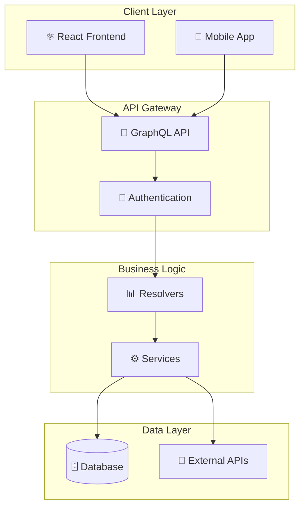

## Core API Operations Flow

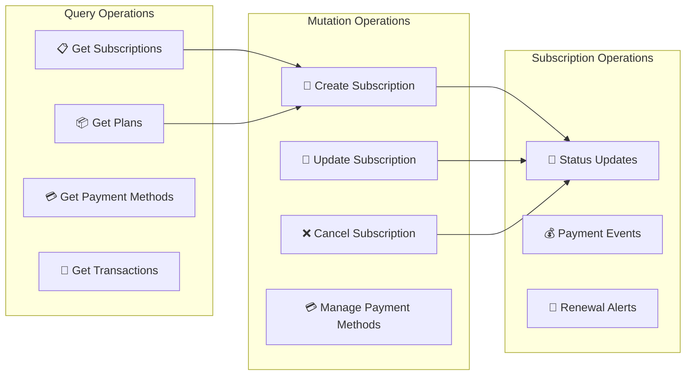

## Subscription Management Flow

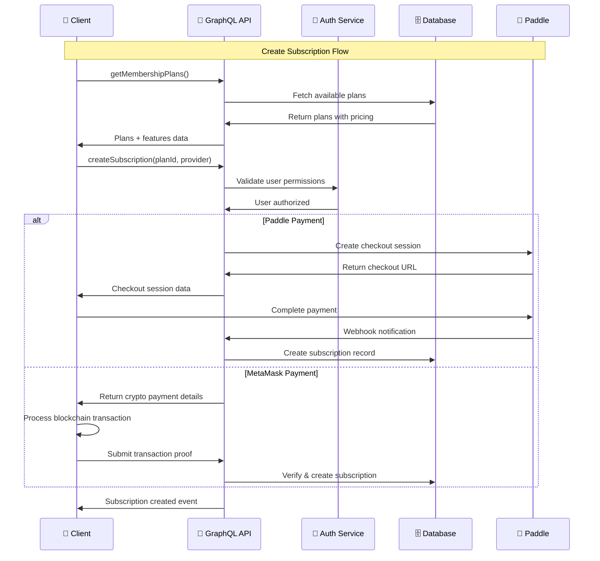

## Payment Method Management

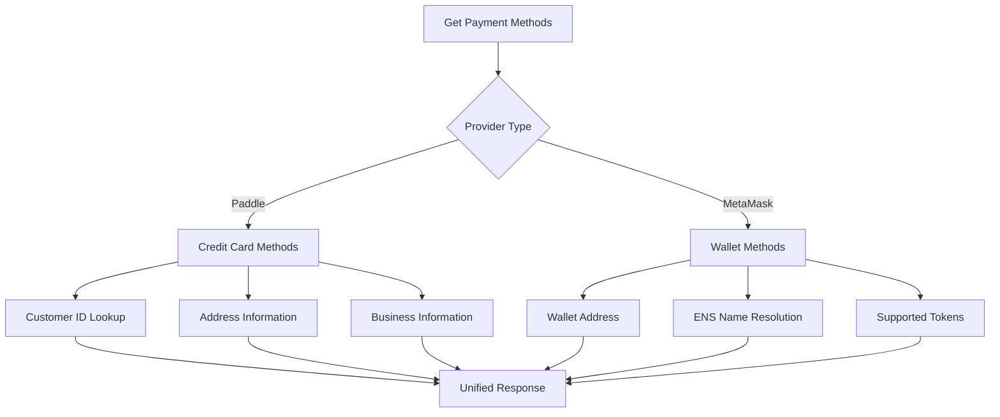

## Real-time Updates Architecture

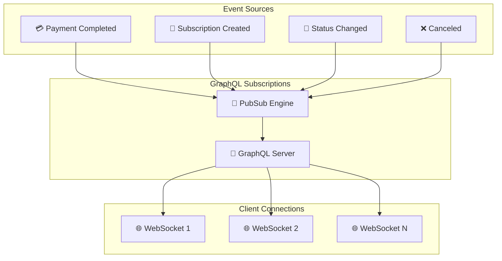

## Error Handling Flow

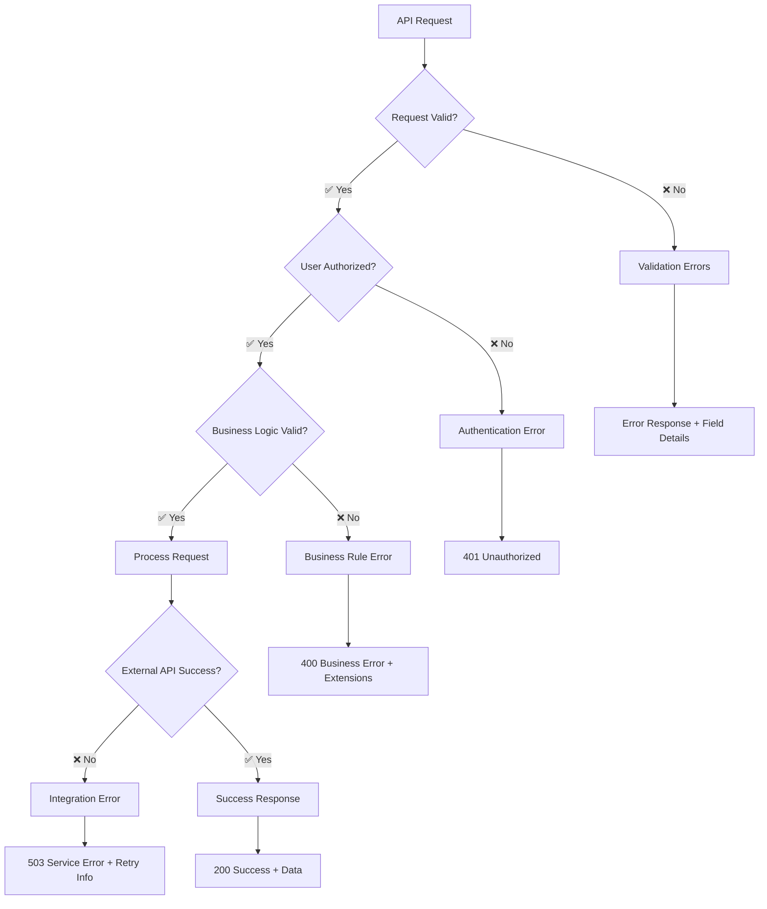

## GraphQL Schema Overview

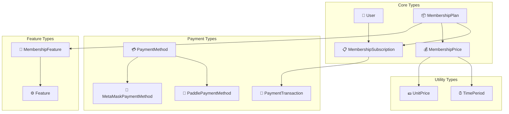

## Authentication & Authorization

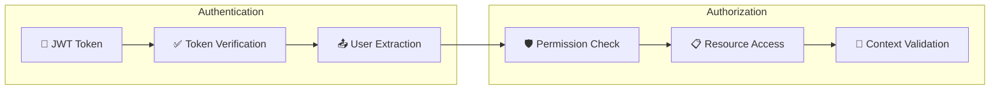

## Query Performance Optimization

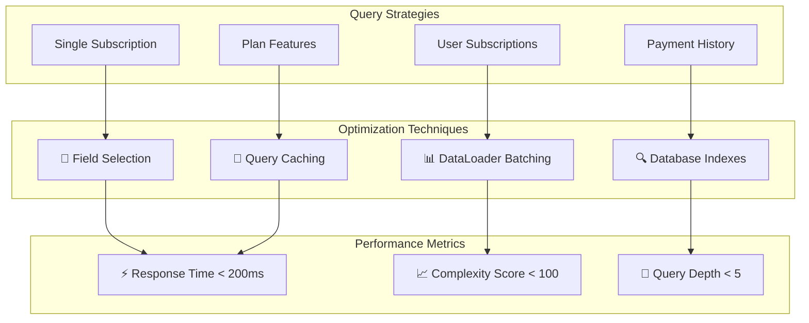

## API Response Patterns

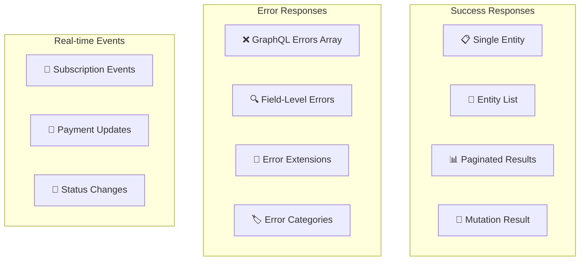

## Integration Points

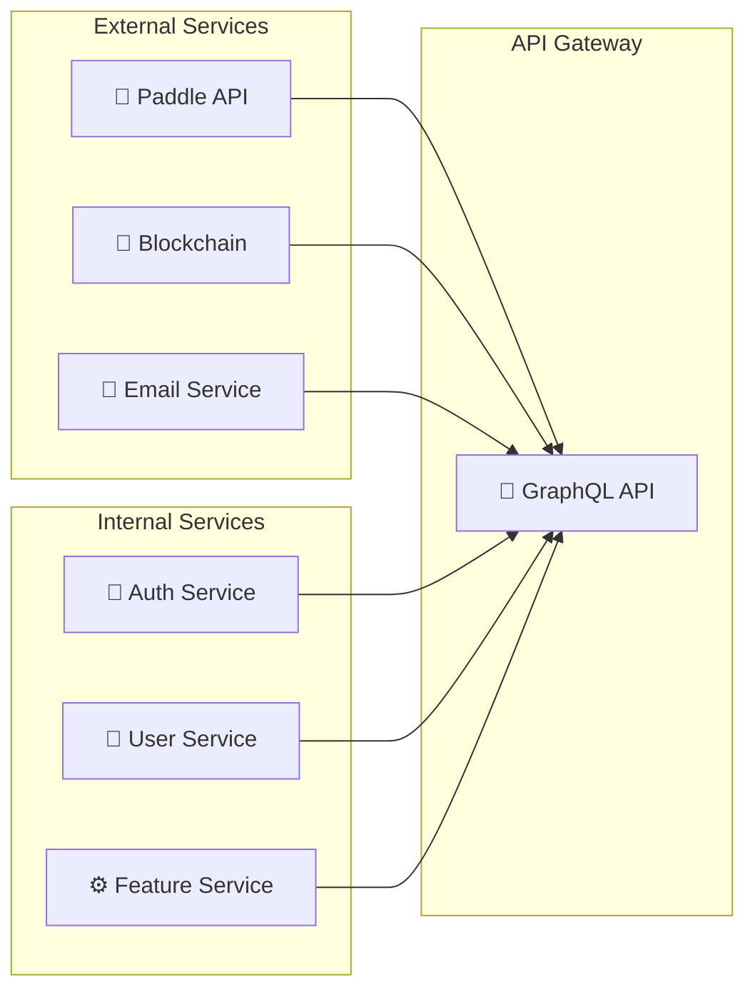

## Rate Limiting & Security

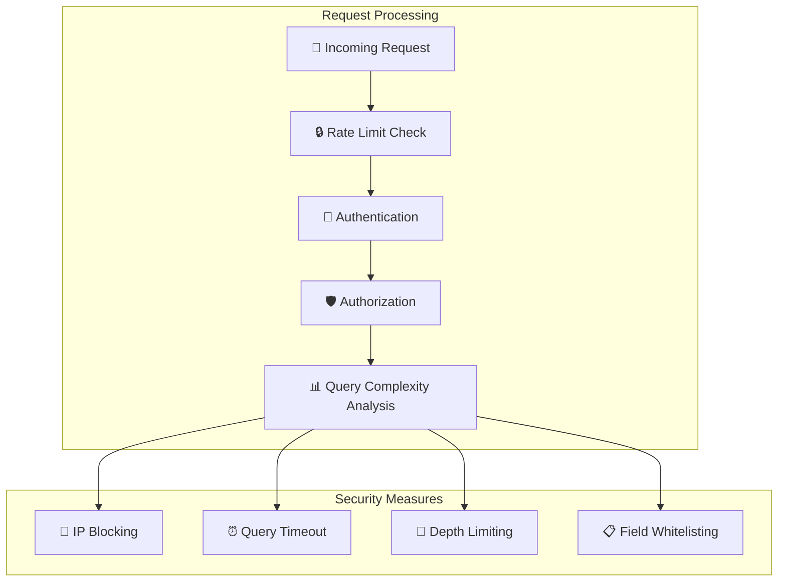