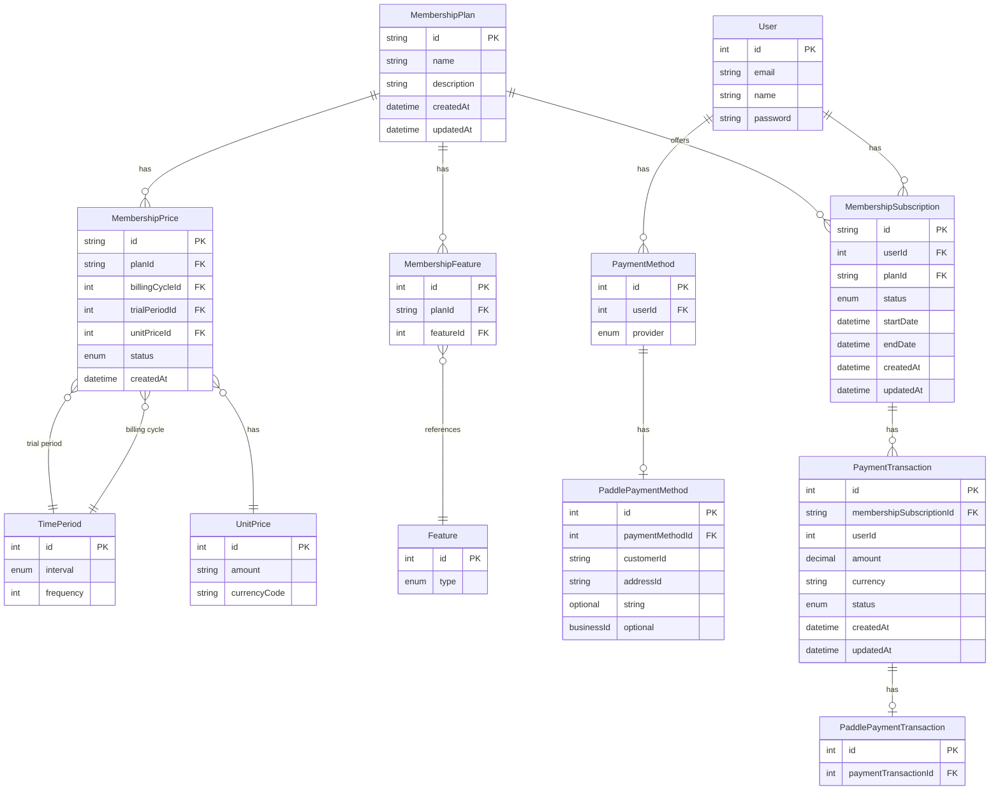

# Membership Data Model

This document outlines the data model for the membership and subscription features, showing the relationships between entities and their attributes.

## Entity Relationship Diagram

## Database Models

### User (partial model, membership-related fields)

| Field | Type | Description |
|-------|------|-------------|
| id    | Int (PK) | Unique identifier |
| email | String (unique) | User's email address |
| name  | String (nullable) | User's display name |
| password | String | User's hashed password |
| ... other user fields ... |

### MembershipSubscription

| Field | Type | Description |
|-------|------|-------------|
| id | String (PK) | UUID identifier |
| userId | Int (FK) | Reference to User |
| planId | String (FK) | Reference to MembershipPlan |
| paddleId | String (nullable, unique) | External Paddle subscription ID |
| status | Enum | active, canceled, past_due, paused, trialing |
| startDate | DateTime | When the subscription began |
| endDate | DateTime | When the subscription ends |
| createdAt | DateTime | Record creation timestamp |
| updatedAt | DateTime | Last update timestamp |

### MembershipPlan

| Field | Type | Description |
|-------|------|-------------|
| id | String (PK) | Unique identifier |
| name | String | Plan name |
| description | String (nullable) | Plan description |
| createdAt | DateTime | Record creation timestamp |
| updatedAt | DateTime | Last update timestamp |

### MembershipPrice

| Field | Type | Description |
|-------|------|-------------|
| id | String (PK) | Unique identifier |
| planId | String (FK) | Reference to MembershipPlan |
| billingCycleId | Int (FK, nullable) | Reference to TimePeriod |
| trialPeriodId | Int (FK, nullable) | Reference to TimePeriod |
| unitPriceId | Int (FK) | Reference to UnitPrice |
| status | Enum | active, archived |
| createdAt | DateTime | Record creation timestamp |

### TimePeriod

| Field | Type | Description |
|-------|------|-------------|
| id | Int (PK) | Unique identifier |
| interval | Enum | day, week, month, year |
| frequency | Int | Number of intervals |

### UnitPrice

| Field | Type | Description |
|-------|------|-------------|
| id | Int (PK) | Unique identifier |
| amount | String | Price amount (stored as string for precision) |
| currencyCode | String | Currency code |

### Feature

| Field | Type | Description |
|-------|------|-------------|
| id | Int (PK) | Unique identifier |
| type | Enum | CRYPTO, EXPENSE |

### MembershipFeature

| Field | Type | Description |
|-------|------|-------------|
| id | Int (PK) | Unique identifier |
| planId | String (FK) | Reference to MembershipPlan |
| featureId | Int (FK) | Reference to Feature |

### PaymentMethod

| Field | Type | Description |
|-------|------|-------------|
| id | Int (PK) | Unique identifier |
| userId | Int (FK) | Reference to User |
| provider | Enum | PADDLE |

### PaddlePaymentMethod

| Field | Type | Description |
|-------|------|-------------|
| id | Int (PK) | Unique identifier |
| paymentMethodId | Int (FK, unique) | Reference to PaymentMethod |
| customerId | String (unique) | Customer ID from Paddle |
| addressId | String (nullable, unique) | Paddle customer address ID |
| businessId | String (nullable, unique) | Paddle customer business ID |

### PaymentTransaction

| Field | Type | Description |
|-------|------|-------------|
| id | Int (PK) | Unique identifier |
| membershipSubscriptionId | String (FK) | Reference to MembershipSubscription |
| userId | Int | Denormalized reference to User |
| amount | Decimal | Payment amount |
| currency | String | Currency code |
| status | Enum | Various payment statuses (see enum) |
| createdAt | DateTime | Record creation timestamp |
| updatedAt | DateTime | Last update timestamp |

### PaddlePaymentTransaction

| Field | Type | Description |
|-------|------|-------------|
| id | Int (PK) | Unique identifier |
| paymentTransactionId | Int (FK, unique) | Reference to PaymentTransaction |

## Enums

### MembershipSubscriptionStatus

- `active`: Subscription is active and in good standing
- `canceled`: User has canceled; subscription remains active until billing period ends
- `past_due`: Payment has failed but subscription can be recovered
- `paused`: Subscription is temporarily on hold
- `trialing`: Subscription is in trial period

### Interval

- `day`
- `week` 
- `month`
- `year`

### PriceStatus

- `active`: Price can be used for new subscriptions
- `archived`: Price is no longer available for new subscriptions

### FeatureType

- `CRYPTO`: Cryptocurrency-related feature
- `EXPENSE`: Expense tracking feature

### PaymentStatus

- `authorized`: Payment has been authorized
- `authorized_flagged`: Payment authorized but flagged for review
- `canceled`: Payment was canceled
- `captured`: Payment captured successfully
- `error`: Payment encountered an error
- `action_required`: Additional action required (e.g., 3D Secure)
- `pending_no_action_required`: Payment is pending with no action needed
- `created`: Payment has been created but not processed
- `unknown`: Payment status is unknown
- `dropped`: Payment was dropped/abandoned

### PaymentProvider

- `PADDLE`: Paddle payment processor

## Model Relationships

- A `User` can have multiple `MembershipSubscription`s
- A `User` can have multiple `PaymentMethod`s
- A `MembershipPlan` can have multiple `MembershipSubscription`s
- A `MembershipPlan` can have multiple `MembershipPrice`s (e.g., monthly, annual)
- A `MembershipPlan` can have multiple `MembershipFeature`s
- Each `MembershipFeature` references a `Feature` type
- Each `MembershipPrice` has:
  - An optional billing cycle `TimePeriod` (e.g., every 1 month)
  - An optional trial period `TimePeriod` (e.g., 14 days)
  - A `UnitPrice` with amount and currency
- A `PaymentMethod` can have one `PaddlePaymentMethod` with Paddle-specific details
- A `MembershipSubscription` can have multiple `PaymentTransaction`s
- A `PaymentTransaction` can have one `PaddlePaymentTransaction` with Paddle-specific details

## Usage Flow

1. A `User` selects a `MembershipPlan` with a specific `MembershipPrice`
2. A `MembershipSubscription` is created with:
   - The user ID
   - The selected plan ID
   - Status "active" or "trialing"
   - Start and end dates based on the billing cycle
3. When payment is processed:
   - A `PaymentMethod` is created or retrieved for the user
   - A `PaddlePaymentMethod` is linked with Paddle's customer ID
   - A `PaymentTransaction` is created for the payment
   - A `PaddlePaymentTransaction` is created with Paddle-specific details
4. As the subscription state changes, the `MembershipSubscription` status is updated 