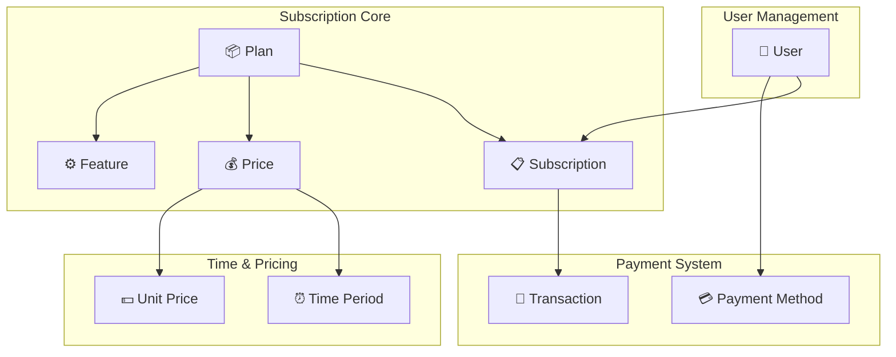
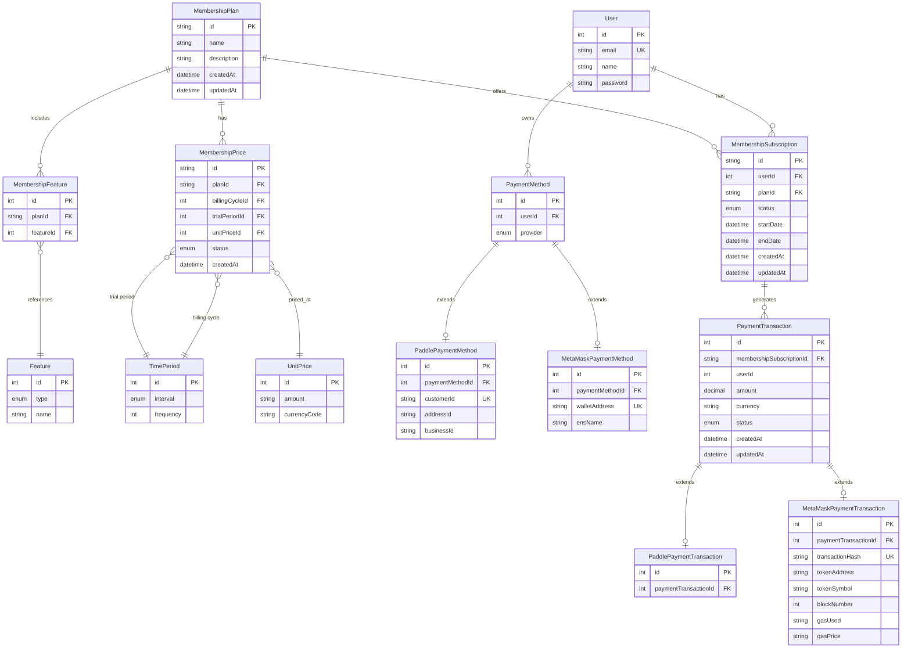
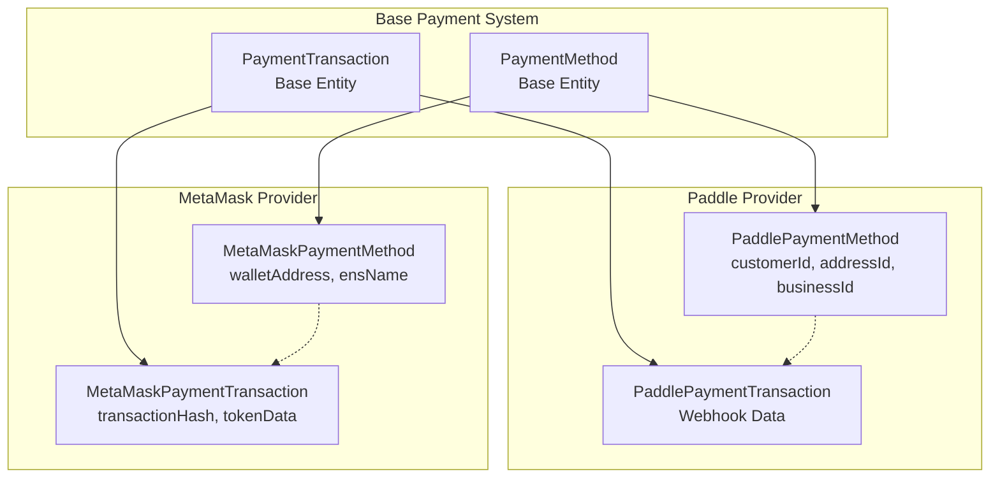
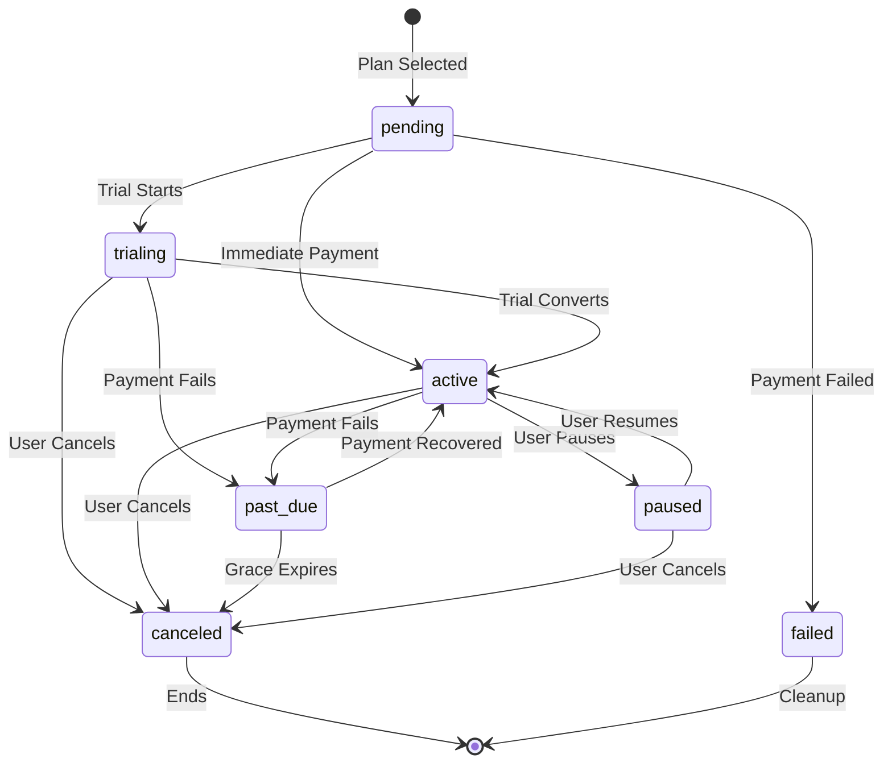
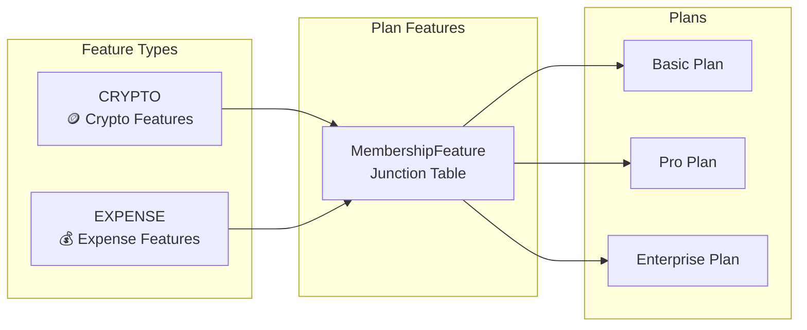
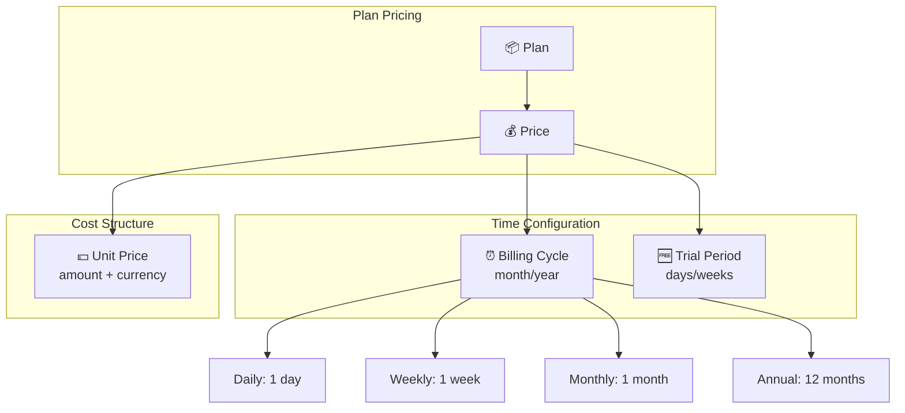
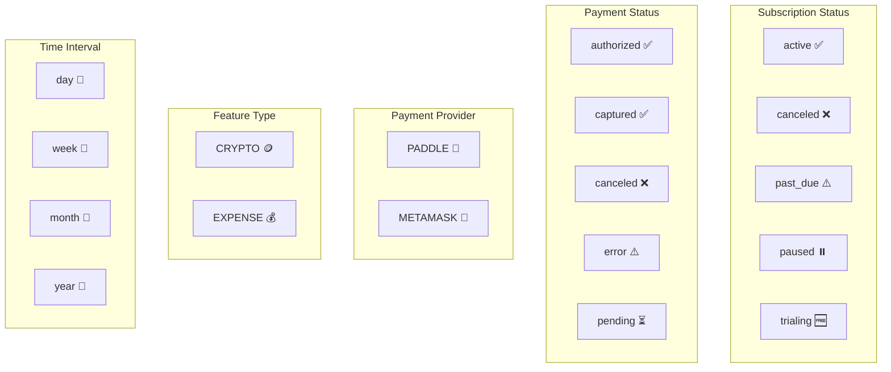
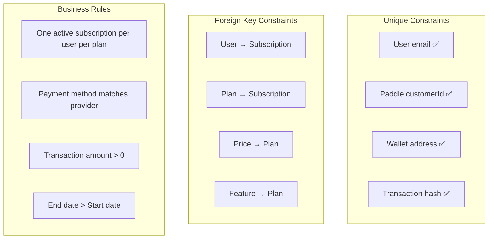
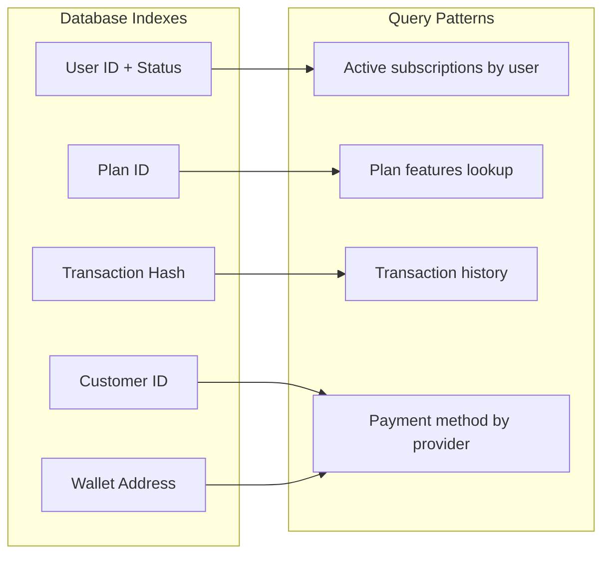

# Membership Data Model

This document outlines the comprehensive data model using visual diagrams to show relationships and structure.

## System Architecture Overview

## Complete Entity Relationship Diagram

## Payment Provider Architecture

## Subscription Lifecycle States

## Feature System Design

## Pricing Structure

## Data Types & Enums

## Security & Data Integrity

## Performance Optimization

