# Discount System Architecture

## Overview

The discount system in Xela provides a comprehensive solution for managing promotional offers, free trials, and pricing incentives. It consists of two main layers: the internal membership discount management and the external Paddle payment provider integration.

## System Architecture

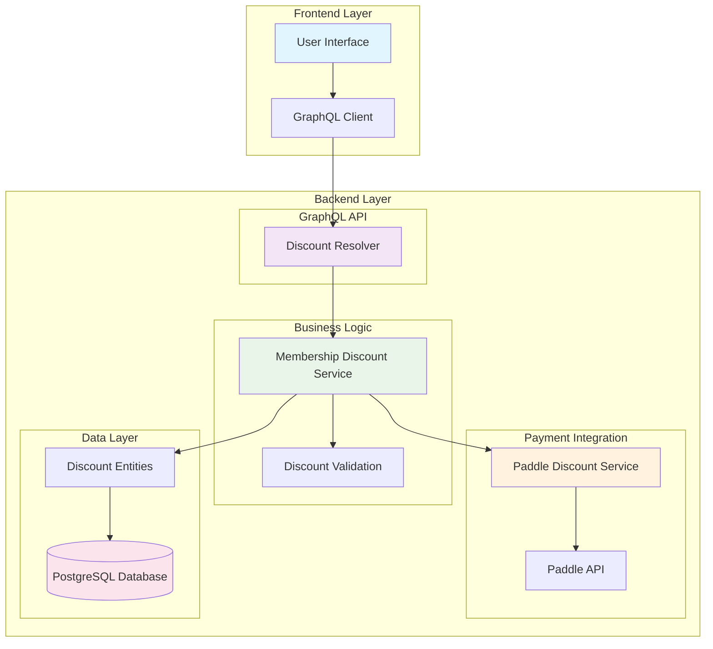

## Core Components

### 1. Discount Types

The system supports three primary discount types:

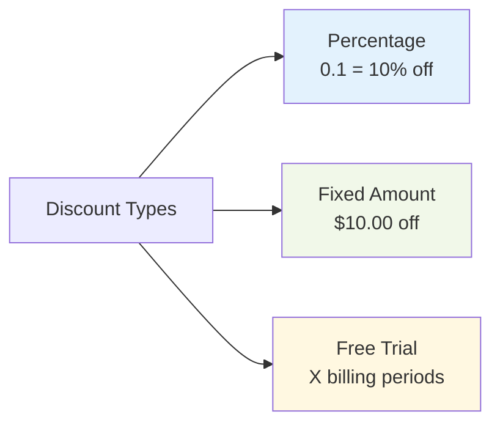

### 2. Target Types

Discounts can be targeted to specific user segments:

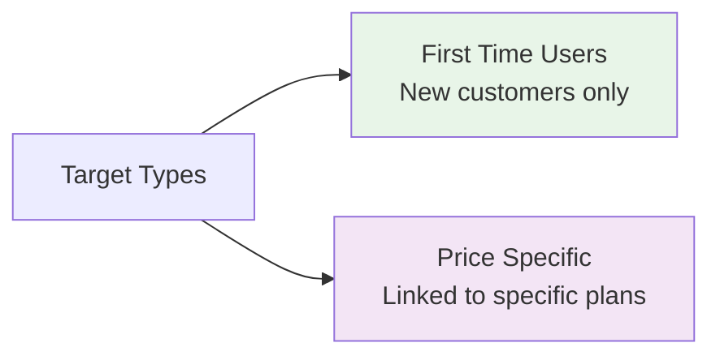

## Data Model

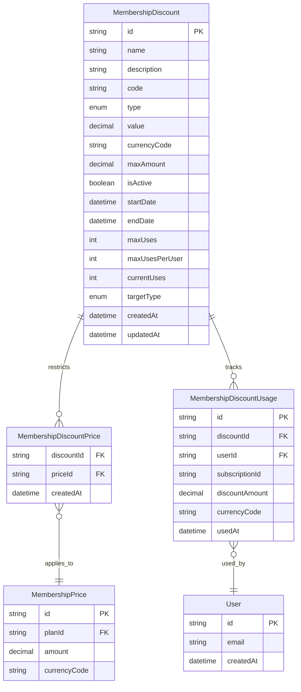

## Service Layer Architecture

### Membership Discount Service

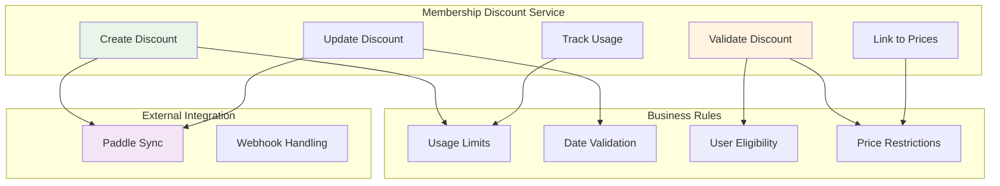

### Paddle Integration Service

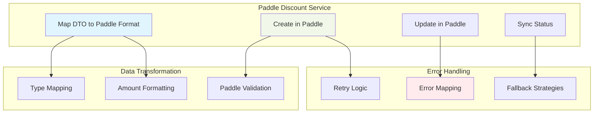

## Discount Lifecycle

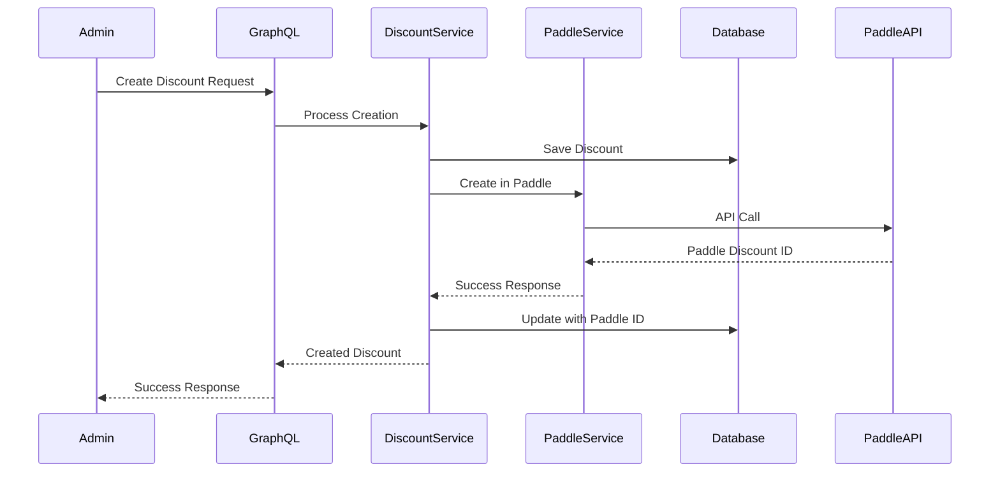

## Validation Flow

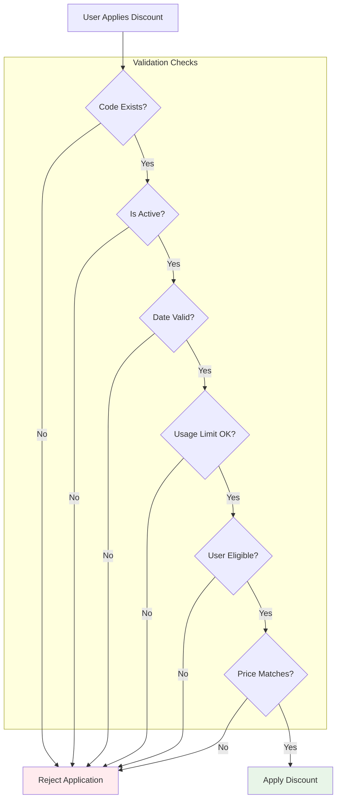

## GraphQL API Operations

### Core Operations

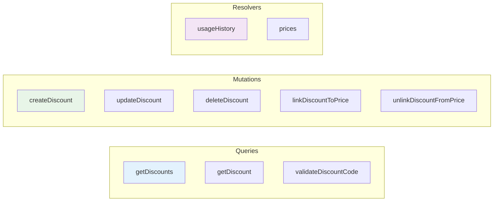

## Integration Points

### Frontend Integration

```mermaid
graph TD
    subgraph "User Journey"
        BROWSE[Browse Plans]
        ENTER_CODE[Enter Discount Code]
        VALIDATE[Validate Code]
        APPLY[Apply Discount]
        CHECKOUT[Proceed to Checkout]
    end
    
    subgraph "Admin Journey"
        CREATE_DISCOUNT[Create Discount]
        CONFIGURE[Configure Rules]
        LINK_PRICES[Link to Prices]
        MONITOR[Monitor Usage]
    end
    
    BROWSE --> ENTER_CODE
    ENTER_CODE --> VALIDATE
    VALIDATE --> APPLY
    APPLY --> CHECKOUT
    
    CREATE_DISCOUNT --> CONFIGURE
    CONFIGURE --> LINK_PRICES
    LINK_PRICES --> MONITOR
    
    style VALIDATE fill:#fff3e0
    style APPLY fill:#e8f5e8
    style MONITOR fill:#f3e5f5
```

### Payment Provider Integration

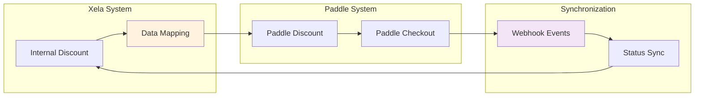

## Error Handling Strategy

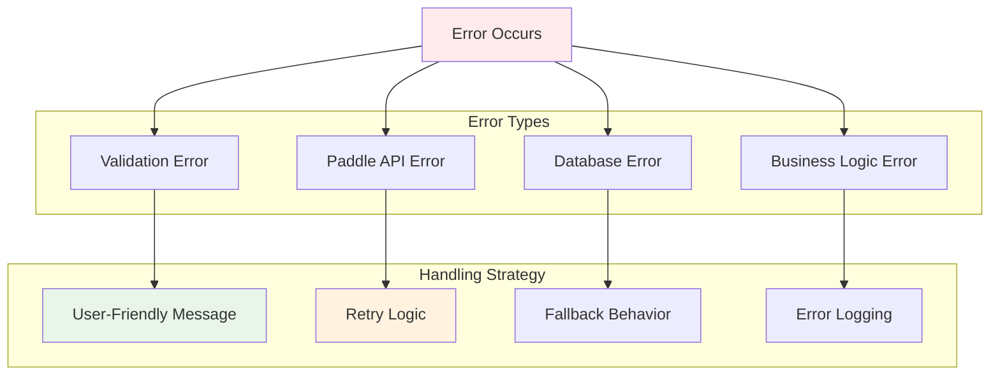

## Performance Considerations

## Security Considerations

- **Code Generation**: Secure random code generation to prevent guessing
- **Usage Tracking**: Prevent abuse through usage limits and user restrictions
- **Validation**: Server-side validation for all discount applications
- **Audit Trail**: Complete audit trail for discount usage and modifications

## Monitoring and Analytics

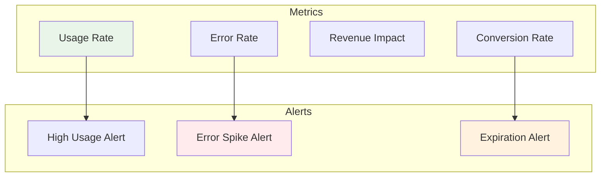

## Future Enhancements

- **A/B Testing**: Support for discount A/B testing
- **Dynamic Pricing**: Real-time discount adjustments
- **Referral Integration**: Integration with referral systems
- **Advanced Targeting**: ML-based user targeting
- **Bulk Operations**: Bulk discount management tools 