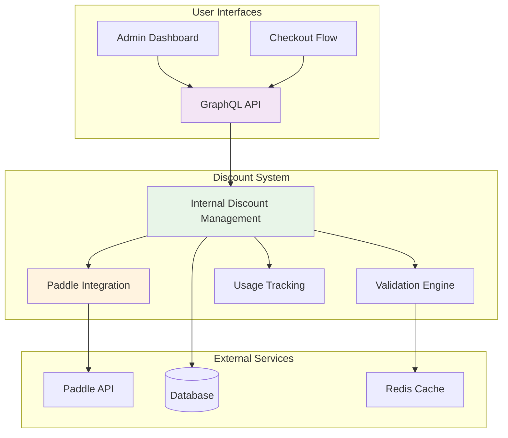
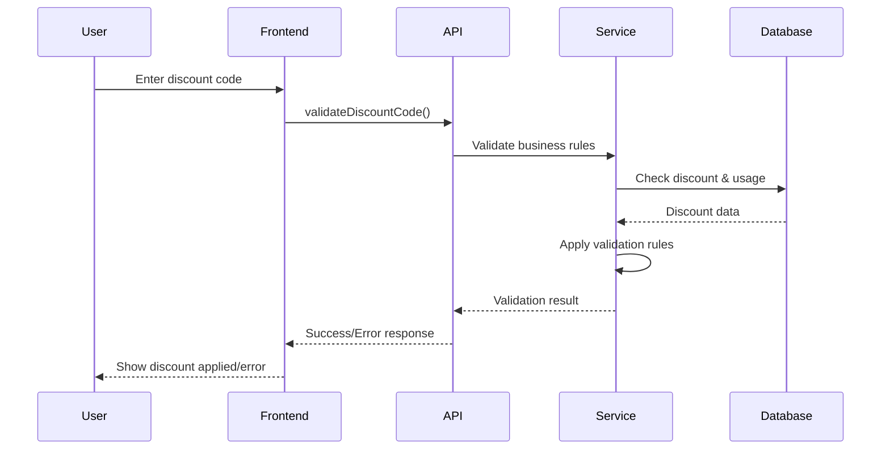

# Discount System Documentation

## Overview

The Xela discount system provides a comprehensive solution for managing promotional offers, free trials, and pricing incentives. This documentation covers the complete system architecture, implementation details, and API reference.

## 📋 Table of Contents

### Core Documentation

1. **[Architecture](./architecture.md)** - System design, components, and data flow
4. **[Strategies](./strategies.md)** - Discount strategies and examples

## 🏗️ System Overview



## 🚀 Quick Start

### For Developers

1. **Read the Architecture**: Start with [architecture.md](./architecture.md) to understand the system design
2. **Implementation Details**: Review [implementation-guide.md](./implementation-guide.md) for technical specifics
3. **API Integration**: Use [api-reference.md](./api-reference.md) for GraphQL operations

### For Product Managers

1. **Discount Strategies**: Check [strategies.md](./strategies.md) for campaign examples
2. **Business Rules**: Review validation logic in [architecture.md](./architecture.md)
3. **Usage Analytics**: See monitoring section in [implementation-guide.md](./implementation-guide.md)

## 💡 Key Features

### Discount Types

| Type | Description | Example |
|------|-------------|---------|
| **Percentage** | Percentage off the total | 25% off (value: 0.25) |
| **Fixed Amount** | Fixed dollar amount off | $10 off (value: 10.00) |
| **Free Trial** | Free billing periods | 1 month free (value: 1) |

### Targeting Options

- **First Time Users**: Only for new customers
- **Price Specific**: Restricted to specific plans/prices

### Business Rules

- Usage limits (global and per-user)
- Date range restrictions
- Price eligibility
- User eligibility validation

## 🔧 Technical Stack

### Backend Components

```
backend/src/modules/
├── membership/discount/           # Core discount logic
│   ├── dtos/                     # Data transfer objects
│   ├── membership-discount.service.ts
│   ├── membership-discount.resolver.ts
│   └── membership-discount.module.ts
└── payment/paddle/               # Paddle integration
    ├── dtos/                     # Paddle-specific DTOs
    ├── paddle-discount.service.ts
    └── paddle.service.ts
```

### Database Schema

- **MembershipDiscount**: Core discount entity
- **MembershipDiscountPrice**: Price restrictions
- **MembershipDiscountUsage**: Usage tracking

### External Integrations

- **Paddle**: Payment provider for discount processing
- **Redis**: Caching for performance optimization
- **PostgreSQL**: Primary data storage

## 📊 Common Use Cases

### 1. Launch Campaign

```graphql
mutation CreateLaunchDiscount {
  createDiscount(data: {
    name: "Launch Week Special"
    code: "LAUNCH50"
    type: PERCENTAGE
    value: "0.5"
    maxUses: 100
    endDate: "2024-12-31T23:59:59Z"
  }) {
    id
    code
  }
}
```

### 2. Free Trial Offer

```graphql
mutation CreateFreeTrial {
  createDiscount(data: {
    name: "30-Day Free Trial"
    type: FREE_TRIAL
    value: "1"
    targetType: FIRST_TIME_USER
  }) {
    id
    name
  }
}
```

### 3. Price-Specific Discount

```graphql
# 1. Create discount
mutation CreateProDiscount {
  createDiscount(data: {
    name: "Pro Plan Special"
    code: "PRO20"
    type: PERCENTAGE
    value: "0.2"
    targetType: PRICE_SPECIFIC
  }) {
    id
  }
}

# 2. Link to specific price
mutation LinkToPrice {
  linkDiscountToPrice(
    discountId: "disc_123"
    priceId: "price_pro_monthly"
  )
}
```

## 🔍 Validation Flow



## 📈 Monitoring & Analytics

### Key Metrics

- **Usage Rate**: How often discounts are used
- **Conversion Rate**: Discount to subscription conversion
- **Revenue Impact**: Financial impact of discounts
- **Error Rate**: API error rates and types

### Performance Optimization

- **Caching**: Redis for frequently accessed data
- **Database Indexing**: Optimized queries for validation
- **Rate Limiting**: API protection against abuse

## 🔒 Security Considerations

- **Secure Code Generation**: Cryptographically secure discount codes
- **Usage Tracking**: Prevent abuse through limits
- **Input Validation**: Server-side validation for all operations
- **Audit Trail**: Complete history of discount usage

## 🧪 Testing

### Test Environment

Use sandbox environment for testing:
```
POST https://api-sandbox.xela.com/graphql
```

### Test Codes

| Code | Type | Value | Description |
|------|------|-------|-------------|
| `TEST10` | PERCENTAGE | 0.1 | 10% off |
| `TEST5USD` | FIXED_AMOUNT | 5.00 | $5 off |
| `TESTFREE` | FREE_TRIAL | 1 | 1 month free |

## 📚 Additional Resources

### Related Documentation

- [Membership System](../README.md) - Overall membership documentation
- [Payment Integration](../providers/paddle/README.md) - Paddle payment provider
- [Frontend Integration](../frontend.md) - UI implementation guide

### External Links

- [Paddle Discount API](https://developer.paddle.com/api-reference/discounts/create-discount)
- [GraphQL Best Practices](https://graphql.org/learn/best-practices/)
- [NestJS Documentation](https://docs.nestjs.com/)

## 🤝 Contributing

### Code Standards

- Follow TypeScript best practices
- Use proper validation decorators
- Include comprehensive error handling
- Write unit tests for business logic

### Documentation Updates

- Update diagrams when architecture changes
- Add examples for new features
- Keep API reference current
- Document breaking changes

## 📞 Support

For technical questions or issues:

1. Check the [Implementation Guide](./implementation-guide.md) for technical details
2. Review [API Reference](./api-reference.md) for usage examples
3. Consult [Architecture](./architecture.md) for system design questions

---

*Last updated: January 2025* 