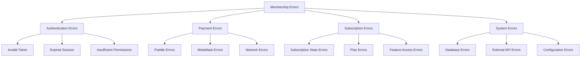

# Membership System Error Handling

This document provides comprehensive guidance on error handling, recovery strategies, and troubleshooting for the membership and subscription system across both traditional (Paddle) and Web3 (MetaMask) payment methods.

## Error Classification

### Error Categories



## Authentication & Authorization Errors

### JWT Token Errors

| Error Code | Description | Resolution |
|------------|-------------|------------|
| `INVALID_TOKEN` | JWT token is malformed or invalid | Redirect to login |
| `EXPIRED_TOKEN` | JWT token has expired | Refresh token or redirect to login |
| `MISSING_TOKEN` | No authorization header provided | Redirect to login |
| `INSUFFICIENT_PERMISSIONS` | User lacks required permissions | Show access denied message |

**Backend Implementation:**

```typescript
@Injectable()
export class JwtGuard implements CanActivate {
  async canActivate(context: ExecutionContext): Promise<boolean> {
    try {
      const request = context.switchToHttp().getRequest();
      const token = this.extractTokenFromHeader(request);
      
      if (!token) {
        throw new UnauthorizedException({
          code: 'MISSING_TOKEN',
          message: 'Authorization token required',
        });
      }
      
      const payload = await this.jwtService.verifyAsync(token);
      request.user = payload;
      return true;
    } catch (error) {
      if (error.name === 'TokenExpiredError') {
        throw new UnauthorizedException({
          code: 'EXPIRED_TOKEN',
          message: 'Token has expired',
        });
      }
      
      throw new UnauthorizedException({
        code: 'INVALID_TOKEN',
        message: 'Invalid authorization token',
      });
    }
  }
}
```

**Frontend Error Handling:**

```typescript
export function useAuthErrorHandler() {
  const navigate = useNavigate();
  const { logout } = useAuth();
  
  const handleAuthError = useCallback((error: ApolloError) => {
    const authError = error.graphQLErrors.find(err => 
      ['INVALID_TOKEN', 'EXPIRED_TOKEN', 'MISSING_TOKEN'].includes(
        err.extensions?.code as string
      )
    );
    
    if (authError) {
      logout();
      navigate('/login', { 
        state: { message: 'Your session has expired. Please log in again.' }
      });
      return true;
    }
    
    return false;
  }, [logout, navigate]);
  
  return { handleAuthError };
}
```

## Payment Processing Errors

### Paddle Payment Errors

#### Webhook Processing Errors

| Error Code | Description | Resolution |
|------------|-------------|------------|
| `PADDLE_SIGNATURE_INVALID` | Webhook signature verification failed | Check webhook secret configuration |
| `USER_ID_MISSING` | No user ID in webhook custom data | Ensure custom data includes userId |
| `PLAN_NOT_FOUND` | Referenced plan doesn't exist | Create missing plan or update webhook |
| `SUBSCRIPTION_NOT_FOUND` | Referenced subscription doesn't exist | Create subscription or handle gracefully |

**Webhook Error Handling:**

```typescript
@Injectable()
export class PaddleWebhookService {
  async processIncomingWebhook(signatureHeader: string, rawBody: Buffer) {
    try {
      // Signature verification
      const eventData = await this.verifyAndUnmarshalWebhook(signatureHeader, rawBody);
      await this.processWebhookEvent(eventData);
    } catch (error) {
      this.logger.error(`Webhook processing failed: ${error.message}`, {
        error: error.stack,
        signaturePresent: !!signatureHeader,
        bodySize: rawBody.length,
      });
      
      if (error.message.includes('signature')) {
        throw new BadRequestException({
          code: 'PADDLE_SIGNATURE_INVALID',
          message: 'Invalid webhook signature',
        });
      }
      
      throw new InternalServerErrorException({
        code: 'WEBHOOK_PROCESSING_FAILED',
        message: 'Webhook processing failed',
      });
    }
  }
  
  private async handleWebhookError(event: EventEntity, error: Error, userId?: number) {
    await this.prisma.webhookError.create({
      data: {
        eventId: event.eventId,
        eventType: event.eventType,
        userId,
        error: error.message,
        stack: error.stack,
        eventData: JSON.stringify(event.data),
        createdAt: new Date(),
      },
    });
    
    // Send alert to monitoring
    this.alertingService.sendAlert({
      type: 'webhook_error',
      severity: 'high',
      message: `Webhook processing failed for event ${event.eventId}`,
      metadata: { eventType: event.eventType, userId, error: error.message },
    });
  }
}
```

### MetaMask/Web3 Payment Errors

#### Wallet Connection Errors

| Error Code | Description | Resolution |
|------------|-------------|------------|
| `METAMASK_NOT_INSTALLED` | MetaMask extension not detected | Prompt user to install MetaMask |
| `WALLET_CONNECTION_REJECTED` | User rejected connection request | Ask user to try again |
| `NETWORK_MISMATCH` | Wrong blockchain network selected | Prompt to switch networks |
| `ACCOUNT_LOCKED` | MetaMask account is locked | Ask user to unlock MetaMask |

**Frontend Wallet Error Handling:**

```typescript
export class WalletConnectionError extends Error {
  constructor(
    public code: string,
    message: string,
    public retryable: boolean = true
  ) {
    super(message);
    this.name = 'WalletConnectionError';
  }
}

export function useWalletErrorHandler() {
  const handleWalletError = useCallback((error: any): WalletConnectionError => {
    if (!window.ethereum) {
      return new WalletConnectionError(
        'METAMASK_NOT_INSTALLED',
        'MetaMask is not installed. Please install MetaMask to continue.',
        false
      );
    }
    
    if (error.code === 4001) {
      return new WalletConnectionError(
        'WALLET_CONNECTION_REJECTED',
        'Connection request was rejected. Please try again.',
        true
      );
    }
    
    if (error.code === -32002) {
      return new WalletConnectionError(
        'CONNECTION_REQUEST_PENDING',
        'A connection request is already pending. Please check MetaMask.',
        true
      );
    }
    
    if (error.message?.includes('locked')) {
      return new WalletConnectionError(
        'ACCOUNT_LOCKED',
        'Your MetaMask account is locked. Please unlock it and try again.',
        true
      );
    }
    
    return new WalletConnectionError(
      'UNKNOWN_WALLET_ERROR',
      'An unknown wallet error occurred. Please try again.',
      true
    );
  }, []);
  
  return { handleWalletError };
}
```

## Subscription Management Errors

### Subscription State Conflicts

| Error Code | Description | Resolution |
|------------|-------------|------------|
| `SUBSCRIPTION_ALREADY_EXISTS` | User already has active subscription | Update existing subscription |
| `SUBSCRIPTION_NOT_FOUND` | Subscription doesn't exist | Create new subscription |
| `INVALID_STATUS_TRANSITION` | Invalid subscription status change | Check business rules |
| `PLAN_CHANGE_NOT_ALLOWED` | Plan change not permitted | Check plan compatibility |

**Subscription Error Handling:**

```typescript
export class SubscriptionError extends Error {
  constructor(
    public code: string,
    message: string,
    public subscriptionId?: string,
    public retryable: boolean = false
  ) {
    super(message);
    this.name = 'SubscriptionError';
  }
}

@Injectable()
export class MembershipSubscriptionService {
  async create(createData: CreateMembershipSubscriptionInput): Promise<MembershipSubscription> {
    try {
      // Check for existing active subscription
      const existingSubscription = await this.prisma.membershipSubscription.findFirst({
        where: {
          userId: createData.userId,
          planId: createData.planId,
          status: { in: ['ACTIVE', 'TRIALING', 'PAST_DUE'] },
        },
      });
      
      if (existingSubscription) {
        throw new SubscriptionError(
          'SUBSCRIPTION_ALREADY_EXISTS',
          'User already has an active subscription to this plan',
          existingSubscription.id,
          false
        );
      }
      
      return await this.prisma.membershipSubscription.create({
        data: createData,
      });
    } catch (error) {
      if (error instanceof SubscriptionError) {
        throw error;
      }
      
      this.logger.error('Failed to create subscription', {
        userId: createData.userId,
        planId: createData.planId,
        error: error.message,
      });
      
      throw new SubscriptionError(
        'SUBSCRIPTION_CREATION_FAILED',
        'Failed to create subscription',
        undefined,
        true
      );
    }
  }
}
```

## Error Recovery Strategies

### Automatic Retry Mechanisms

```typescript
@Injectable()
export class RetryService {
  async withRetry<T>(
    operation: () => Promise<T>,
    options: {
      maxRetries: number;
      baseDelay: number;
      maxDelay: number;
      backoffFactor: number;
      retryableErrors?: string[];
    }
  ): Promise<T> {
    const { maxRetries, baseDelay, maxDelay, backoffFactor, retryableErrors } = options;
    
    for (let attempt = 0; attempt <= maxRetries; attempt++) {
      try {
        return await operation();
      } catch (error) {
        const isLastAttempt = attempt === maxRetries;
        const isRetryable = !retryableErrors || 
          retryableErrors.includes(error.code) ||
          this.isNetworkError(error);
        
        if (isLastAttempt || !isRetryable) {
          throw error;
        }
        
        const delay = Math.min(
          baseDelay * Math.pow(backoffFactor, attempt),
          maxDelay
        );
        
        this.logger.warn(`Retrying operation after ${delay}ms (attempt ${attempt + 1}/${maxRetries})`, {
          error: error.message,
          attempt: attempt + 1,
          delay,
        });
        
        await this.sleep(delay);
      }
    }
    
    throw new Error('Retry attempts exhausted');
  }
  
  private isNetworkError(error: any): boolean {
    return error.code === 'ECONNRESET' ||
           error.code === 'ECONNREFUSED' ||
           error.code === 'ETIMEDOUT' ||
           error.message?.includes('timeout');
  }
  
  private sleep(ms: number): Promise<void> {
    return new Promise(resolve => setTimeout(resolve, ms));
  }
}
```

## Monitoring & Alerting

### Error Tracking

```typescript
@Injectable()
export class ErrorTrackingService {
  async logError(error: Error, context: any): Promise<void> {
    const errorLog = {
      message: error.message,
      stack: error.stack,
      code: (error as any).code,
      timestamp: new Date(),
      context,
      severity: this.determineSeverity(error),
      userId: context.userId,
      sessionId: context.sessionId,
      userAgent: context.userAgent,
      ipAddress: context.ipAddress,
    };
    
    // Store in database
    await this.prisma.errorLog.create({ data: errorLog });
    
    // Send to external monitoring (Sentry, DataDog, etc.)
    if (errorLog.severity === 'HIGH' || errorLog.severity === 'CRITICAL') {
      await this.sendToMonitoring(errorLog);
    }
    
    // Send alerts for critical errors
    if (errorLog.severity === 'CRITICAL') {
      await this.sendAlert(errorLog);
    }
  }
  
  private determineSeverity(error: Error): 'LOW' | 'MEDIUM' | 'HIGH' | 'CRITICAL' {
    const errorCode = (error as any).code;
    
    if (['DATABASE_ERROR', 'EXTERNAL_API_DOWN'].includes(errorCode)) {
      return 'CRITICAL';
    }
    
    if (['PAYMENT_FAILED', 'WEBHOOK_PROCESSING_FAILED'].includes(errorCode)) {
      return 'HIGH';
    }
    
    if (['VALIDATION_ERROR', 'PLAN_NOT_FOUND'].includes(errorCode)) {
      return 'MEDIUM';
    }
    
    return 'LOW';
  }
}
```

This comprehensive error handling documentation provides a robust foundation for managing errors across the entire membership system, ensuring graceful degradation and effective recovery strategies. 