# Membership & Payment Flow

This document outlines the comprehensive flow of payment processing and subscription management using visual diagrams.

## System Overview

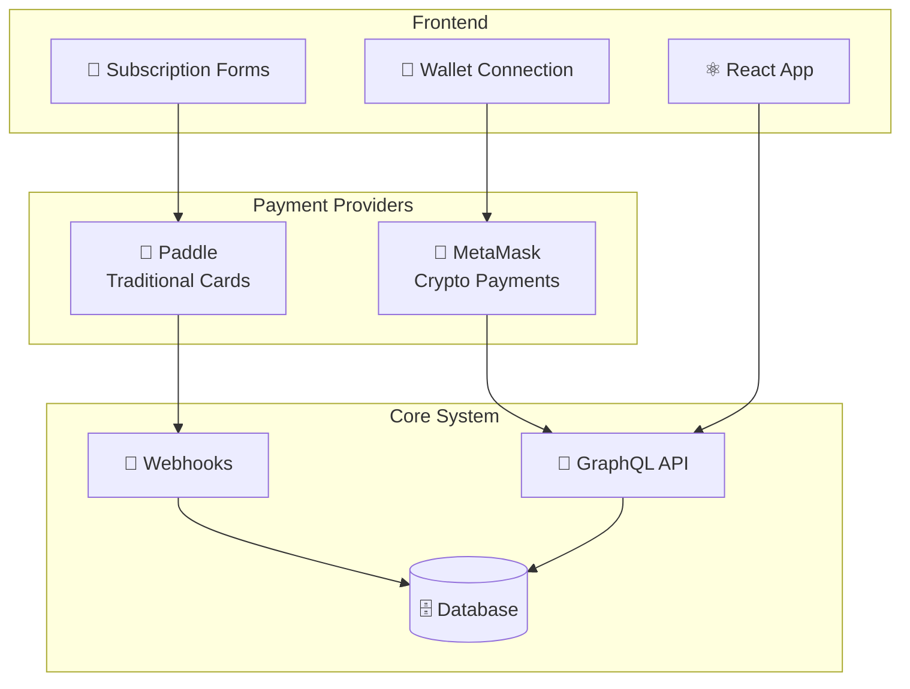

## Subscription Lifecycle

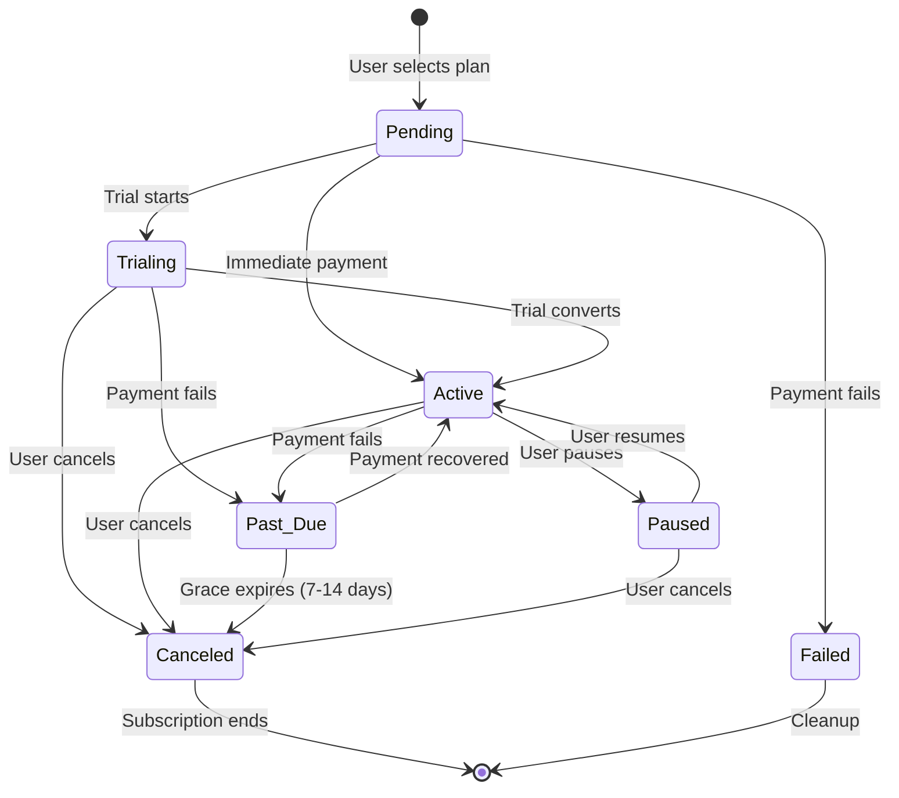

## Payment Processing Flows

### Paddle Flow (Traditional)

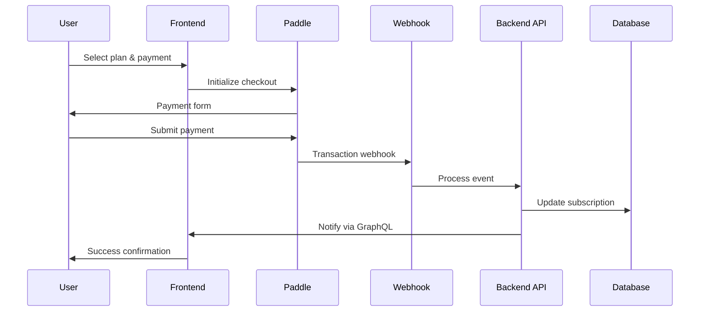

### MetaMask Flow (Crypto)

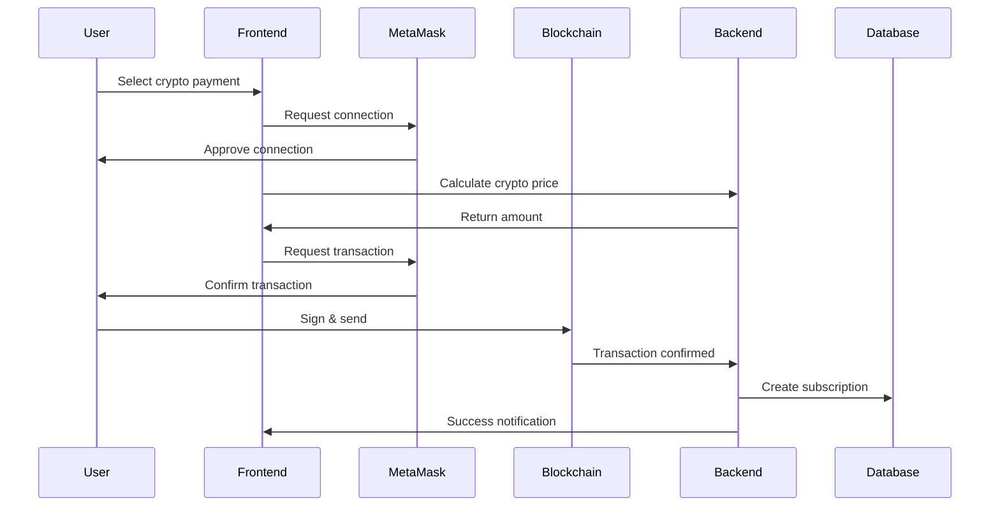

## Webhook Event Processing

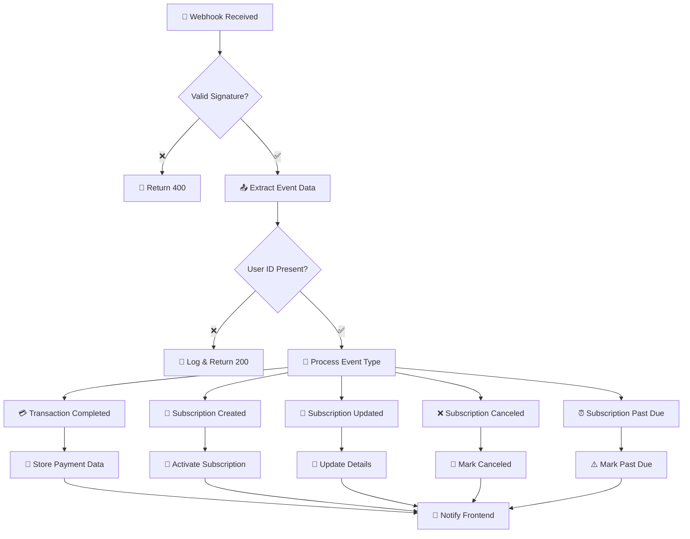

## Error Handling Matrix

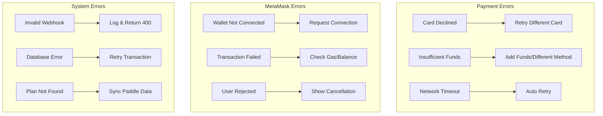

## State Transitions

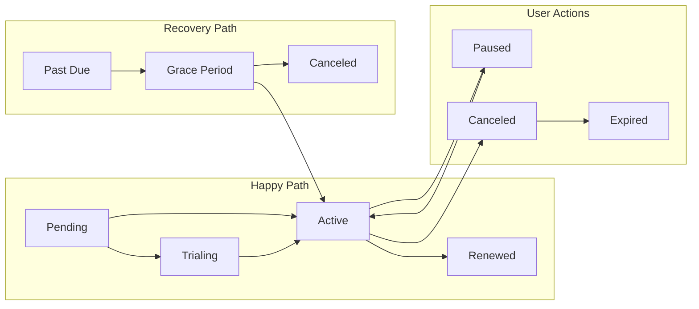

## Payment Method Management

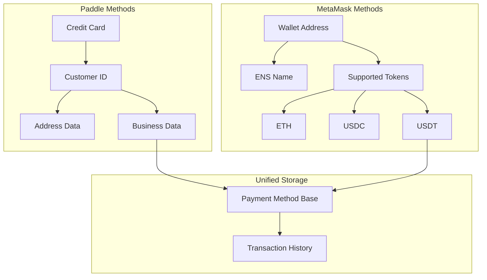

## Real-time Updates

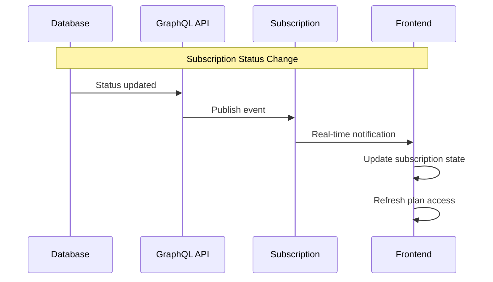

## Security Flow

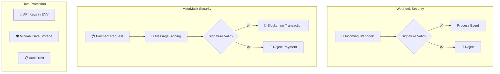

## Monitoring Dashboard

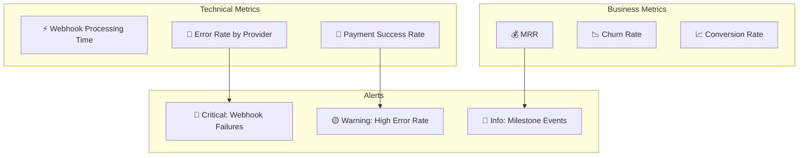
