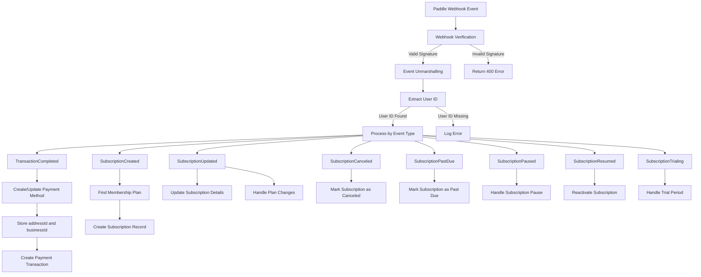

# Paddle Subscription Flow

This document outlines the flow of Paddle webhooks and how they're processed in our application to manage the subscription lifecycle.

## Webhook Processing Flow



## Subscription State Machine


## Webhook Event Handling

### TransactionCompleted

When a transaction is completed:

1. Extract the Paddle customer ID and user ID from the webhook
2. Check if a payment method already exists for this customer
3. If not, create a new payment method record linking the user to Paddle
4. Store additional customer information:
   - `addressId`: The Paddle address ID (if available)
   - `businessId`: The Paddle business ID (if available)
5. Create a payment transaction record for the subscription

### Storing Address and Business IDs

The Paddle webhook events may include `addressId` and `businessId` fields that should be stored for future reference. To handle these:

```typescript
// In handleTransactionCompleted or other webhook handlers
const data = event.data as any;
const paddleCustomerId = data.customerId;
const addressId = data.addressId;  // Extract from webhook data if available
const businessId = data.businessId;  // Extract from webhook data if available

// When creating or updating PaddlePaymentMethod
await tx.paddlePaymentMethod.create({
  data: {
    providerCustomerId: paddleCustomerId,
    addressId: addressId || null,  // Store if available
    businessId: businessId || null,  // Store if available
    // Link to the parent PaymentMethod record
    paymentMethod: {
      connect: { id: newPaymentMethod.id },
    },
  },
});
```

### SubscriptionCreated

When a subscription is created:

1. Find the corresponding membership plan based on Paddle price ID
2. Calculate subscription end date based on next billing date
3. Create a subscription record with status `ACTIVE`

### SubscriptionUpdated

When a subscription is updated:

1. Find the user's existing subscription
2. Update plan ID if changed
3. Update end date if billing date changed
4. Update subscription status based on Paddle status

### SubscriptionCanceled

When a subscription is canceled:

1. Find the user's existing subscription
2. Mark the subscription as `CANCELED`
3. Keep the existing end date (subscription remains active until the end of the billing period)

### SubscriptionPastDue

When a subscription payment fails:

1. Find the user's existing subscription
2. Mark the subscription as `PAST_DUE`

### SubscriptionPaused / SubscriptionResumed

1. Find the user's existing subscription
2. Update subscription status accordingly

### SubscriptionTrialing

When a subscription enters a trial period:

1. Find the user's existing subscription (or create one)
2. Ensure the subscription is marked as `ACTIVE`

## Data Model

The following database models are used to track subscriptions:

- `MembershipSubscription`: Main subscription record
- `MembershipPlan`: Product/plan details
- `PaymentMethod`: User's payment method info
- `PaddlePaymentMethod`: Paddle-specific payment method details including:
  - `providerCustomerId`: Customer ID from Paddle
  - `addressId`: Customer address ID from Paddle (optional)
  - `businessId`: Customer business ID from Paddle (optional)
- `PaymentTransaction`: Payment records for subscriptions

## Subscription Lifecycle Example

1. User subscribes to a plan:
   - `SubscriptionCreated` webhook received
   - New subscription created with `ACTIVE` status

2. Recurring payment processed:
   - `TransactionCompleted` webhook received
   - New payment transaction record created

3. User cancels subscription:
   - `SubscriptionCanceled` webhook received
   - Subscription marked as `CANCELED` but remains active until billing period ends

4. Billing period ends:
   - Subscription automatically transitions to `ENDED` status (internal logic, not webhook-driven)

5. Payment fails:
   - `SubscriptionPastDue` webhook received
   - Subscription marked as `PAST_DUE`
   - User may update payment method to fix

## Error Handling

All webhook event processing includes comprehensive error handling:

- Each event type is processed in its own try/catch block
- Errors are logged with detailed context
- Database operations use transactions where appropriate to ensure data consistency
- Missing user ID or subscription data is handled gracefully with appropriate logging
