# Frontend Integration Documentation

This document outlines the React frontend architecture for membership and subscription management using visual diagrams.

## Frontend Architecture Overview

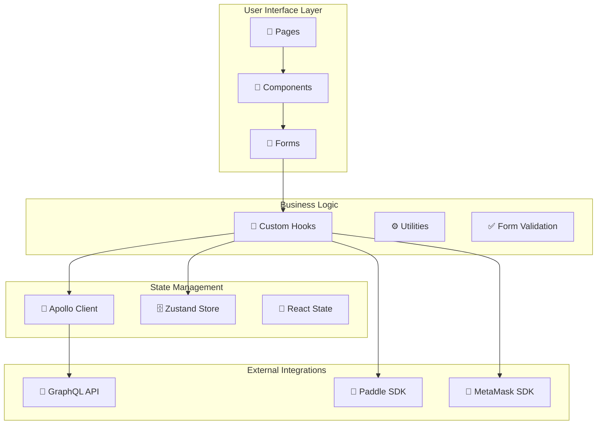

## Component Hierarchy

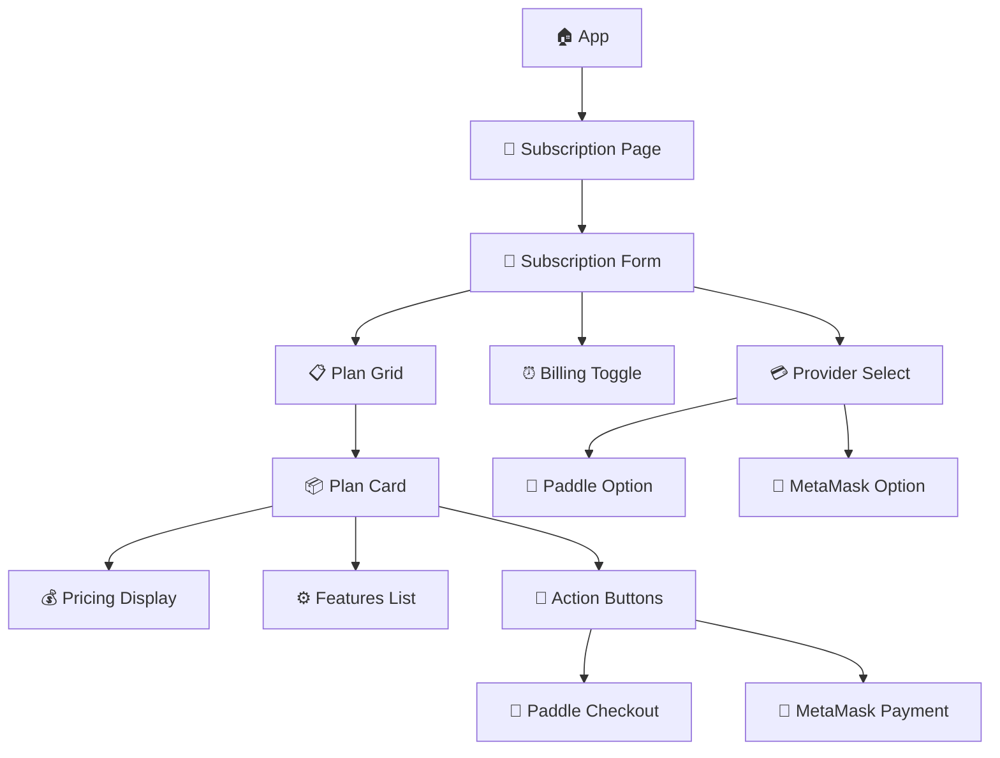

## User Flow Diagrams

### Plan Selection Flow

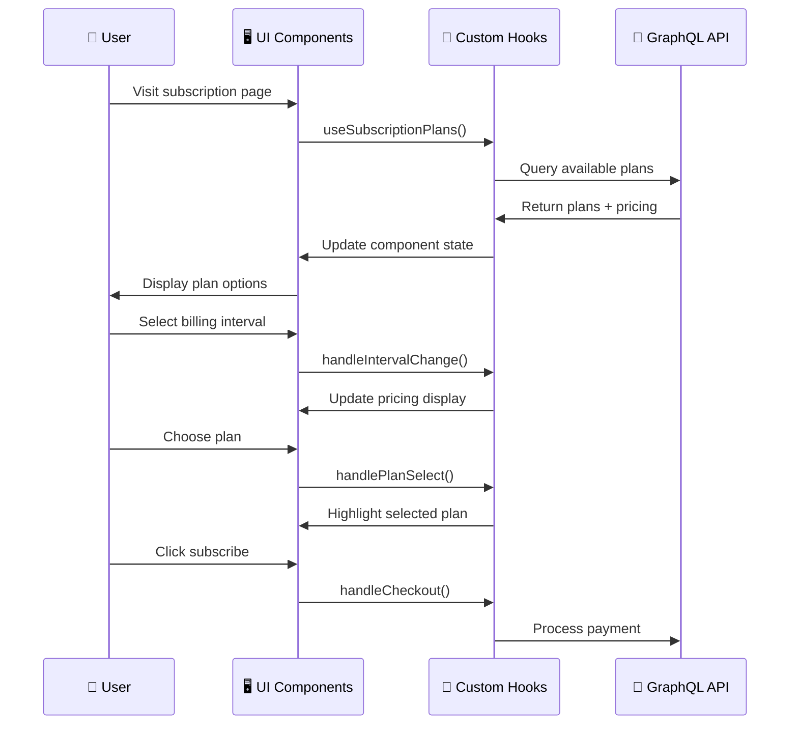

### Paddle Payment Flow

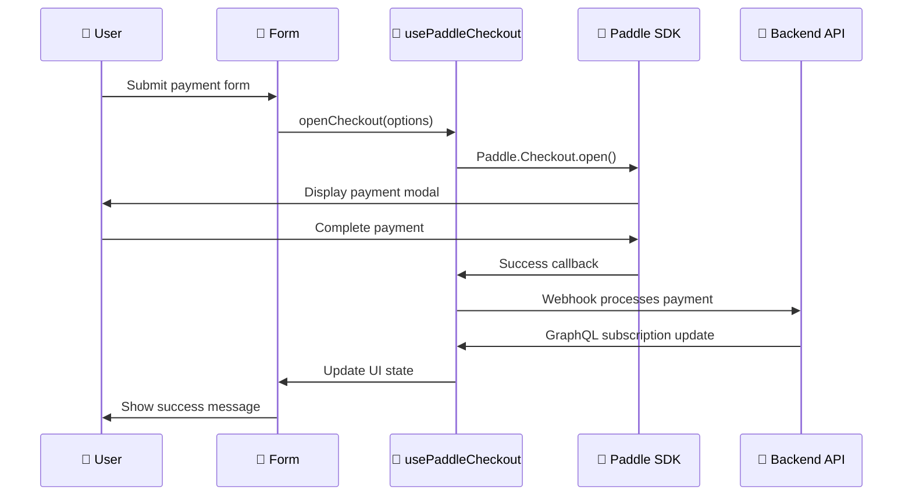

### MetaMask Payment Flow

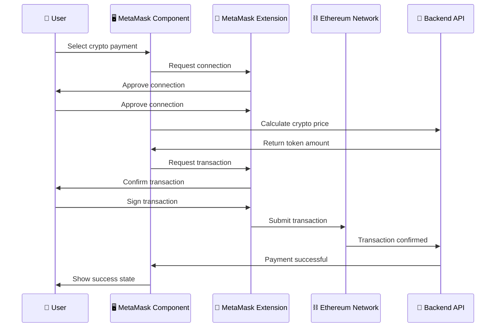

## State Management Flow

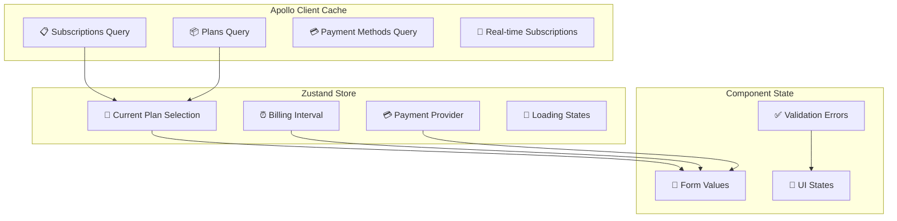

## Hook Architecture

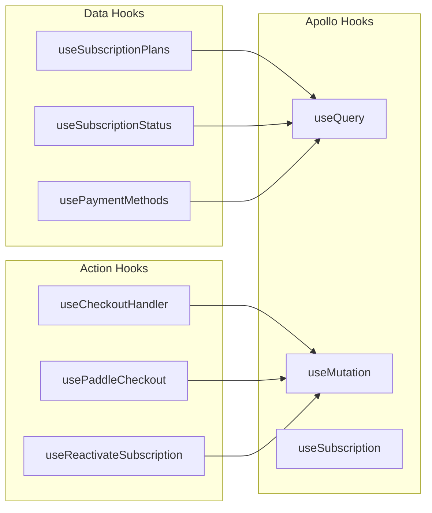

## Form Validation Flow

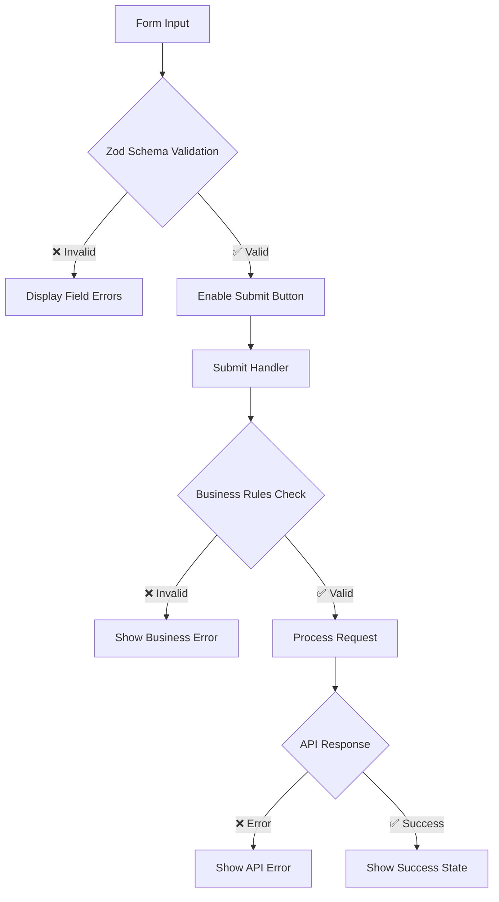

## Error Handling Strategy

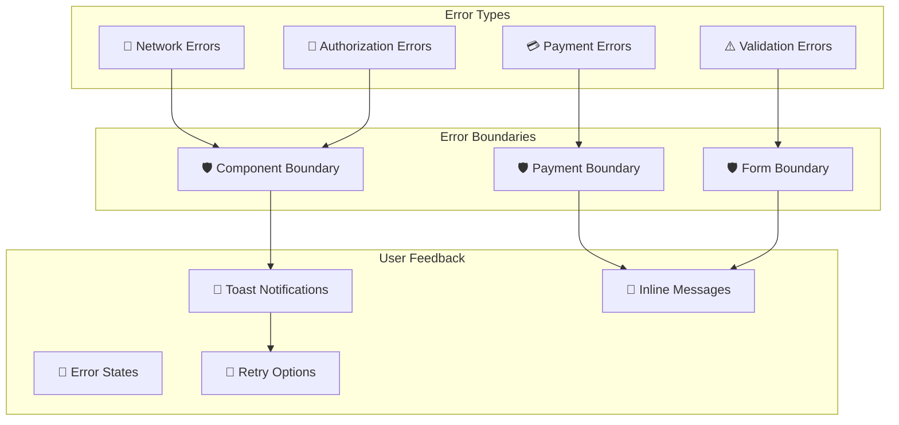

## Real-time Updates

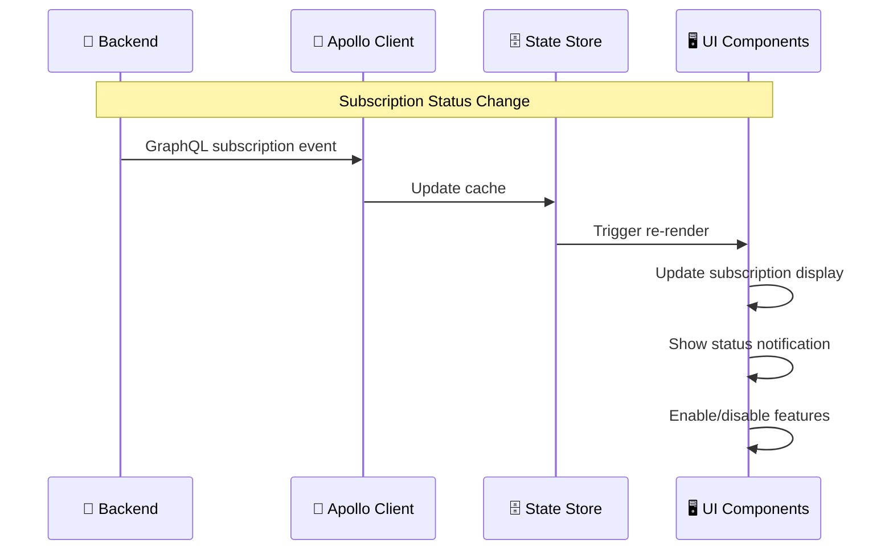

## Performance Optimization

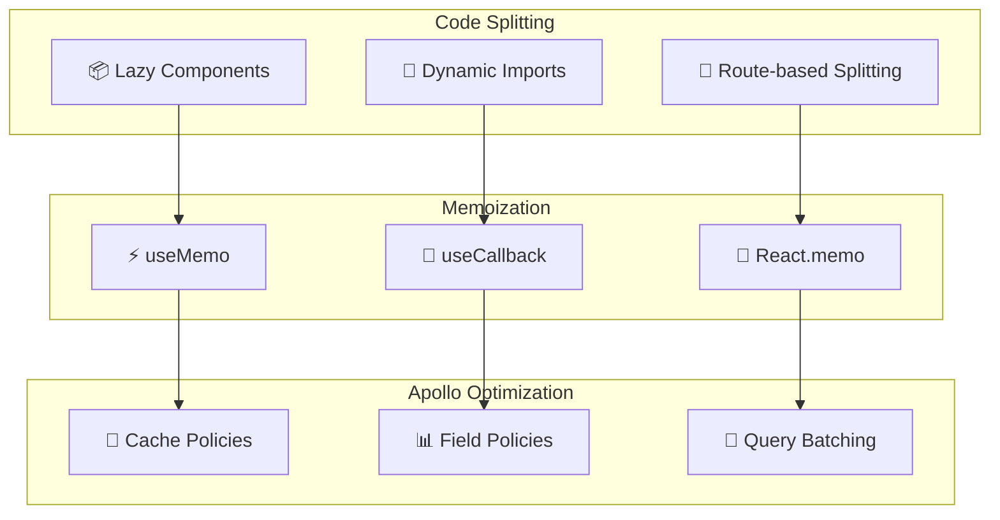

## Component Props Flow

```mermaid
graph TB
    subgraph "SubscriptionForm Props"
        SF1[plans: MembershipPlan[]]
        SF2[loading: boolean]
        SF3[onSubmit: Function]
    end
    
    subgraph "PlanCard Props"
        PC1[plan: MembershipPlan]
        PC2[isSelected: boolean]
        PC3[billingInterval: Interval]
        PC4[onSelect: Function]
    end
    
    subgraph "PaymentProvider Props"
        PP1[selectedProvider: Provider]
        PP2[onProviderChange: Function]
        PP3[availableMethods: Method[]]
    end
    
    SF1 --> PC1
    SF2 --> PC2
    SF3 --> PC4
    PC1 --> PP1
    PC4 --> PP2
```

## Loading States Management

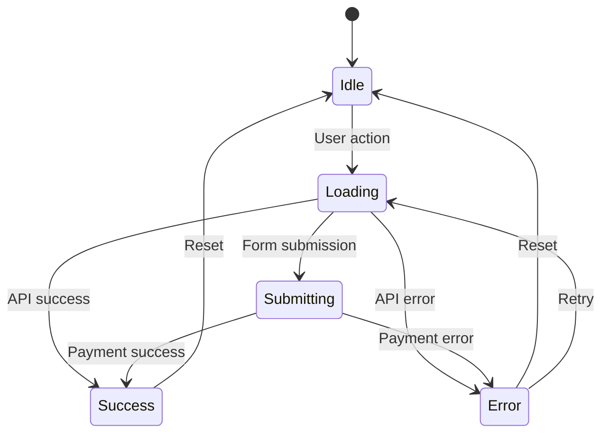

## Accessibility Features

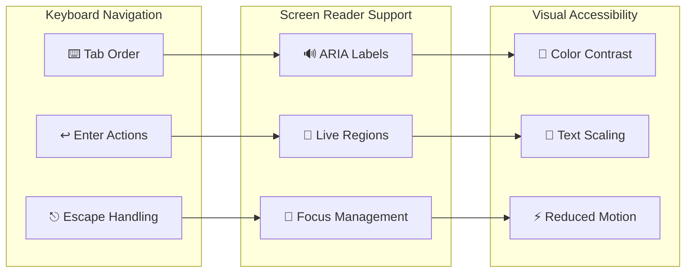

This comprehensive frontend documentation covers all aspects of the membership system implementation, from basic components to advanced features like Web3 integration, providing developers with the information needed to understand, maintain, and extend the system. 