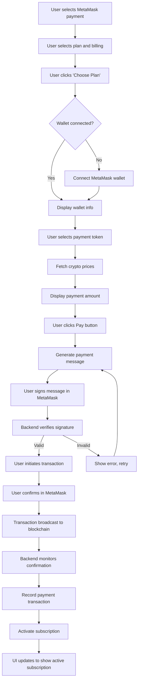
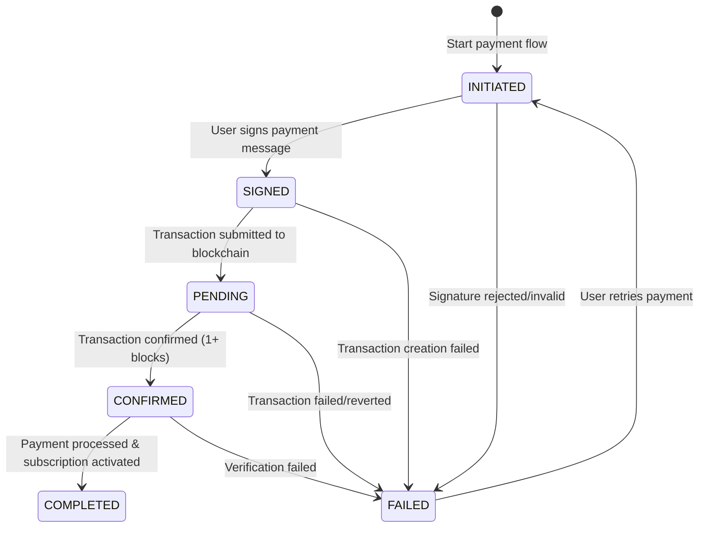
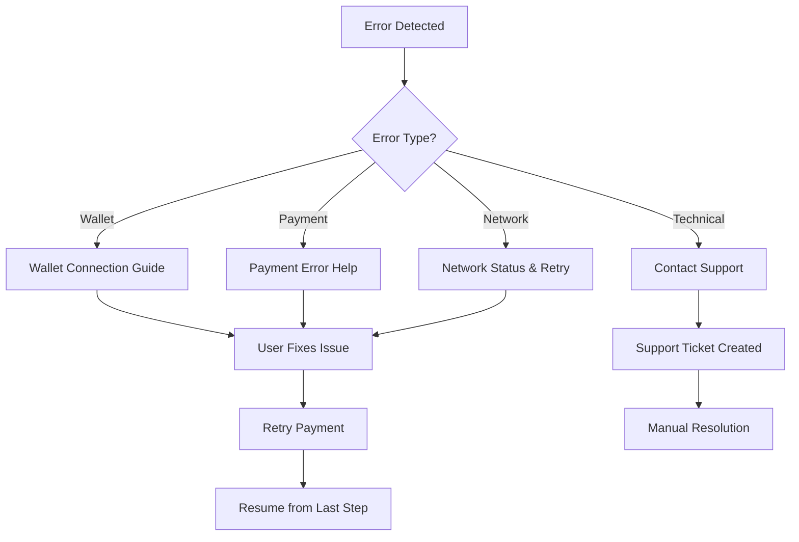

# MetaMask Web3 Subscription Management

This document outlines the Web3 subscription management features using MetaMask as a payment provider, including wallet connection, crypto payment processing, and blockchain transaction verification.

## Overview

MetaMask integration allows users to pay for subscriptions using cryptocurrency (ETH, USDC, USDT) through their MetaMask wallet. The payment flow uses signature-based verification and direct token transfers, providing a secure and decentralized payment method alongside traditional Paddle payments.

## Subscription Operations

### Creating a New MetaMask Subscription

To initiate a new Web3 subscription:

1. User navigates to the Subscription page and selects MetaMask from the payment provider dropdown
2. User selects a membership plan and billing cycle (monthly/yearly)  
3. User clicks "Choose Plan" to initiate the MetaMask payment flow
4. **Wallet Connection Phase**:
   - If not connected, user is prompted to connect their MetaMask wallet
   - MetaMask extension opens and user approves the connection
   - Wallet address is displayed and verified
5. **Token Selection Phase**:
   - User selects payment token (ETH, USDC, or USDT)
   - System fetches real-time cryptocurrency prices
   - Equivalent crypto amount is calculated and displayed
6. **Payment Authorization Phase**:
   - User clicks "Pay [amount] [token]" button
   - System generates a payment authorization message with timestamp
   - User signs the message in MetaMask (no gas fees for signing)
   - Backend verifies the signature and message authenticity
7. **Transaction Phase**:
   - User initiates the actual token transfer transaction
   - MetaMask shows transaction details including gas fees
   - User confirms the transaction in MetaMask
   - Transaction is broadcast to the blockchain
8. **Verification Phase**:
   - Backend monitors the blockchain for transaction confirmation
   - Once confirmed, the payment transaction is recorded
   - Subscription is activated and user gains access
   - UI updates to show the new active subscription



### Payment Status Tracking

MetaMask payments go through several distinct states during processing:

1. **INITIATED**: Payment process started, awaiting signature
2. **SIGNED**: Payment message signed, awaiting transaction
3. **PENDING**: Transaction submitted to blockchain, awaiting confirmation
4. **CONFIRMED**: Transaction confirmed on blockchain
5. **COMPLETED**: Payment processed and subscription activated
6. **FAILED**: Payment failed at any stage



### Wallet Management

#### Connecting a Wallet

1. User clicks "Connect MetaMask" button
2. MetaMask extension prompts for connection approval
3. User approves the connection request
4. Wallet address is stored in the payment method record
5. ENS name is automatically resolved if available
6. Connection status is maintained during the session

#### Wallet Address Verification

Before any payment operation:

1. System verifies the connected wallet address matches the stored payment method
2. If addresses don't match, user is prompted to switch accounts in MetaMask
3. Signature verification ensures the user controls the wallet private key
4. Anti-replay protection prevents signature reuse

### Transaction Processing

#### Supported Tokens

| Token | Name | Network | Purpose |
|-------|------|---------|---------|
| ETH | Ethereum | Ethereum Mainnet | Native currency payments |
| USDC | USD Coin | Ethereum Mainnet | Stable USD-pegged payments |
| USDT | Tether USD | Ethereum Mainnet | Stable USD-pegged payments |

#### Gas Fee Handling

- **Signature Operations**: Free (no gas required)
- **Token Transfers**: User pays network gas fees
- **Gas Estimation**: Dynamic estimation provided before transaction
- **Fee Display**: Gas costs shown in both ETH and USD
- **Failed Transactions**: Gas is consumed even if transaction fails

#### Price Conversion

1. Real-time cryptocurrency prices fetched from CoinGecko/CoinMarketCap
2. USD subscription price converted to equivalent token amount
3. Price locks implemented with 5-minute expiration
4. Slippage protection for price changes during payment
5. Rate display: "1 ETH = $2,000.00" for transparency

### Blockchain Verification

#### Transaction Monitoring

1. **Immediate Verification**: Transaction receipt checked for basic validity
2. **Confirmation Waiting**: Wait for network confirmations (typically 1-3 blocks)
3. **Detail Verification**: Confirm transaction details match payment request
   - Recipient address matches our payment wallet
   - Token amount matches expected payment
   - Token contract matches selected payment token
4. **Status Updates**: Real-time status updates via GraphQL subscriptions

#### Failed Transaction Handling

- **Insufficient Funds**: Clear error message with suggested solutions
- **Gas Too Low**: Suggest higher gas fee and retry
- **Network Congestion**: Provide estimated wait time
- **Token Approval**: Guide user through token approval process if needed
- **Slippage**: Offer to update price and retry payment

## Security Features

### Signature-Based Authentication

- **Message Format**: Standardized payment authorization message
- **Timestamp Protection**: Messages expire after 5 minutes
- **Nonce System**: Prevents signature replay attacks
- **Address Recovery**: Cryptographic verification of wallet ownership

### Payment Validation

- **Transaction Hash Verification**: Ensure transaction exists on blockchain
- **Amount Verification**: Confirm exact payment amount received
- **Recipient Verification**: Validate payment sent to correct address
- **Token Contract Verification**: Ensure correct token contract used

### Anti-Fraud Measures

- **Rate Limiting**: Limit payment attempts per wallet/IP
- **Duplicate Prevention**: Prevent multiple subscriptions from same wallet
- **Suspension Detection**: Monitor for suspicious wallet activity
- **MEV Protection**: Protect against front-running and sandwich attacks

## Error Handling

### Common Error Scenarios

#### Wallet Connection Errors
- **MetaMask Not Installed**: Redirect to MetaMask installation
- **Wrong Network**: Prompt user to switch to correct network
- **Account Locked**: Guide user to unlock MetaMask
- **Connection Rejected**: Explain benefits and retry option

#### Payment Errors
- **Insufficient Balance**: Show required balance vs available balance
- **Gas Fee Too High**: Suggest lower gas price or different time
- **Transaction Rejected**: Explain transaction details and retry
- **Network Issues**: Provide network status and retry options

#### Technical Errors
- **Price Feed Unavailable**: Use cached prices with warning
- **Blockchain Node Issues**: Switch to backup RPC provider
- **Database Errors**: Graceful degradation with error logging
- **Signature Verification Failed**: Clear error message and retry

### Error Recovery Flow



## Integration Points

### Backend Services

#### MetaMask Service (`metamask.service.ts`)
- Wallet address validation and ENS resolution
- Payment signature verification
- Cryptocurrency price fetching
- Transaction creation and monitoring
- Blockchain interaction management

#### GraphQL Resolvers (`metamask.resolver.ts`)
- `createMetaMaskPaymentMethod`: Register wallet address
- `verifyPaymentSignature`: Validate payment authorization
- `createMetaMaskTransaction`: Record blockchain transaction
- `getCryptoPrice`: Get real-time token prices
- `verifyTransactionOnChain`: Confirm transaction status

### Frontend Components

#### MetaMask Provider (`MetaMaskProvider.tsx`)
- MetaMask SDK integration
- Wallet connection management
- Account change handling
- Network switching support

#### Payment Component (`MetaMaskPayment.tsx`)
- Payment flow orchestration
- Progress tracking and status display
- Token selection interface
- Transaction confirmation handling

### Database Schema

#### MetaMaskPaymentMethod
```sql
CREATE TABLE "MetaMaskPaymentMethod" (
  "id" SERIAL PRIMARY KEY,
  "paymentMethodId" INTEGER UNIQUE NOT NULL,
  "walletAddress" TEXT UNIQUE NOT NULL,
  "ensName" TEXT,
  FOREIGN KEY ("paymentMethodId") REFERENCES "PaymentMethod"("id")
);
```

#### MetaMaskPaymentTransaction
```sql
CREATE TABLE "MetaMaskPaymentTransaction" (
  "id" SERIAL PRIMARY KEY,
  "paymentTransactionId" INTEGER UNIQUE NOT NULL,
  "transactionHash" TEXT UNIQUE NOT NULL,
  "tokenAddress" TEXT,
  "tokenSymbol" TEXT NOT NULL,
  "blockNumber" INTEGER,
  "gasUsed" TEXT,
  "gasPrice" TEXT,
  FOREIGN KEY ("paymentTransactionId") REFERENCES "PaymentTransaction"("id") ON DELETE CASCADE
);
```

## Monitoring and Analytics

### Key Metrics

- **Conversion Rate**: Wallet connection to completed payment
- **Transaction Success Rate**: Successful blockchain confirmations
- **Average Payment Time**: From initiation to confirmation
- **Gas Fee Analysis**: Average gas costs by token type
- **Error Rate**: Payment failures by category

### Operational Monitoring

- **Blockchain Node Health**: RPC endpoint response times
- **Price Feed Reliability**: Price data freshness and accuracy
- **Transaction Pool Status**: Network congestion monitoring
- **Wallet Integration**: MetaMask SDK performance

## Troubleshooting Guide

### For Users

1. **Wallet Won't Connect**
   - Ensure MetaMask is installed and unlocked
   - Check that you're on the correct network (Ethereum Mainnet)
   - Try refreshing the page and reconnecting

2. **Transaction Failed**
   - Check your wallet balance covers both payment and gas fees
   - Increase gas fee if network is congested
   - Ensure you're not trying to send from a contract wallet

3. **Payment Not Processed**
   - Wait for blockchain confirmation (can take several minutes)
   - Check transaction status on Etherscan
   - Contact support if transaction succeeded but subscription not activated

### For Developers

1. **Integration Testing**
   - Test with MetaMask test networks (Sepolia, Goerli)
   - Use test tokens for integration validation
   - Verify webhook endpoints receive transaction confirmations

2. **Error Logging**
   - Log all signature verification attempts
   - Track transaction hashes and confirmation status
   - Monitor price feed reliability and failover

3. **Performance Optimization**
   - Cache cryptocurrency prices with appropriate TTL
   - Implement connection pooling for blockchain RPC calls
   - Use efficient GraphQL subscriptions for real-time updates

## Future Enhancements

### Layer 2 Support
- Polygon (MATIC) integration for lower fees
- Arbitrum support for faster transactions
- Base network support for enhanced UX

### Additional Tokens
- DAI stablecoin support
- WBTC for Bitcoin exposure
- Custom token allowlist management

### Advanced Features
- Subscription auto-renewal with pre-authorized payments
- Multi-signature wallet support for enterprise accounts
- Cross-chain bridge integration for token swapping

---

**Last Updated**: January 2025  
**Version**: 1.0  
**Integration Status**: Phase 1 Complete, Phase 2 In Progress 