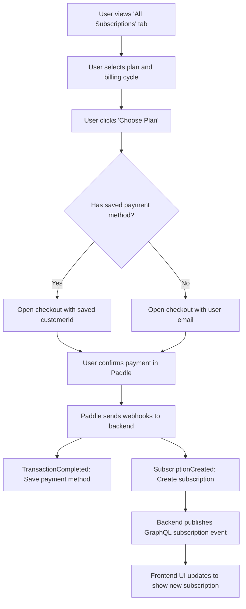
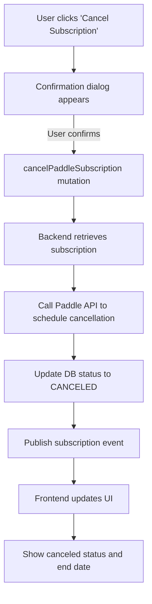
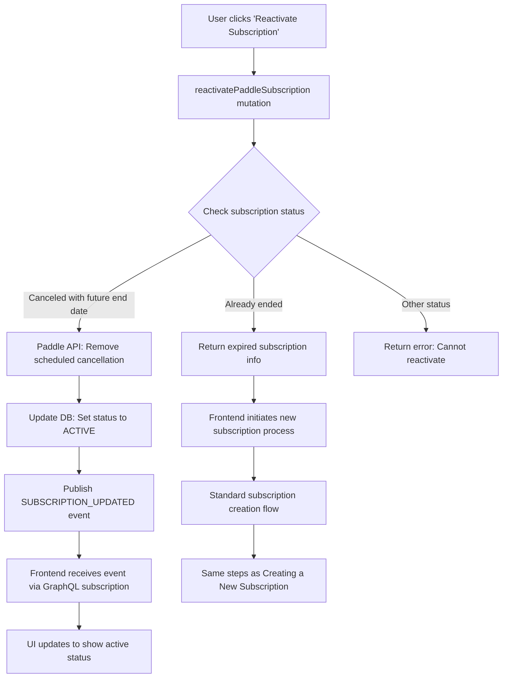
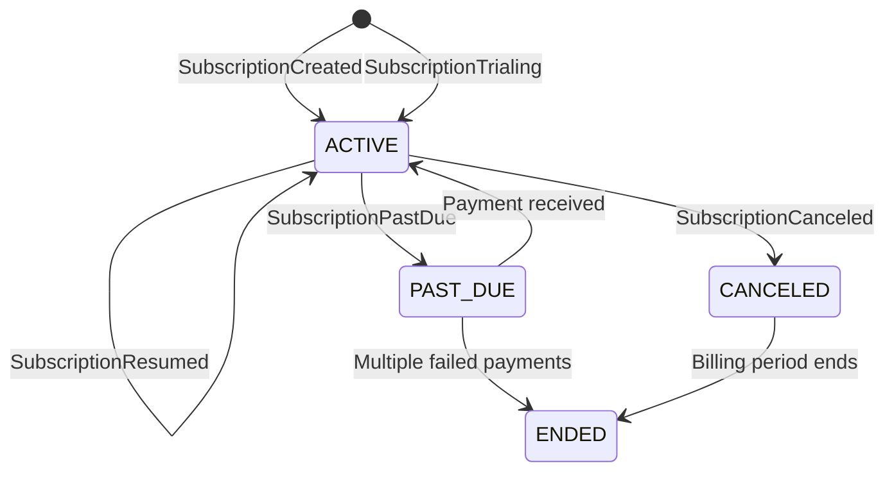

# Subscription Management

This document outlines the subscription management features available in the application, including how to create, cancel, reactivate subscriptions using Paddle as the payment provider.

## Subscription Operations

### Creating a New Subscription

To initiate a new subscription:

1. User navigates to the Subscription page and selects the "All Subscriptions" tab
2. The `SubscriptionForm` component displays available membership plans
3. User selects a plan and chooses billing cycle (monthly/yearly)
4. User selects a payment provider (Paddle is the default)
5. The system checks if the user already has a saved payment method with the selected provider
6. Clicking "Choose Plan" button opens the Paddle checkout:
   - For existing customers with saved payment methods, the checkout uses their Paddle customerId
   - For new customers, the checkout is initialized with their email
7. Upon successful payment, Paddle sends a `TransactionCompleted` webhook to the backend
8. The backend creates/updates the user's payment method records and links to the Paddle customerId
9. Paddle also sends a `SubscriptionCreated` webhook to create the subscription record
10. The frontend automatically updates via GraphQL subscription to display the new subscription

### Canceling a Subscription

To cancel a subscription:

1. User navigates to the "Current Subscriptions" tab
2. User opens the dropdown menu on their active subscription card and selects "Cancel Subscription"
3. A confirmation dialog appears explaining that cancellation takes effect at the end of the billing period
4. Upon confirmation, the frontend calls the `cancelPaddleSubscription` mutation
5. The backend performs the following steps:
   - Retrieves the subscription from the database
   - Calls the Paddle API to schedule cancellation at the end of the billing period
   - Updates the subscription status to "CANCELED" in the database
   - Preserves the original end date (until which the user has access)
6. A GraphQL subscription event is published to notify the client
7. UI updates to show the canceled status and end date

### Reactivating a Subscription

To reactivate a subscription, the user follows these steps:

1. User navigates to the "Current Subscriptions" tab
2. User opens the dropdown menu on their canceled subscription card and selects "Reactivate Subscription"
3. The frontend calls the `reactivatePaddleSubscription` mutation

There are two main scenarios when reactivating a subscription:

1. **Reactivating a subscription with a future end date** (scheduled cancellation)
   - The subscription is still active but scheduled to be canceled at the end of the billing period
   - The backend calls the Paddle API to remove the scheduled cancellation
   - The subscription status is updated to ACTIVE in the database
   - A GraphQL subscription event is published to notify the client
   - The UI updates to show the active status

2. **Reactivating an expired subscription** (already ended)
   - The backend returns the expired subscription information
   - The frontend treats this as creating a new subscription with the same plan
   - The user is redirected to the standard subscription creation flow
   - The checkout and webhook processes are identical to creating a new subscription
   - Once complete, a new subscription record is created (not related to the old one)

#### Complete Flowchart

## Payment Method Handling

### How Payment Methods Are Saved

When a user completes their first transaction:

1. Paddle generates a unique `customerId` for the user
2. Our backend receives this via the `TransactionCompleted` webhook
3. We store this customer ID along with any address or business information
4. For subsequent checkouts, we use this stored `customerId` to pre-fill payment options

### Reusing Payment Methods

For any subscription operation (new, upgrade, or management):

1. The application checks if the user has a saved Paddle payment method
2. If found, it passes the Paddle `customerId` to the checkout flow
3. The Paddle checkout then presents the customer with their saved payment methods
4. The customer can choose to use an existing payment method or add a new one
5. This avoids the need to re-enter payment details for each subscription change

## Webhook Handling

The backend handles the following Paddle webhooks:

- `subscription.created`: Create a new subscription record
- `subscription.updated`: Update an existing subscription
- `subscription.canceled`: Mark a subscription as canceled
- `subscription.past_due`: Mark a subscription as past due
- `subscription.paused`: Mark a subscription as paused
- `subscription.resumed`: Mark a subscription as resumed
- `subscription.trialing`: Mark a subscription as in trial period  
- `transaction.completed`: Record a payment transaction and store customer payment information

### Subscription State Machine

