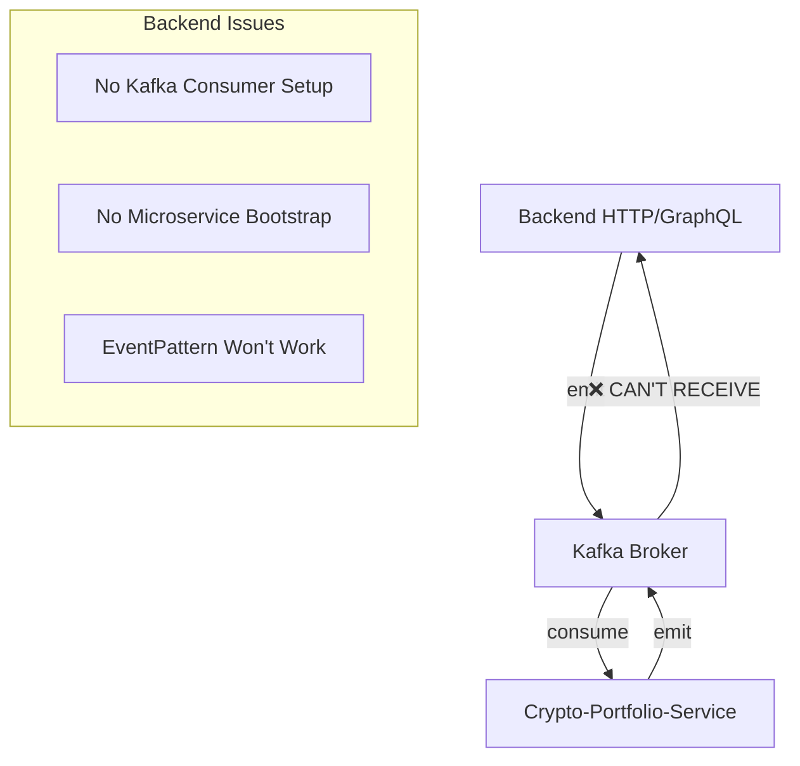
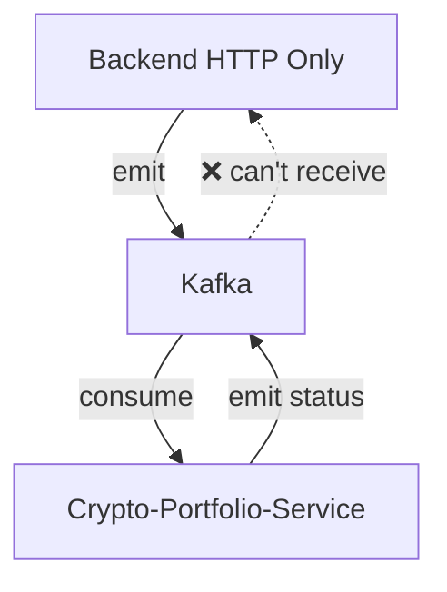
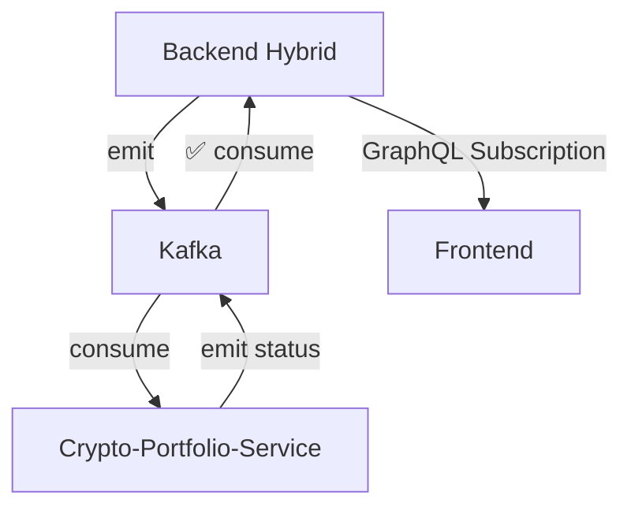

# 🎨 CREATIVE PHASE: BACKEND MICROSERVICE ARCHITECTURE ANALYSIS

**Date**: 2025-06-02  
**Phase Type**: Architecture Design  
**Problem Identified**: Backend EventPattern not working due to architectural mismatch

---

## 📋 PROBLEM STATEMENT

**Challenge**: The backend's `PortfolioController` uses `@EventPattern('create-crypto-portfolio-status')` but the backend is NOT configured as a microservice, making it unable to receive Kafka events.

**Current Architecture Issue**:
- **Backend**: Regular NestJS application (HTTP/GraphQL only) with Kafka CLIENT
- **Crypto-Portfolio-Service**: Proper NestJS microservice with Kafka CONSUMER/PRODUCER
- **Event Flow**: Broken - Backend cannot receive Kafka events without microservice setup

**Evidence**:
```typescript
// ❌ Backend main.ts - Regular HTTP application
const app = await NestFactory.create(AppModule);

// ✅ Crypto-Portfolio-Service main.ts - Proper microservice
const app = await NestFactory.createMicroservice<AsyncMicroserviceOptions>(AppModule, {
  transport: Transport.KAFKA,
  // ... kafka config
});
```

---

## 🔍 CURRENT STATE ANALYSIS

### Existing Communication Flow:


### Current Configuration Analysis:

**Backend** (Hybrid Application):
- ✅ **Kafka Producer**: Can send messages via `ClientKafka`
- ❌ **Kafka Consumer**: No microservice setup to receive events
- ❌ **Event Patterns**: `@EventPattern` decorators are non-functional
- 🔧 **Purpose**: HTTP/GraphQL API server with outbound messaging

**Crypto-Portfolio-Service** (Pure Microservice):
- ✅ **Kafka Producer**: Can send status updates
- ✅ **Kafka Consumer**: Proper microservice setup
- ✅ **Event Patterns**: Fully functional for receiving events
- 🔧 **Purpose**: Background processing and external API integration

---

## 🎯 OPTIONS ANALYSIS

### Option 1: Convert Backend to Hybrid Service (Recommended)
**Description**: Add microservice capabilities to the existing backend while maintaining HTTP/GraphQL functionality
**Implementation**: Bootstrap both HTTP server and Kafka microservice in the same application

**Pros**:
- ✅ **Minimal Code Changes**: Keep existing HTTP/GraphQL functionality
- ✅ **Event Pattern Support**: Enable `@EventPattern` decorators to work
- ✅ **Unified Deployment**: Single service handles both API and message processing
- ✅ **Shared Context**: Direct access to database, cache, and business logic
- ✅ **Real-time Updates**: Can immediately push GraphQL subscriptions

**Cons**:
- ❌ **Increased Complexity**: Managing both HTTP and message processing
- ❌ **Resource Usage**: Higher memory/CPU usage for dual protocols
- ❌ **Single Point of Failure**: API and message processing in one service

**Complexity**: Medium  
**Implementation Time**: 2-3 hours  
**Best For**: Current architecture with minimal disruption

---

### Option 2: Keep Backend Pure HTTP (Current State)
**Description**: Remove EventPattern from backend and handle status updates differently
**Implementation**: Use polling, webhooks, or database triggers instead of Kafka events

**Pros**:
- ✅ **Simple Architecture**: Clear separation between HTTP API and microservices
- ✅ **No Changes to Main Service**: Backend remains focused on API
- ✅ **Easy Debugging**: Separate concerns for API vs messaging

**Cons**:
- ❌ **Event Pattern Removal**: Must delete existing EventPattern code
- ❌ **Alternative Complexity**: Need polling, webhooks, or database listeners
- ❌ **Real-time Limitations**: Less efficient real-time updates
- ❌ **Code Duplication**: Status logic may need duplication

**Complexity**: Low  
**Implementation Time**: 1-2 hours  
**Best For**: Simple architectures with minimal real-time requirements

---

### Option 3: Create Dedicated Event Processing Service
**Description**: New microservice specifically for handling Kafka events and updating GraphQL subscriptions
**Implementation**: Extract event handling to separate service that communicates with backend via HTTP/database

**Pros**:
- ✅ **Clear Separation**: Distinct services for API, processing, and events
- ✅ **Scalability**: Independent scaling of event processing
- ✅ **Fault Isolation**: Event processing failures don't affect API

**Cons**:
- ❌ **Additional Service**: More infrastructure to maintain
- ❌ **Complex Communication**: HTTP calls or database coordination needed
- ❌ **Development Overhead**: Additional deployment and monitoring
- ❌ **Latency**: Extra network hops for real-time updates

**Complexity**: High  
**Implementation Time**: 1-2 days  
**Best For**: Large-scale systems with dedicated event processing needs

---

### Option 4: Move All Event Logic to Database Triggers
**Description**: Use PostgreSQL triggers and PgPubSub for real-time updates instead of Kafka
**Implementation**: Database triggers update subscription tables, PgPubSub notifies GraphQL subscriptions

**Pros**:
- ✅ **Database-Centric**: Leverage existing PostgreSQL infrastructure
- ✅ **ACID Transactions**: Guaranteed consistency with database operations
- ✅ **Simple Architecture**: No additional message broker complexity
- ✅ **Real-time Subscriptions**: Direct PgPubSub integration

**Cons**:
- ❌ **Database Load**: Additional processing burden on PostgreSQL
- ❌ **Limited Scalability**: Database becomes bottleneck for events
- ❌ **Kafka Investment Loss**: Existing Kafka infrastructure underutilized
- ❌ **Cross-Service Communication**: Harder to communicate between services

**Complexity**: Medium  
**Implementation Time**: 4-6 hours  
**Best For**: Database-heavy applications with simpler messaging needs

---

## 🏆 DECISION MATRIX

| Criteria | Hybrid Backend (Option 1) | Pure HTTP (Option 2) | Event Service (Option 3) | DB Triggers (Option 4) |
|----------|---------------------------|---------------------|-------------------------|------------------------|
| **Implementation Ease** | ⭐⭐⭐⭐ | ⭐⭐⭐⭐⭐ | ⭐⭐ | ⭐⭐⭐ |
| **Architectural Clarity** | ⭐⭐⭐ | ⭐⭐⭐⭐⭐ | ⭐⭐⭐⭐⭐ | ⭐⭐⭐ |
| **Real-time Performance** | ⭐⭐⭐⭐⭐ | ⭐⭐ | ⭐⭐⭐⭐ | ⭐⭐⭐⭐ |
| **Scalability** | ⭐⭐⭐ | ⭐⭐⭐ | ⭐⭐⭐⭐⭐ | ⭐⭐ |
| **Maintenance Overhead** | ⭐⭐⭐ | ⭐⭐⭐⭐ | ⭐⭐ | ⭐⭐⭐ |
| **Resource Efficiency** | ⭐⭐⭐ | ⭐⭐⭐⭐⭐ | ⭐⭐⭐ | ⭐⭐⭐⭐ |
| **Development Velocity** | ⭐⭐⭐⭐ | ⭐⭐⭐ | ⭐⭐ | ⭐⭐⭐ |
| **Current Code Reuse** | ⭐⭐⭐⭐⭐ | ⭐⭐ | ⭐⭐⭐ | ⭐⭐ |

**Total Score**: Option 1: 30/40 | Option 2: 28/40 | Option 3: 26/40 | Option 4: 22/40

---

## 🎯 RECOMMENDED DECISION

### **Selected Option: Convert Backend to Hybrid Service (Option 1)**

**Rationale**:
1. **Minimal Disruption**: Keeps existing code and architecture mostly intact
2. **Event Pattern Support**: Enables the existing `@EventPattern` to work as intended
3. **Real-time Capability**: Immediate GraphQL subscription updates
4. **Investment Protection**: Leverages existing Kafka infrastructure
5. **Development Efficiency**: Fastest path to working solution

---

## 🛠️ IMPLEMENTATION PLAN

### Step 1: Modify Backend Main.ts (Hybrid Bootstrap)
```typescript
// backend/src/main.ts
async function bootstrap() {
  // Create HTTP application
  const app = await NestFactory.create(AppModule, { rawBody: true });
  
  // Existing HTTP setup...
  app.enableCors({ origin: "*" });
  // ... rest of HTTP config
  
  // 🆕 ADD: Connect Kafka microservice to same app
  const kafkaOptions = {
    transport: Transport.KAFKA,
    options: {
      client: {
        clientId: 'backend-consumer',
        brokers: [process.env.MESSAGE_BROKER_URL || 'localhost:9092'],
      },
      consumer: {
        groupId: 'backend-consumer-group',
        allowAutoTopicCreation: true,
      }
    }
  };
  
  app.connectMicroservice(kafkaOptions);
  
  // Start both HTTP and microservice
  await app.startAllMicroservices();
  await app.listen(configService.get("SERVER_PORT"));
}
```

### Step 2: Update CryptoModule Configuration
```typescript
// No changes needed - existing Kafka client setup works for producing
// Microservice connection handles consuming
```

### Step 3: Verify PortfolioController Event Patterns
```typescript
// backend/src/modules/crypto/portfolio/portfolio.controller.ts
// ✅ This will now work properly:
@EventPattern('create-crypto-portfolio-status')
async handleStatusUpdate(@Payload() payload: PortfolioStatusPayload) {
  // Existing implementation works as-is
}
```

### Step 4: Test Event Flow
1. Backend emits `create-crypto-portfolio` → Crypto-Portfolio-Service
2. Crypto-Portfolio-Service processes and emits `create-crypto-portfolio-status` → Backend
3. Backend receives event and publishes GraphQL subscription
4. Frontend receives real-time update

---

## 🔄 ARCHITECTURAL VISUALIZATION

### Before (Broken):


### After (Fixed):


---

## 🧪 TESTING STRATEGY

### Unit Tests:
- Mock Kafka events for portfolio controller
- Verify GraphQL subscription publishing
- Test error handling for malformed events

### Integration Tests:
- End-to-end portfolio creation flow
- Event pattern reception and processing
- Real-time subscription delivery

### Performance Tests:
- Dual-protocol resource usage
- Event processing latency
- Concurrent HTTP and Kafka load

---

## 📊 SUCCESS METRICS

### Immediate Success Indicators:
- ✅ `@EventPattern` decorators receive events
- ✅ GraphQL subscriptions trigger on status updates
- ✅ Backend logs show Kafka message consumption
- ✅ Portfolio creation status updates in real-time

### Performance Benchmarks:
- **Event Processing Latency**: < 100ms from Kafka to GraphQL subscription
- **Resource Usage**: < 20% increase in memory/CPU from hybrid setup
- **HTTP Performance**: No degradation in API response times

---

## 🎨 CREATIVE CHECKPOINT: Implementation Complexity

The hybrid approach provides the **optimal balance** between:
- 🎯 **Functionality**: Enables broken EventPattern to work
- ⚡ **Performance**: Direct event processing without extra services
- 🛠️ **Simplicity**: Minimal code changes to existing architecture
- 💰 **Cost**: No additional infrastructure requirements

🎨🎨🎨 EXITING CREATIVE PHASE - DECISION MADE 🎨🎨🎨

## 📋 FINAL RECOMMENDATION SUMMARY

**Decision**: **Convert Backend to Hybrid Service (HTTP + Kafka Microservice)**

**Why This Solves Your Problem**:
- 🎯 **Root Cause**: Backend lacks microservice bootstrap to receive Kafka events
- ⚡ **Solution**: Add `connectMicroservice()` to enable `@EventPattern` functionality
- 🚀 **Minimal Impact**: Keep all existing HTTP/GraphQL functionality intact
- 🔄 **Real-time Flow**: Complete event-driven architecture for portfolio status updates

**Next Steps**: Implement hybrid bootstrap in main.ts to enable Kafka event consumption alongside HTTP serving. 