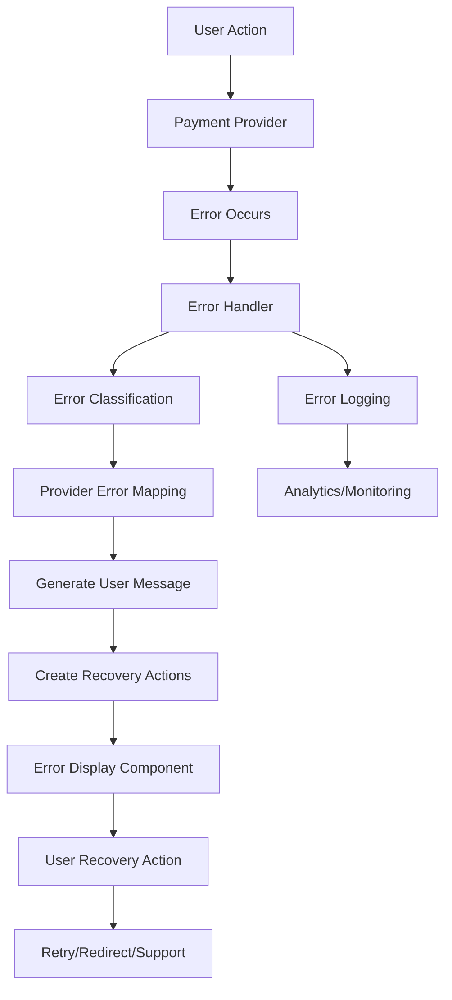

# 🎨 CREATIVE PHASE: ERROR HANDLING STRATEGY

**Project**: XELA Finance Management System  
**Task**: Discount Integration into Payment Providers  
**Creative Phase**: Error Handling Strategy Design  
**Date**: Current Session  

---

## 📋 PROBLEM STATEMENT

Design a comprehensive, user-friendly error handling strategy for discount-related issues across multiple payment providers (Paddle, MetaMask, and future providers). The system must provide clear, actionable feedback to users while maintaining consistency across different payment flows and error scenarios.

### Key Challenges:
1. **Multi-Provider Consistency**: Different payment providers may have different error patterns
2. **User Experience**: Technical errors need to be translated to user-friendly messages
3. **Error Recovery**: Users should be able to recover from errors without losing progress
4. **Extensibility**: Error handling must work for future payment providers

---

## 🔍 OPTIONS ANALYSIS

### Option 1: Provider-Specific Error Handlers
**Description**: Each payment provider has its own error handling logic with provider-specific error translation.

**Pros**:
- Allows fine-tuned error handling per provider
- Can leverage provider-specific error codes and messages
- Simple to implement initially
- Provider-specific context can be preserved

**Cons**:
- Inconsistent user experience across providers
- Code duplication for common error scenarios
- Difficult to maintain as providers are added
- No centralized error handling strategy

**Complexity**: Low  
**Implementation Time**: 1-2 days  

### Option 2: Unified Error Handler with Provider Adapters
**Description**: Central error handling system with provider-specific adapters that translate errors to a common format.

**Pros**:
- Consistent user experience across all providers
- Centralized error handling logic
- Easy to add new providers
- Common error recovery patterns
- Reusable error translation logic

**Cons**:
- More complex initial implementation
- Need to map provider errors to common format
- Potential loss of provider-specific context

**Complexity**: Medium  
**Implementation Time**: 3-4 days  

### Option 3: Layered Error Handling System
**Description**: Multi-layer approach with technical error layer, business logic layer, and user presentation layer.

**Pros**:
- Separation of concerns
- Highly maintainable and extensible
- Rich error context preservation
- Sophisticated error recovery options
- Easy testing and debugging

**Cons**:
- Higher implementation complexity
- Over-engineering for current needs
- Longer development time
- More abstraction layers to maintain

**Complexity**: High  
**Implementation Time**: 5-7 days  

### Option 4: Hybrid Error Context System
**Description**: Combines unified error handling with contextual error information, using error codes and user-friendly messages with recovery actions.

**Pros**:
- Best of both worlds - consistency and context
- Extensible error classification system
- Clear user feedback with actionable recovery
- Maintains provider context when needed
- Progressive enhancement approach

**Cons**:
- Medium complexity implementation
- Need to design error taxonomy
- Requires comprehensive error mapping

**Complexity**: Medium  
**Implementation Time**: 3-4 days  

---

## 🎯 DECISION

**Selected Option**: **Option 4 - Hybrid Error Context System**

### Rationale:
1. **User Experience**: Provides consistent, clear error messages with actionable recovery steps
2. **Developer Experience**: Maintains technical context while simplifying error handling
3. **Extensibility**: Easy to add new providers and error types
4. **Maintainability**: Centralized error logic with provider flexibility
5. **Implementation Balance**: Reasonable complexity for significant benefits

---

## 🏗️ IMPLEMENTATION PLAN

### 1. Error Classification System

#### Error Categories:
```typescript
enum DiscountErrorCategory {
  VALIDATION = 'validation',      // Code format, existence
  ELIGIBILITY = 'eligibility',    // User eligibility, usage limits
  EXPIRATION = 'expiration',      // Time-based restrictions
  APPLICABILITY = 'applicability', // Plan/price compatibility
  PROVIDER = 'provider',          // Payment provider specific
  NETWORK = 'network',            // Network/connectivity issues
  SYSTEM = 'system'              // Internal system errors
}
```

#### Error Severity Levels:
```typescript
enum ErrorSeverity {
  INFO = 'info',        // Informational messages
  WARNING = 'warning',  // Warnings that don't block flow
  ERROR = 'error',      // Blocking errors with recovery
  CRITICAL = 'critical' // System errors requiring support
}
```

### 2. Error Context Interface

```typescript
interface DiscountError {
  category: DiscountErrorCategory;
  severity: ErrorSeverity;
  code: string;
  message: string;
  userMessage: string;
  recoveryActions: RecoveryAction[];
  context: {
    provider: PaymentProvider;
    discountCode?: string;
    discountId?: string;
    timestamp: Date;
    userId?: string;
  };
}

interface RecoveryAction {
  type: 'retry' | 'redirect' | 'contact_support' | 'try_different_code';
  label: string;
  action: () => void;
}
```

### 3. Error Handler Architecture

```typescript
class DiscountErrorHandler {
  private errorMap: Map<string, DiscountError>;
  
  constructor() {
    this.initializeErrorMap();
  }
  
  handleError(
    error: any, 
    provider: PaymentProvider, 
    context: Partial<DiscountError['context']>
  ): DiscountError {
    // 1. Identify error type
    // 2. Map to standardized error
    // 3. Add contextual information
    // 4. Generate recovery actions
    // 5. Return formatted error
  }
  
  private mapProviderError(error: any, provider: PaymentProvider): string {
    // Provider-specific error mapping
  }
  
  private generateRecoveryActions(error: DiscountError): RecoveryAction[] {
    // Context-aware recovery action generation
  }
}
```

### 4. User Interface Components

#### Error Display Component:
```typescript
interface ErrorDisplayProps {
  error: DiscountError;
  onRetry?: () => void;
  onDismiss?: () => void;
}

const ErrorDisplay: React.FC<ErrorDisplayProps> = ({ error, onRetry, onDismiss }) => {
  return (
    <Alert variant={getAlertVariant(error.severity)}>
      <AlertIcon severity={error.severity} />
      <AlertDescription>
        <div className="space-y-3">
          <p>{error.userMessage}</p>
          {error.recoveryActions.length > 0 && (
            <div className="flex gap-2">
              {error.recoveryActions.map((action, index) => (
                <Button
                  key={index}
                  variant={index === 0 ? "default" : "outline"}
                  size="sm"
                  onClick={action.action}
                >
                  {action.label}
                </Button>
              ))}
            </div>
          )}
        </div>
      </AlertDescription>
    </Alert>
  );
};
```

### 5. Error Mapping Configuration

#### Common Discount Errors:
```typescript
const DISCOUNT_ERROR_MAP = {
  // Validation Errors
  'DISCOUNT_NOT_FOUND': {
    category: DiscountErrorCategory.VALIDATION,
    severity: ErrorSeverity.ERROR,
    userMessage: 'The discount code you entered is not valid. Please check the code and try again.',
    recoveryActions: ['try_different_code', 'contact_support']
  },
  
  // Eligibility Errors
  'USER_LIMIT_EXCEEDED': {
    category: DiscountErrorCategory.ELIGIBILITY,
    severity: ErrorSeverity.ERROR,
    userMessage: 'You have already used this discount code. Please try a different code.',
    recoveryActions: ['try_different_code']
  },
  
  'FIRST_TIME_USER_ONLY': {
    category: DiscountErrorCategory.ELIGIBILITY,
    severity: ErrorSeverity.ERROR,
    userMessage: 'This discount is only available for new customers.',
    recoveryActions: ['try_different_code']
  },
  
  // Expiration Errors
  'DISCOUNT_EXPIRED': {
    category: DiscountErrorCategory.EXPIRATION,
    severity: ErrorSeverity.ERROR,
    userMessage: 'This discount code has expired. Please try a different code.',
    recoveryActions: ['try_different_code']
  },
  
  // Applicability Errors
  'DISCOUNT_NOT_APPLICABLE': {
    category: DiscountErrorCategory.APPLICABILITY,
    severity: ErrorSeverity.ERROR,
    userMessage: 'This discount cannot be applied to your selected plan. Please try a different code.',
    recoveryActions: ['try_different_code']
  },
  
  // Provider Errors
  'PADDLE_DISCOUNT_ERROR': {
    category: DiscountErrorCategory.PROVIDER,
    severity: ErrorSeverity.ERROR,
    userMessage: 'There was an issue applying the discount. Please try again.',
    recoveryActions: ['retry', 'contact_support']
  },
  
  // Network Errors
  'NETWORK_ERROR': {
    category: DiscountErrorCategory.NETWORK,
    severity: ErrorSeverity.WARNING,
    userMessage: 'Connection issue while validating discount. Please check your connection and try again.',
    recoveryActions: ['retry']
  }
};
```

### 6. Integration Points

#### Payment Provider Integration:
```typescript
// In useCheckoutHandler.ts
const handleDiscountError = (error: any, provider: PaymentProvider) => {
  const discountError = errorHandler.handleError(error, provider, {
    discountCode: appliedDiscount?.discount?.code,
    discountId: appliedDiscount?.discount?.id,
    userId: user?.id
  });
  
  // Display error to user
  setError(discountError);
  
  // Log for debugging
  console.error('Discount Error:', discountError);
};
```

#### Backend Integration:
```typescript
// In discount validation service
try {
  const result = await this.validateDiscount(data, userId);
  return result;
} catch (error) {
  throw new DiscountValidationError(
    this.mapToDiscountErrorCode(error),
    error.message,
    { discountCode: data.code, userId }
  );
}
```

---

## 📊 IMPLEMENTATION ARCHITECTURE



---

## 🎨 CREATIVE CHECKPOINT: ERROR TAXONOMY DESIGNED

### Error Handling Strategy Benefits:
1. **Consistent UX**: Same error patterns across all payment providers
2. **Clear Recovery**: Users know exactly what to do when errors occur
3. **Extensible**: Easy to add new error types and providers
4. **Maintainable**: Centralized error logic with provider flexibility
5. **Debuggable**: Rich context for troubleshooting

---

🎨🎨🎨 EXITING CREATIVE PHASE - ERROR HANDLING DECISION MADE 🎨🎨🎨 