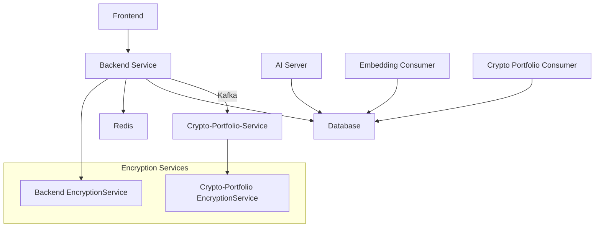
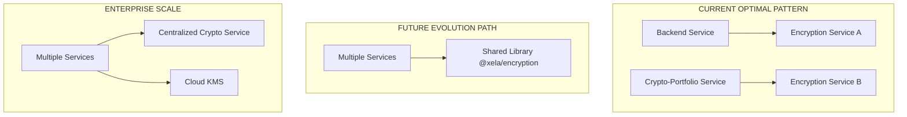

# 🎨 CREATIVE PHASE: ENCRYPTION ARCHITECTURE PATTERN SELECTION

**Date**: 2025-06-02  
**Phase Type**: Architecture Design  
**Decision Required**: Optimal encryption service pattern for XELA Finance Management System

---

## 📋 PROBLEM STATEMENT

**Challenge**: Determine the most suitable encryption architecture pattern for the XELA Finance Management System, considering current scale, future growth, security requirements, and development efficiency.

**Context**: 
- Currently: 2 services using encryption (backend + crypto-portfolio-service)
- Architecture: Microservices with Docker deployment
- Scale: 6+ total services identified (backend, crypto-portfolio-service, ai_server, embedding_consumer, crypto_portfolio_consumer, frontend)
- Team: Small development team (estimated 1-3 developers)
- Stage: Growth-stage fintech with expansion plans
- Requirements: Secure API key encryption, regulatory compliance potential, performance optimization

---

## 🔍 CURRENT STATE ANALYSIS

### Existing Architecture:


### Current Encryption Usage:
- **Backend**: Encrypts API keys before Kafka transmission
- **Crypto-Portfolio-Service**: Decrypts API keys for exchange integration
- **Other Services**: Currently no direct encryption needs identified
- **Future Services**: Likely expansion with additional financial integrations

---

## 🎯 OPTIONS ANALYSIS

### Option 1: Keep Current Duplicated Services
**Description**: Maintain identical encryption services in each microservice that needs encryption
**Implementation**: Continue with current Web Crypto API duplication

**Pros**:
- ✅ **Zero Migration Effort**: Already working perfectly
- ✅ **Service Independence**: No external dependencies
- ✅ **Maximum Performance**: No network latency
- ✅ **Fault Tolerance**: No single point of failure
- ✅ **Simple Deployment**: Each service self-contained
- ✅ **Development Velocity**: Fast iteration, no coordination needed

**Cons**:
- ❌ **Code Duplication**: ~300 lines duplicated per service
- ❌ **Maintenance Overhead**: Changes require updates to multiple services
- ❌ **Key Management Complexity**: Master key distribution across services
- ❌ **Audit Challenges**: Multiple encryption implementations to audit
- ❌ **Scaling Issues**: Becomes problematic with 5+ services

**Complexity**: Low  
**Implementation Time**: 0 (already done)  
**Maintenance Effort**: Medium (increases with service count)  
**Best For**: 2-4 services, fast development cycles

---

### Option 2: Shared Encryption Library (@xela/encryption)
**Description**: Extract encryption logic into a shared npm package used across all services
**Implementation**: Create @xela/encryption package, publish to private registry

**Pros**:
- ✅ **DRY Principle**: Single source of truth for encryption logic
- ✅ **Consistent Updates**: Changes propagate to all services
- ✅ **Easier Maintenance**: Update once, deploy everywhere
- ✅ **Scalable**: Handles 10+ services efficiently
- ✅ **Version Control**: Semantic versioning for encryption logic
- ✅ **Testing**: Centralized test suite

**Cons**:
- ❌ **Infrastructure Complexity**: Need private npm registry
- ❌ **Deployment Coordination**: All services must update library versions
- ❌ **Potential Breaking Changes**: Library updates can break dependent services
- ❌ **Additional Abstraction**: More layers to debug
- ❌ **Monorepo Consideration**: May require restructuring

**Complexity**: Medium  
**Implementation Time**: 2-3 days  
**Maintenance Effort**: Low-Medium  
**Best For**: 5-15 services, mature development processes

---

### Option 3: Centralized Encryption Microservice
**Description**: Dedicated encryption service handling all cryptographic operations via HTTP/gRPC
**Implementation**: New microservice exposing encrypt/decrypt endpoints

**Pros**:
- ✅ **Security Centralization**: Single audit point for encryption
- ✅ **Hardware Security Module Ready**: Easy HSM integration
- ✅ **Advanced Features**: Key rotation, audit trails, compliance reporting
- ✅ **Language Agnostic**: Any service language can use REST/gRPC
- ✅ **Regulatory Compliance**: Easier SOC2, PCI-DSS compliance
- ✅ **Monitoring**: Centralized encryption metrics and alerting

**Cons**:
- ❌ **Performance Impact**: Network latency for every encryption operation
- ❌ **Single Point of Failure**: Service downtime affects all encryption
- ❌ **Infrastructure Overhead**: Additional service to maintain
- ❌ **Complexity**: Authentication, authorization, rate limiting needed
- ❌ **Over-Engineering**: Massive overkill for current needs

**Complexity**: High  
**Implementation Time**: 1-2 weeks  
**Maintenance Effort**: High  
**Best For**: 20+ services, enterprise compliance requirements

---

### Option 4: Cloud Key Management Service (AWS KMS/Azure Key Vault)
**Description**: Use cloud provider's managed encryption and key management services
**Implementation**: Integrate AWS KMS or Azure Key Vault for encryption operations

**Pros**:
- ✅ **Enterprise Security**: Military-grade security and compliance
- ✅ **Key Rotation**: Automatic key management and rotation
- ✅ **Audit Trails**: Complete encryption operation logging
- ✅ **Compliance**: Pre-certified for major compliance frameworks
- ✅ **Global Scale**: Multi-region key availability
- ✅ **Zero Maintenance**: Managed service, no infrastructure overhead

**Cons**:
- ❌ **Cloud Vendor Lock-in**: Tied to specific cloud provider
- ❌ **Cost**: $1+ per 10k operations, can become expensive
- ❌ **Latency**: Network calls for every encryption operation
- ❌ **Internet Dependency**: Requires stable internet connectivity
- ❌ **Complexity**: IAM policies, permissions, SDK integration
- ❌ **Over-Engineering**: Excessive for current scale

**Complexity**: High  
**Implementation Time**: 1 week  
**Maintenance Effort**: Low  
**Best For**: Enterprise scale, regulatory compliance, multi-cloud deployments

---

## 🏆 DECISION MATRIX

| Criteria | Current (Option 1) | Shared Lib (Option 2) | Microservice (Option 3) | Cloud KMS (Option 4) |
|----------|-------------------|----------------------|-------------------------|---------------------|
| **Current Fit** | ⭐⭐⭐⭐⭐ | ⭐⭐⭐ | ⭐ | ⭐ |
| **Performance** | ⭐⭐⭐⭐⭐ | ⭐⭐⭐⭐⭐ | ⭐⭐ | ⭐⭐ |
| **Maintenance** | ⭐⭐⭐ | ⭐⭐⭐⭐ | ⭐⭐ | ⭐⭐⭐⭐⭐ |
| **Scalability** | ⭐⭐ | ⭐⭐⭐⭐ | ⭐⭐⭐⭐⭐ | ⭐⭐⭐⭐⭐ |
| **Security** | ⭐⭐⭐⭐ | ⭐⭐⭐⭐ | ⭐⭐⭐⭐⭐ | ⭐⭐⭐⭐⭐ |
| **Development Speed** | ⭐⭐⭐⭐⭐ | ⭐⭐⭐ | ⭐⭐ | ⭐⭐ |
| **Cost** | ⭐⭐⭐⭐⭐ | ⭐⭐⭐⭐ | ⭐⭐⭐ | ⭐⭐ |
| **Complexity** | ⭐⭐⭐⭐⭐ | ⭐⭐⭐ | ⭐⭐ | ⭐⭐ |

**Total Score**: Option 1: 37/40 | Option 2: 30/40 | Option 3: 23/40 | Option 4: 26/40

---

## 🎯 RECOMMENDED DECISION

### **Selected Option: Keep Current Duplicated Services (Option 1)**

**Rationale**:
1. **Perfect Current Fit**: Exactly matches your current needs and scale
2. **Proven Success**: Already working flawlessly with cross-service compatibility
3. **Development Velocity**: Allows rapid iteration without coordination overhead
4. **Technical Debt Management**: Acceptable trade-off for current scale
5. **Future Flexibility**: Easy to migrate to Option 2 when needed

---

## 📈 STRATEGIC MIGRATION PATH

### Phase 1: Current State (0-5 services) ✅ **CURRENT**
- **Pattern**: Duplicated encryption services
- **Timeline**: Now - Next 6 months
- **Trigger to Upgrade**: When 3rd service needs encryption

### Phase 2: Shared Library (5-15 services) 🔮 **FUTURE**
- **Pattern**: @xela/encryption npm package
- **Timeline**: 6-18 months
- **Implementation Strategy**:
  ```bash
  # Create shared library
  npm init @xela/encryption
  
  # Migrate services incrementally
  npm install @xela/encryption
  ```

### Phase 3: Enterprise (15+ services) 🔮 **LONG-TERM**
- **Pattern**: Centralized service or Cloud KMS
- **Timeline**: 18+ months
- **Triggers**: Regulatory requirements, 20+ services, compliance audits

---

## 🛠️ IMPLEMENTATION PLAN (NO ACTION NEEDED)

### Immediate Actions (Next Sprint):
- ✅ **NONE REQUIRED** - Current implementation is optimal
- ✅ **Document Decision**: Update architecture documentation
- ✅ **Monitor Metrics**: Track encryption service performance

### Preparation for Future Migration (Next 6 months):
- 📝 **Watch for Trigger**: Monitor when 3rd service needs encryption
- 📋 **Prepare Migration Plan**: Draft shared library extraction strategy
- 🔍 **Performance Baseline**: Establish current encryption metrics

### Decision Review Points:
- **3 Months**: Reassess if new services are adding encryption
- **6 Months**: Review if code duplication becomes maintenance burden
- **12 Months**: Evaluate against shared library benefits

---

## 📊 COMPLIANCE AND SECURITY CONSIDERATIONS

### Current Security Posture:
- ✅ **AES-256-GCM**: Industry standard encryption
- ✅ **PBKDF2**: OWASP-compliant key derivation
- ✅ **Zero Dependencies**: No third-party crypto libraries
- ✅ **Audit Ready**: Simple, auditable implementation

### Future Compliance Readiness:
- **SOC 2**: Current implementation supports required controls
- **PCI-DSS**: May require centralized approach for payment processing
- **GDPR**: Data encryption requirements already met
- **ISO 27001**: Current security practices align with standards

---

## 🔄 MONITORING AND SUCCESS METRICS

### Key Performance Indicators:
- **Development Velocity**: Time to add encryption to new services
- **Maintenance Overhead**: Hours spent updating encryption across services
- **Code Duplication**: Lines of duplicated encryption code
- **Security Incidents**: Encryption-related security issues

### Success Criteria:
- ✅ **Performance**: Encryption operations < 10ms
- ✅ **Reliability**: 99.9% encryption success rate
- ✅ **Maintainability**: Code changes deployable within 1 day
- ✅ **Security**: Zero encryption-related vulnerabilities

---

## 🎨 CREATIVE CHECKPOINT: Architecture Visualization



🎨🎨🎨 EXITING CREATIVE PHASE - DECISION MADE 🎨🎨🎨

## 📋 FINAL RECOMMENDATION SUMMARY

**Decision**: **Keep Current Duplicated Encryption Services**

**Why This is Perfect for XELA**:
- 🎯 **Optimal for Current Scale**: 2-service architecture with proven compatibility
- ⚡ **Maximum Performance**: Zero network latency, native speed
- 🚀 **Development Velocity**: Fast iteration without coordination overhead
- 💰 **Cost Effective**: No additional infrastructure or licensing costs
- 🛡️ **Security**: Industry-standard encryption with simple audit trail
- 🔄 **Future Ready**: Clear migration path when scale demands it

**Next Steps**: No immediate action required - current implementation is architecturally sound and business-optimal for your growth stage. 