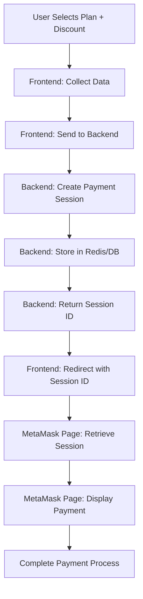

# 🎨 CREATIVE PHASE: SECURE PAYMENT SESSION MANAGEMENT

**Project**: XELA Finance Management System  
**Task**: Discount Integration into Payment Providers  
**Creative Phase**: Payment Session Security Architecture  
**Date**: Current Session  

---

## 📋 PROBLEM STATEMENT

Design a secure method for passing payment data to MetaMask checkout that eliminates sensitive information from URL parameters while maintaining a smooth user experience. The current implementation exposes payment amounts, plan IDs, and potentially discount information through URL parameters, creating security vulnerabilities.

### Key Requirements:
1. **Eliminate URL Parameter Exposure**: Remove sensitive payment data from URLs
2. **Maintain User Experience**: Ensure seamless checkout flow
3. **Support Discount Integration**: Accommodate discount data securely
4. **Industry Best Practices**: Follow established security patterns

---

## 🔍 OPTIONS ANALYSIS

### Option 1: Frontend State Management (Redux/Context)
**Description**: Store payment data in frontend state and pass to MetaMask page
**Pros**:
- Simple implementation
- No backend changes required
- Immediate availability of data
**Cons**:
- Data lost on page refresh/navigation
- Still vulnerable to client-side inspection
- No protection against direct URL access
**Complexity**: Low
**Security Score**: 2/10

### Option 2: Browser Storage (localStorage/sessionStorage)
**Description**: Store payment data in browser storage with encrypted keys
**Pros**:
- Survives page refresh
- Better than URL parameters
- Client-side only solution
**Cons**:
- Still client-side vulnerable
- Limited encryption on frontend
- Persistent storage concerns
**Complexity**: Medium
**Security Score**: 4/10

### Option 3: Encrypted URL Tokens
**Description**: Encrypt payment data and pass as single URL parameter
**Pros**:
- Bookmarkable
- No backend session required
- Single parameter approach
**Cons**:
- Complex encryption/decryption
- Still URL-based
- Performance overhead
**Complexity**: High
**Security Score**: 6/10

### Option 4: Temporary Backend Session ⭐
**Description**: Create secure backend session with payment data, pass session ID
**Pros**:
- Industry standard approach
- Complete URL security
- Server-side data validation
- Scalable architecture
- Easy discount integration
**Cons**:
- Requires backend implementation
- Session management overhead
**Complexity**: Medium
**Security Score**: 9/10

---

## 🏆 DECISION: TEMPORARY BACKEND SESSION

**Selected Approach**: Option 4 - Temporary Backend Session

### 🔬 Research Validation

Real-world research confirms this as the industry standard:

#### **Stripe Checkout Session Pattern**
```javascript
// Backend: Create checkout session
const session = await stripe.checkout.sessions.create({
  payment_method_types: ['card'],
  line_items: [{
    price_data: { amount: 2000, currency: 'usd' },
    quantity: 1,
  }],
  mode: 'payment',
  success_url: `${domain}/success?session_id={CHECKOUT_SESSION_ID}`,
});

// Frontend: Redirect with session ID only
window.location.href = `/checkout?session_id=${session.id}`;
```

#### **PayPal Session Management**
```javascript
// Backend: Create order session
const order = await createOrder(cartData);

// Frontend: Redirect with order ID
window.location.href = `/payment?order_id=${order.id}`;
```

#### **Square Session Pattern**
```javascript
// Backend: Create payment session
const payment = await squareClient.paymentsApi.createPayment({
  sourceId: 'nonce',
  idempotencyKey: uuid(),
  amountMoney: { amount: 100, currency: 'USD' }
});

// Frontend: Use session reference
return { sessionId: payment.result.payment.id };
```

### 🛡️ Security Benefits

1. **URL Parameter Elimination**: No sensitive data in URLs
2. **Server-Side Validation**: Payment data validated on backend
3. **Session Expiration**: Automatic cleanup of temporary data
4. **Audit Trail**: Server-side logging of payment sessions
5. **CSRF Protection**: Session-based protection mechanisms

### 🎯 Implementation Architecture



---

## 🔧 IMPLEMENTATION SPECIFICATIONS

### **Backend Payment Session Service**

```typescript
interface PaymentSessionData {
  planId: string;
  amount: number;
  currency: string;
  planName: string;
  billingInterval: string;
  discountId?: string;
  discountAmount?: number;
  userId: string;
  expiresAt: Date;
}

class PaymentSessionService {
  async createSession(data: PaymentSessionData): Promise<string> {
    const sessionId = generateUUID();
    const expiresAt = new Date(Date.now() + 15 * 60 * 1000); // 15 minutes
    
    await this.sessionStore.set(sessionId, {
      ...data,
      expiresAt
    });
    
    return sessionId;
  }
  
  async getSession(sessionId: string): Promise<PaymentSessionData | null> {
    const session = await this.sessionStore.get(sessionId);
    
    if (!session || new Date() > session.expiresAt) {
      await this.sessionStore.delete(sessionId);
      return null;
    }
    
    return session;
  }
}
```

### **Frontend Integration**

```typescript
// Modified useCheckoutHandler
const handleMetaMaskCheckout = async (formData: SubscriptionFormData) => {
  const sessionData = {
    planId: selectedPlan.id,
    amount: selectedPrice.unitPrice.amount,
    currency: 'USD',
    planName: selectedPlan.name,
    billingInterval: formData.billingInterval,
    discountId: formData.discountCode?.id,
    userId: user.id
  };
  
  const response = await createPaymentSession(sessionData);
  router.push(`/payment/metamask?session=${response.sessionId}`);
};
```

### **MetaMask Page Data Retrieval**

```typescript
// /payment/metamask/page.tsx
const MetaMaskPaymentPage = () => {
  const [paymentData, setPaymentData] = useState<PaymentSessionData | null>(null);
  const searchParams = useSearchParams();
  
  useEffect(() => {
    const sessionId = searchParams.get('session');
    if (sessionId) {
      getPaymentSession(sessionId).then(setPaymentData);
    }
  }, []);
  
  // Rest of component logic
};
```

---

## 📊 INTEGRATION WITH DISCOUNT SYSTEM

### **Discount Data Flow**

1. **Frontend Validation**: Discount code validated via existing `useDiscountValidation`
2. **Session Creation**: Discount ID and calculated amount included in session
3. **Backend Verification**: Session creation re-validates discount
4. **Payment Processing**: Discount applied during MetaMask payment creation

### **Session Data Structure with Discounts**

```typescript
interface PaymentSessionWithDiscount extends PaymentSessionData {
  discount?: {
    id: string;
    code: string;
    type: 'PERCENTAGE' | 'FIXED';
    value: number;
    appliedAmount: number;
    finalAmount: number;
  };
}
```

---

## 🎨🎨🎨 EXITING CREATIVE PHASE - DECISION MADE 🎨🎨🎨

**Final Decision**: Implement Temporary Backend Session architecture for secure MetaMask payment data handling.

**Key Implementation Points**:
1. Create PaymentSession service with Redis/database storage
2. Modify useCheckoutHandler to create sessions instead of URL parameters
3. Update MetaMask payment page to retrieve session data
4. Integrate discount information securely within session data
5. Implement session expiration and cleanup mechanisms

This approach aligns with industry standards used by Stripe, PayPal, and Square, providing maximum security while maintaining an excellent user experience. 