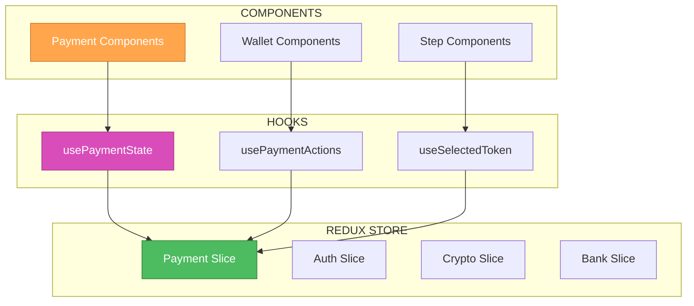
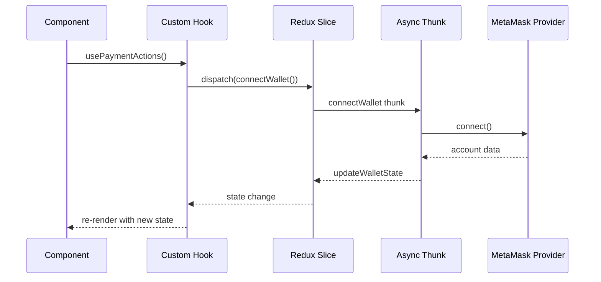

# 🎨 CREATIVE PHASE: PAYMENT STATE ARCHITECTURE

**Date**: 2024-12-28  
**Phase Type**: Architecture Design  
**Component**: Payment State Management  
**Current Implementation**: Context API with 8 separate contexts  

## 🎯 PROBLEM STATEMENT

The current PaymentContext.tsx uses a complex Context API setup with 8 separate contexts to manage payment flow state. This creates several architectural concerns:

1. **Performance Issues**: Multiple context providers can cause unnecessary re-renders
2. **Complexity**: 8 separate contexts make the code harder to maintain and understand
3. **Testing Challenges**: Complex context setup makes unit testing difficult
4. **State Persistence**: Context state is lost on page refresh, problematic for payment flows
5. **DevTools**: Limited debugging capabilities compared to Redux DevTools

The project already has Redux Toolkit configured with auth, crypto, and bank slices, suggesting a preference for centralized state management.

## 🏗️ COMPONENT ANALYSIS

### Current Context Architecture
```
PaymentContextProvider
├── PaymentStateContext (selectedToken, cryptoAmount, usdPrice, etc.)
├── PaymentActionsContext (updatePaymentState, resetPaymentSteps, etc.)
├── LoadingStateContext (isPaymentLoading, isConnecting, etc.)
├── LoadingActionsContext (updateLoadingState)
├── WalletStateContext (account, isConnected, supportedTokens)
├── WalletActionsContext (handleConnect, handleDisconnect, etc.)
├── PaymentFlowStateContext (paymentData, isPaymentButtonDisabled, etc.)
└── PaymentFlowActionsContext (handlePayment, onPaymentSuccess, etc.)
```

### Core State Categories
1. **Payment State**: Token selection, amounts, pricing
2. **Loading State**: Various loading indicators
3. **Wallet State**: Connection status, account info
4. **Payment Flow State**: Step tracking, button states

### Key Interactions
- MetaMask Provider → Wallet State
- GraphQL Queries → Payment State (pricing)
- Payment Flow → All State Categories
- UI Components → All Contexts via hooks

## 🔄 ARCHITECTURE OPTIONS

### Option 1: Keep Current Context API
**Description**: Maintain the existing 8-context architecture with potential optimizations

**Pros**:
- No migration effort required
- Component-scoped state (doesn't pollute global store)
- Direct prop passing to provider
- Familiar pattern for team

**Cons**:
- Performance issues with multiple providers
- Complex testing setup
- No state persistence
- Limited debugging tools
- High maintenance overhead
- Re-render optimization challenges

**Technical Fit**: Medium  
**Complexity**: High (due to 8 contexts)  
**Scalability**: Low  
**Maintenance**: Low  

### Option 2: Single Context with useReducer
**Description**: Consolidate into one context using useReducer for state management

**Pros**:
- Reduced provider nesting
- Better performance than multiple contexts
- Centralized state logic
- Easier testing than current setup

**Cons**:
- Still no persistence
- Limited debugging compared to Redux
- Custom reducer logic needed
- No time-travel debugging

**Technical Fit**: Medium  
**Complexity**: Medium  
**Scalability**: Medium  
**Maintenance**: Medium  

### Option 3: Redux Toolkit Slice (Recommended)
**Description**: Create a payment slice using Redux Toolkit, following existing patterns

**Pros**:
- Consistent with existing architecture (auth, crypto, bank slices)
- Excellent debugging with Redux DevTools
- State persistence capabilities
- Better performance with selector optimizations
- Easier unit testing
- Time-travel debugging
- Centralized state management
- Built-in async thunk support
- Immer integration for immutable updates

**Cons**:
- Migration effort required
- Global state (though can be scoped)
- Learning curve for team members unfamiliar with Redux

**Technical Fit**: High  
**Complexity**: Low (with RTK)  
**Scalability**: High  
**Maintenance**: High  

### Option 4: Zustand (Alternative)
**Description**: Use Zustand for lightweight state management

**Pros**:
- Simpler than Redux
- Good performance
- TypeScript support
- Persistence plugins

**Cons**:
- Introduces new dependency
- Different from existing patterns
- Less mature ecosystem
- Team learning curve

**Technical Fit**: Medium  
**Complexity**: Low  
**Scalability**: Medium  
**Maintenance**: Medium  

## 🎯 DECISION

**Chosen Option**: Redux Toolkit Slice (Option 3)

**Rationale**:
1. **Consistency**: Aligns with existing architecture patterns (auth.slice.ts, crypto.slice.ts, bank.slice.ts)
2. **Performance**: Better optimization with selectors and memoization
3. **Developer Experience**: Redux DevTools provide excellent debugging capabilities
4. **Maintainability**: Centralized state logic is easier to maintain and test
5. **Scalability**: Can easily extend for future payment features
6. **Persistence**: Can add persistence middleware if needed
7. **Team Familiarity**: Team already uses Redux for other features

## 🏗️ IMPLEMENTATION PLAN

### Phase 1: Create Payment Slice Structure
```typescript
// state/slices/payment.slice.ts
interface PaymentState {
  // Payment data
  selectedToken: string;
  cryptoAmount: string;
  usdPrice: number;
  tokenBalance: string;
  paymentSteps: PaymentStep[];
  
  // Loading states
  isPaymentLoading: boolean;
  isConnecting: boolean;
  isDisconnecting: boolean;
  isCheckingBalance: boolean;
  priceLoading: boolean;
  subscriptionLoading: boolean;
  
  // Wallet state
  account: string | null;
  isConnected: boolean;
  supportedTokens: TokenInfo[];
  
  // Payment flow
  paymentData: MetaMaskPaymentData | null;
  isPaymentButtonDisabled: boolean;
  paymentButtonText: string;
}
```

### Phase 2: Create Async Thunks
```typescript
// Async actions for complex operations
export const connectWallet = createAsyncThunk(...)
export const disconnectWallet = createAsyncThunk(...)
export const checkTokenBalance = createAsyncThunk(...)
export const processPayment = createAsyncThunk(...)
```

### Phase 3: Create Selectors
```typescript
// Optimized selectors for component consumption
export const selectPaymentState = (state: RootState) => state.payment;
export const selectSelectedToken = (state: RootState) => state.payment.selectedToken;
export const selectIsPaymentLoading = (state: RootState) => state.payment.isPaymentLoading;
// ... more selectors
```

### Phase 4: Create Custom Hooks
```typescript
// Custom hooks for component integration
export const usePaymentState = () => useAppSelector(selectPaymentState);
export const useSelectedToken = () => useAppSelector(selectSelectedToken);
export const usePaymentActions = () => {
  const dispatch = useAppDispatch();
  return {
    updateSelectedToken: (token: string) => dispatch(updateSelectedToken(token)),
    connectWallet: () => dispatch(connectWallet()),
    // ... more actions
  };
};
```

### Phase 5: Migration Strategy
1. Create payment slice alongside existing context
2. Migrate components one by one
3. Remove context provider once all components migrated
4. Clean up unused context code

## 📊 ARCHITECTURE DIAGRAM



## 🔄 DATA FLOW DIAGRAM



## ✅ IMPLEMENTATION CONSIDERATIONS

### Performance Optimizations
- Use `createSelector` for complex derived state
- Implement proper memoization in selectors
- Use `useAppSelector` with specific selectors to prevent unnecessary re-renders

### Error Handling
- Centralize error handling in async thunks
- Use consistent error state patterns
- Implement proper error recovery mechanisms

### Testing Strategy
- Mock Redux store for component tests
- Test async thunks independently
- Use Redux Toolkit's testing utilities

### Migration Risks
- Temporary code duplication during migration
- Potential state synchronization issues
- Component re-testing required

## 🔍 VALIDATION CHECKLIST

### Requirements Met
- [✓] Centralized state management
- [✓] Better performance than current context setup
- [✓] Consistent with existing architecture
- [✓] Improved debugging capabilities
- [✓] Easier testing and maintenance

### Technical Feasibility
- [✓] Redux Toolkit already configured
- [✓] Team familiar with Redux patterns
- [✓] Clear migration path available
- [✓] No breaking changes to external APIs

### Risk Assessment
- **Low Risk**: Well-established patterns in codebase
- **Medium Effort**: Migration requires careful planning
- **High Benefit**: Significant improvement in maintainability and performance

## 🎨 CREATIVE PHASE COMPLETE

**Decision Made**: Migrate from Context API to Redux Toolkit slice  
**Next Steps**: Begin implementation following the phased approach  
**Expected Benefits**: Better performance, debugging, and maintainability  
**Timeline**: 2-3 days for complete migration  

---

**🎨🎨🎨 EXITING CREATIVE PHASE - DECISION MADE 🎨🎨🎨** 