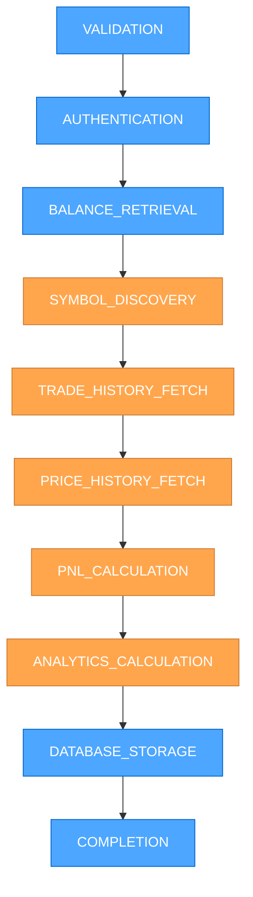
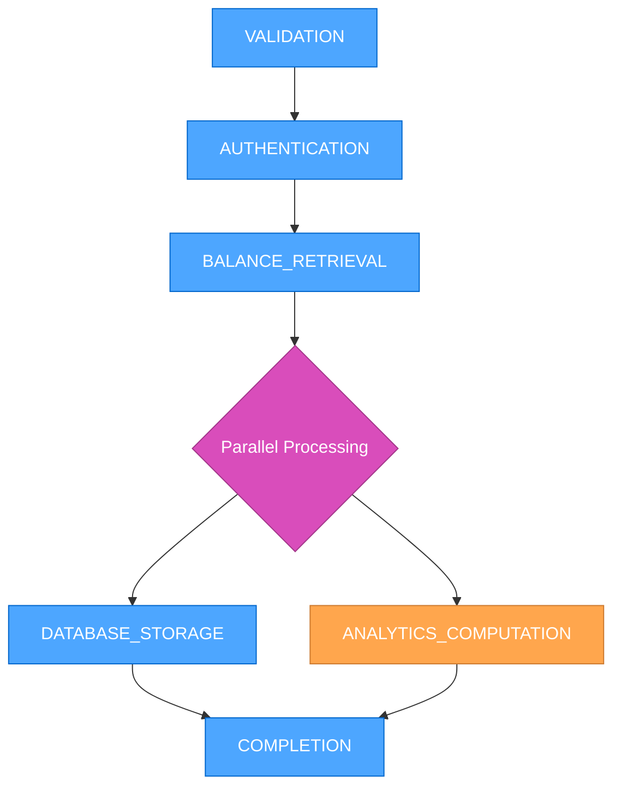
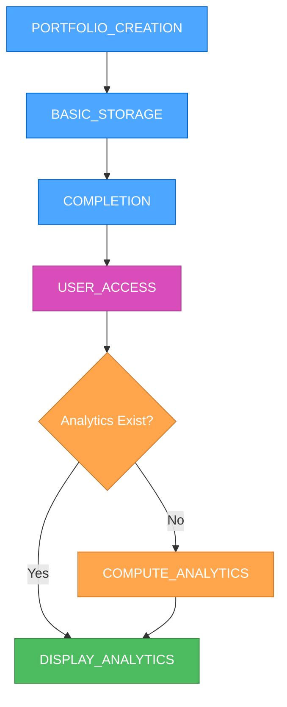
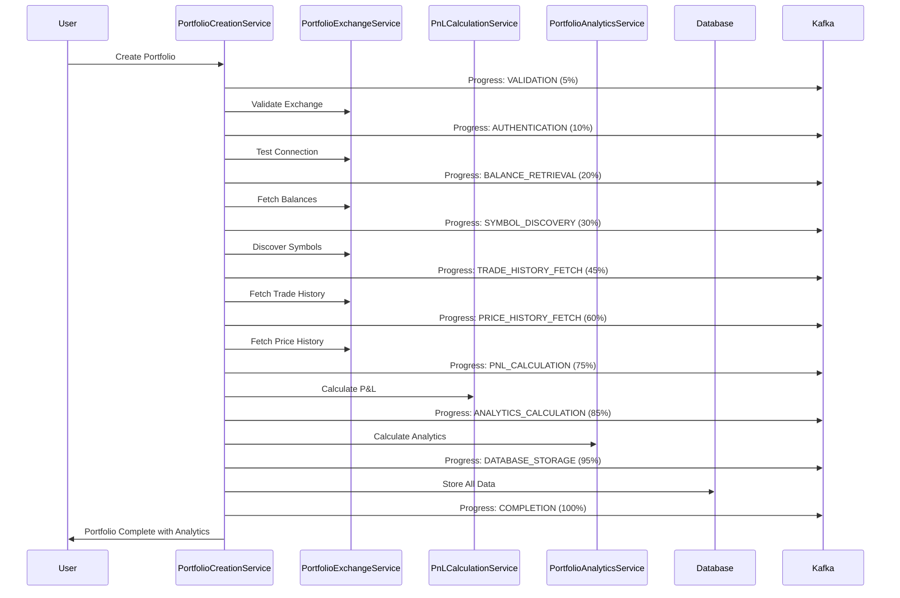

# 🎨 CREATIVE PHASE: PORTFOLIO CREATION & PRECOMPUTATION MERGE

> **TL;DR:** Architectural design to merge the separate precomputation phase into the main portfolio creation workflow, eliminating redundant fields and simplifying the user experience.

## 🧭 PROBLEM STATEMENT

**Current Architecture Issues**:
- **Two-Phase Complexity**: Users experience portfolio creation → separate precomputation phase
- **Redundant Fields**: `CreatePortfolioExecution` has both creation and computation fields
- **Kafka Overhead**: Separate Kafka messages and handlers for computation
- **User Experience Gap**: Portfolio appears "complete" but analytics are still processing
- **Code Duplication**: Similar progress tracking logic in two different services

**Business Requirements**:
- **Seamless Experience**: Portfolio creation should include analytics from the start
- **Single Progress Flow**: One unified progress indicator for the entire process
- **Simplified Architecture**: Reduce complexity and maintenance overhead
- **Better Performance**: Eliminate Kafka message overhead between phases

## 🏗️ ARCHITECTURE OPTIONS ANALYSIS

### Option 1: Sequential Integration (Recommended)
**Description**: Extend portfolio creation steps to include analytics computation as additional steps

**Architecture**:


**Pros**:
- ✅ **Single Service**: All logic in `PortfolioCreationService`
- ✅ **Unified Progress**: One progress bar for entire process
- ✅ **No Kafka Overhead**: Direct method calls instead of message passing
- ✅ **Simplified Model**: Remove computation-specific fields
- ✅ **Better UX**: Portfolio is truly complete when creation finishes
- ✅ **Easier Testing**: Single service to test and debug

**Cons**:
- ❌ **Longer Creation Time**: Users wait longer for "completion"
- ❌ **Service Complexity**: `PortfolioCreationService` becomes larger
- ❌ **Error Handling**: More complex error recovery across more steps

**Technical Fit**: High - Aligns with existing step-based architecture
**Complexity**: Medium - Requires service integration and model cleanup
**Scalability**: High - Eliminates Kafka message overhead

### Option 2: Parallel Processing
**Description**: Run analytics computation in parallel with database storage

**Architecture**:


**Pros**:
- ✅ **Faster Completion**: Basic portfolio ready quickly
- ✅ **Parallel Efficiency**: Analytics don't block basic functionality
- ✅ **Progressive Enhancement**: Basic → Enhanced experience

**Cons**:
- ❌ **Complex Coordination**: Parallel process management
- ❌ **Partial State**: Portfolio exists without complete analytics
- ❌ **Error Complexity**: Handle failures in parallel processes

**Technical Fit**: Medium - Requires parallel processing infrastructure
**Complexity**: High - Complex coordination and error handling
**Scalability**: Medium - Still has coordination overhead

### Option 3: Lazy Loading Analytics
**Description**: Create portfolio immediately, compute analytics on first access

**Architecture**:


**Pros**:
- ✅ **Fast Creation**: Immediate portfolio creation
- ✅ **On-Demand**: Analytics only when needed
- ✅ **Resource Efficient**: No unnecessary computation

**Cons**:
- ❌ **Delayed Analytics**: Users wait when accessing analytics
- ❌ **Complex Caching**: Need to manage analytics lifecycle
- ❌ **Inconsistent UX**: Sometimes fast, sometimes slow

**Technical Fit**: Low - Doesn't align with precomputation goal
**Complexity**: High - Complex caching and lifecycle management
**Scalability**: Medium - Reduces upfront load but increases access latency

## 🎯 DECISION: SEQUENTIAL INTEGRATION

**Chosen Option**: Option 1 - Sequential Integration

**Rationale**:
1. **User Experience**: Portfolio is truly complete with full analytics when creation finishes
2. **Architectural Simplicity**: Single service, single progress flow, no Kafka overhead
3. **Code Maintainability**: Easier to test, debug, and maintain one integrated service
4. **Performance**: Eliminates message passing overhead and reduces system complexity
5. **Business Value**: Delivers on the promise of "precomputed analytics"

## 📋 IMPLEMENTATION PLAN

### Phase 1: Service Integration
**Merge computation logic into PortfolioCreationService**

**New Portfolio Creation Steps**:
```typescript
enum PortfolioCreationStep {
  VALIDATION,
  AUTHENTICATION,
  BALANCE_RETRIEVAL,
  SYMBOL_DISCOVERY,      // New
  TRADE_HISTORY_FETCH,   // New
  PRICE_HISTORY_FETCH,   // New
  PNL_CALCULATION,       // New
  ANALYTICS_CALCULATION, // New
  DATABASE_STORAGE,
  COMPLETION
}
```

**Service Dependencies**:
- Inject `PnLCalculationService` into `PortfolioCreationService`
- Inject `PortfolioAnalyticsService` into `PortfolioCreationService`
- Remove `PortfolioComputationService` (logic moved to creation service)

### Phase 2: Model Cleanup
**Remove redundant computation fields from CreatePortfolioExecution**

**Fields to Remove**:
```typescript
// Remove these computation-specific fields
computationStage?: ComputationStage
symbolsDiscovered?: number
tradesProcessed?: number
pricesProcessed?: number
pnlCalculated?: boolean
analyticsCalculated?: boolean
computationProgress?: number
computationStartedAt?: DateTime
computationCompletedAt?: DateTime
```

**Rationale**: These fields become redundant when computation is part of the main creation flow

### Phase 3: Progress Enhancement
**Enhance progress tracking for extended workflow**

**Progress Mapping**:
```typescript
const STEP_PROGRESS = {
  VALIDATION: 5,
  AUTHENTICATION: 10,
  BALANCE_RETRIEVAL: 20,
  SYMBOL_DISCOVERY: 30,      // New
  TRADE_HISTORY_FETCH: 45,   // New
  PRICE_HISTORY_FETCH: 60,   // New
  PNL_CALCULATION: 75,       // New
  ANALYTICS_CALCULATION: 85, // New
  DATABASE_STORAGE: 95,
  COMPLETION: 100
}
```

### Phase 4: Kafka Cleanup
**Remove computation-specific Kafka infrastructure**

**Remove**:
- `COMPUTE_PORTFOLIO_DATA` topic
- `ComputePortfolioDataMessage` interface
- Computation message handlers in `AppController`
- `PortfolioComputationService` Kafka logic

**Keep**:
- `CRYPTO_PORTFOLIO_CREATION_STATUS` topic (for progress updates)
- Existing progress event publishing

## 🔄 DATA FLOW DESIGN

### Integrated Creation Flow


## 🧪 VALIDATION CRITERIA

### Requirements Validation
- ✅ **Seamless Experience**: Single creation flow with analytics
- ✅ **Unified Progress**: One progress bar for entire process
- ✅ **Simplified Architecture**: Reduced services and complexity
- ✅ **Better Performance**: No Kafka message overhead
- ✅ **Complete Portfolio**: Analytics available immediately upon completion

### Technical Validation
- ✅ **Service Integration**: All computation logic in creation service
- ✅ **Model Cleanup**: Redundant fields removed
- ✅ **Progress Tracking**: Extended step-based progress
- ✅ **Error Handling**: Unified error handling across all steps
- ✅ **Database Consistency**: All data stored in single transaction

### Performance Validation
- ✅ **Reduced Latency**: No message passing between services
- ✅ **Memory Efficiency**: Single service instance handling entire flow
- ✅ **Database Efficiency**: Batch operations for all computed data
- ✅ **Error Recovery**: Simplified retry logic within single service

## 🚀 IMPLEMENTATION BENEFITS

### User Experience
- **Single Progress Flow**: Users see one unified progress bar
- **Complete Portfolio**: Analytics available immediately upon completion
- **Predictable Timing**: Clear expectation of total creation time
- **Better Error Messages**: Unified error handling and recovery

### Developer Experience
- **Simplified Architecture**: One service to maintain instead of two
- **Easier Testing**: Single service integration tests
- **Reduced Complexity**: No Kafka message coordination
- **Better Debugging**: Single call stack for entire process

### System Performance
- **Reduced Overhead**: No Kafka message serialization/deserialization
- **Memory Efficiency**: Single service instance handling entire flow
- **Database Efficiency**: Batch operations for all computed data
- **Simplified Monitoring**: Single service to monitor and alert on

## 📊 RISK ASSESSMENT

### Low Risk
- ✅ **Service Integration**: Well-defined interfaces between services
- ✅ **Model Changes**: Additive changes to existing schema
- ✅ **Progress Updates**: Extending existing progress system

### Medium Risk
- ⚠️ **Creation Time**: Longer creation time may impact user perception
- ⚠️ **Service Size**: Larger service may be harder to maintain
- ⚠️ **Error Complexity**: More steps means more potential failure points

### Mitigation Strategies
- **Creation Time**: Clear progress indicators and time estimates
- **Service Size**: Maintain clear separation of concerns within service
- **Error Handling**: Comprehensive error recovery at each step

## ✅ CREATIVE PHASE COMPLETE

**Architecture Decision**: Sequential Integration of precomputation into main portfolio creation flow

**Key Benefits**:
- Unified user experience with single progress flow
- Simplified architecture with reduced complexity
- Better performance through elimination of Kafka overhead
- Complete portfolio with analytics available immediately

**Implementation Ready**: All components identified, dependencies mapped, and integration plan defined

---

*This creative phase document provides the architectural foundation for merging the precomputation phase into the main portfolio creation workflow.* 