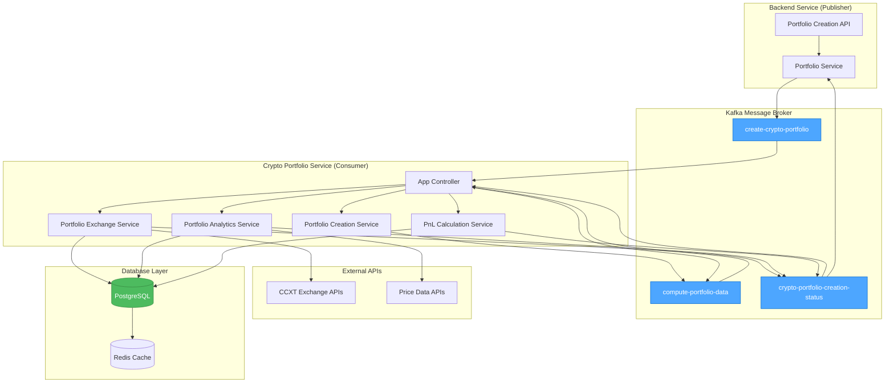
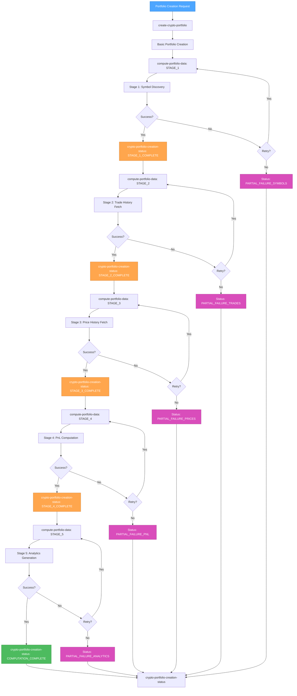

# 🎨 CREATIVE PHASE: Portfolio Data Precomputation Architecture & Algorithm Design

## 🎯 CREATIVE PHASE OVERVIEW
**Feature**: Portfolio Data Precomputation Enhancement  
**Complexity**: Level 3 (Intermediate Feature)  
**Phase**: Architecture & Algorithm Design (REVISED)  
**Date**: 2024-12-28

---

## 🔍 PROBLEM STATEMENT

**Core Challenge**: Transform basic portfolio balance fetching into a comprehensive analytics engine that precomputes:
- Complete trading history across all symbols (including those no longer held)
- Accurate PnL calculations using FIFO cost basis
- Portfolio performance metrics and risk analytics
- Historical price data for valuation accuracy

**Key Technical Challenges**:
1. **Symbol Discovery Problem**: Fetch trades for symbols not in current balance
2. **Computational Intensity**: Processing millions of trades for large portfolios
3. **Rate Limiting**: Managing API calls across 190+ supported exchanges
4. **Data Consistency**: Ensuring accurate financial calculations across large datasets
5. **Integration**: Working with existing Kafka-based consumer architecture

---

## 🏗️ ARCHITECTURE DESIGN DECISIONS

### 🎨 **CREATIVE CHECKPOINT: Architecture Options Analysis (REVISED)**

#### **Option 1: Enhanced Consumer Pattern** 
**Description**: Extend current Kafka consumer to handle staged computation within the same service
**Pros**:
- Works seamlessly with existing Kafka infrastructure
- No additional messaging systems required
- Maintains current deployment patterns
- Leverages existing error handling and retry mechanisms
**Cons**:
- Longer processing times for individual messages
- May require consumer timeout adjustments
- All computation happens in single consumer process
**Complexity**: Low  
**Implementation Time**: 2-3 weeks

#### **Option 2: Multi-Stage Kafka Messages** 
**Description**: Break computation into multiple Kafka messages with staged processing
**Pros**:
- Non-blocking portfolio creation
- Each stage is independent and retryable
- Leverages existing Kafka infrastructure
- Granular progress tracking via Kafka status messages
- Horizontal scaling through consumer groups
**Cons**:
- More complex message coordination
- Multiple Kafka topics required
- State management across messages
**Complexity**: Medium  
**Implementation Time**: 3-4 weeks

#### **Option 3: Hybrid Consumer + Internal Jobs**
**Description**: Use Kafka for triggering but internal job processing for stages
**Pros**:
- Best of both worlds - Kafka integration + internal optimization
- Non-blocking creation with detailed progress
- Internal retry and error handling
**Cons**:
- Introduces additional complexity
- Mixed architectural patterns
- More difficult to monitor and debug
**Complexity**: High  
**Implementation Time**: 5-6 weeks

### 🎯 **ARCHITECTURE DECISION: Multi-Stage Kafka Messages (Option 2)**

**Rationale**: 
- Maintains architectural consistency with existing Kafka-based system
- Enables non-blocking user experience through staged processing
- Provides necessary scalability using existing consumer group patterns
- Allows granular failure recovery and retry logic per stage
- Fits perfectly with existing Kafka topic patterns and status reporting

### 🏗️ **REVISED ARCHITECTURE DESIGN**



### 📊 **KAFKA-BASED DATA FLOW ARCHITECTURE**



### 🔧 **KAFKA TOPICS ENHANCEMENT**

#### **New Kafka Topics Required**
```typescript
export enum KafkaTopic {
    // Existing topics
    CREATE_CRYPTO_PORTFOLIO = "create-crypto-portfolio",
    RETRY_CRYPTO_PORTFOLIO = "retry-crypto-portfolio", 
    UPDATE_CRYPTO_PORTFOLIO_CREDENTIALS = "update-crypto-portfolio-credentials",
    CRYPTO_PORTFOLIO_CREATION_STATUS = "crypto-portfolio-creation-status",
    
    // New computation topics (minimal addition)
    COMPUTE_PORTFOLIO_DATA = "compute-portfolio-data",
    // Removed: PORTFOLIO_STAGE_COMPLETE - using existing status channel
    // Removed: PORTFOLIO_COMPUTATION_RETRY - using existing retry channel
    // Removed: PORTFOLIO_ANALYTICS_READY - using existing status channel
}
```

#### **Message Payload Structures**
```typescript
// Enhanced portfolio creation payload
interface CreatePortfolioPayload {
    userId: number;
    executionId: number;
    exchanges: string;
    apiKey: string;
    secretKey: string;
    passphrase?: string; // Keep optional - some exchanges don't require passphrase
    sandbox?: boolean; // Keep optional - defaults to false
    // Removed: enableFullComputation - we always do full computation
    // Removed: computationStages - we always run all stages in sequence
}

// Computation stage payload
interface ComputePortfolioDataPayload {
    userId: number;
    executionId: number;
    portfolioId: string;
    stage: ComputationStage;
    retryCount: number; // Always track retry count, default 0
    previousStageData: any; // Always provide previous stage context (can be null/empty for first stage)
}

// Enhanced existing status payload (extends current structure)
interface CryptoPortfolioCreationStatusPayload {
    // Existing required fields
    executionId: number;
    currentStep: PortfolioCreationStep;
    currentMilestone: PortfolioCreationMilestone;
    progressPercent: number;
    updatedAt: Date;
    
    // Optional existing fields (keep as-is for backward compatibility)
    statusMessage?: string;
    errorMessage?: string;
    
    // New computation-specific fields - only present when relevant
    computationStage?: ComputationStage; // Only set during computation phases
    stageResults?: any; // Only set when stage completes
    nextStage?: ComputationStage; // Only set when there's a next stage
    isComputationComplete?: boolean; // Only set during computation phases
}

enum ComputationStage {
    SYMBOL_DISCOVERY = "symbol_discovery",
    TRADE_HISTORY = "trade_history", 
    PRICE_HISTORY = "price_history",
    PNL_CALCULATION = "pnl_calculation",
    ANALYTICS_GENERATION = "analytics_generation"
}

// Result interfaces - all fields required since they represent completed computations
interface SymbolDiscoveryResult {
    symbols: string[];
    discoveryMethod: string;
    symbolCount: number;
    discoveredAt: Date;
}

interface TradeHistoryResult {
    totalTrades: number;
    symbolsWithTrades: string[];
    tradesBySymbol: Record<string, number>;
    oldestTradeDate: Date;
    newestTradeDate: Date;
    fetchedAt: Date;
}

interface PnLCalculationResult {
    assetPnLResults: AssetPnLResult[];
    portfolioPnL: PortfolioPnLSummary;
    calculatedAt: Date;
    totalAssets: number;
}

interface AssetPnLResult {
    symbol: string;
    realizedGains: number;
    unrealizedGains: number;
    totalGains: number;
    currentValue: number;
    quantity: number;
    averageCostBasis: number;
    currentPrice: number;
    salesResults: SaleResult[];
    tradingVolume: number;
    tradeCount: number;
    firstTradeDate: Date | null; // Can be null if no trades found
    lastTradeDate: Date | null; // Can be null if no trades found
}
```

### 🔄 **ENHANCED APP CONTROLLER**

```typescript
@Controller()
export class AppController {
    private readonly logger = new Logger(AppController.name);

    constructor(
        @Inject("KAFKA_SERVICE") private readonly kafkaClient: ClientKafka,
        private readonly prisma: PrismaService,
        private readonly portfolioCreationService: PortfolioCreationService,
        private readonly portfolioExchangeService: PortfolioExchangeService,
        private readonly portfolioAnalyticsService: PortfolioAnalyticsService,
        private readonly pnlCalculationService: PnLCalculationService,
    ) {}

    @EventPattern(KafkaTopic.CREATE_CRYPTO_PORTFOLIO)
    async handlePortfolioCreation(
        @Payload() payload: CreatePortfolioPayload,
        @Ctx() context: KafkaContext,
    ) {
        this.logger.log(`📥 Received portfolio creation request for execution ${payload.executionId}`);

        try {
            // Step 1: Create basic portfolio (existing functionality)
            const result = await this.portfolioCreationService.createPortfolio(payload);
            
            // Step 2: Always trigger computation stages (removed enableFullComputation check)
            await this.triggerComputationStages(payload, result.portfolioId);

            this.logger.log(`✅ Portfolio created for execution ${payload.executionId}, portfolio ID: ${result.portfolioId}`);
        } catch (error) {
            this.logger.error(`❌ Failed to process portfolio creation for execution ${payload.executionId}:`, error);
        }
    }

    @EventPattern(KafkaTopic.COMPUTE_PORTFOLIO_DATA)
    async handlePortfolioComputation(
        @Payload() payload: ComputePortfolioDataPayload,
        @Ctx() context: KafkaContext,
    ) {
        this.logger.log(`📊 Processing computation stage ${payload.stage} for portfolio ${payload.portfolioId} (retry: ${payload.retryCount})`);

        try {
            let stageResults: any;
            let nextStage: ComputationStage | undefined;

            switch (payload.stage) {
                case ComputationStage.SYMBOL_DISCOVERY:
                    stageResults = await this.portfolioExchangeService.discoverTradedSymbols(payload);
                    nextStage = ComputationStage.TRADE_HISTORY;
                    break;

                case ComputationStage.TRADE_HISTORY:
                    stageResults = await this.portfolioExchangeService.fetchComprehensiveTradeHistory(payload);
                    nextStage = ComputationStage.PRICE_HISTORY;
                    break;

                case ComputationStage.PRICE_HISTORY:
                    stageResults = await this.portfolioExchangeService.fetchHistoricalPrices(payload);
                    nextStage = ComputationStage.PNL_CALCULATION;
                    break;

                case ComputationStage.PNL_CALCULATION:
                    stageResults = await this.pnlCalculationService.calculatePortfolioPnL(payload);
                    nextStage = ComputationStage.ANALYTICS_GENERATION;
                    break;

                case ComputationStage.ANALYTICS_GENERATION:
                    stageResults = await this.portfolioAnalyticsService.generateAnalytics(payload);
                    nextStage = undefined; // Final stage
                    break;
            }

            // Publish stage completion
            await this.publishStageCompletion(payload, stageResults, nextStage);

        } catch (error) {
            this.logger.error(`❌ Failed computation stage ${payload.stage} for portfolio ${payload.portfolioId}:`, error);
            await this.handleStageFailure(payload, error);
        }
    }

    @EventPattern(KafkaTopic.CRYPTO_PORTFOLIO_CREATION_STATUS)
    async handleStatusUpdate(
        @Payload() payload: CryptoPortfolioCreationStatusPayload,
        @Ctx() context: KafkaContext,
    ) {
        this.logger.log(`📊 Processing status update for execution ${payload.executionId}`);

        try {
            // Check if this is a computation stage completion
            if (payload.computationStage && !payload.isComputationComplete) {
                // Update database with stage results
                await this.updatePortfolioWithStageResults(payload);

                // Trigger next stage if available
                if (payload.nextStage) {
                    const userId = await this.getUserIdFromExecution(payload.executionId);
                    const portfolioId = await this.getPortfolioIdFromExecution(payload.executionId);
                    
                    const nextStagePayload: ComputePortfolioDataPayload = {
                        userId,
                        executionId: payload.executionId,
                        portfolioId,
                        stage: payload.nextStage,
                        retryCount: 0, // Reset retry count for new stage
                        previousStageData: payload.stageResults, // Pass current stage results to next stage
                    };

                    this.kafkaClient.emit(KafkaTopic.COMPUTE_PORTFOLIO_DATA, nextStagePayload);
                    this.logger.log(`🚀 Triggered next stage: ${payload.nextStage} for execution ${payload.executionId}`);
                } else {
                    // All stages complete - log final status
                    this.logger.log(`🎉 All computation stages complete for execution ${payload.executionId}`);
                }
            }

            // Handle other status updates (existing functionality)
            // This allows the existing backend to continue processing status updates normally

        } catch (error) {
            this.logger.error(`❌ Failed to handle status update for execution ${payload.executionId}:`, error);
        }
    }

    private async triggerComputationStages(
        payload: CreatePortfolioPayload, 
        portfolioId: string
    ): Promise<void> {
        const computationPayload: ComputePortfolioDataPayload = {
            userId: payload.userId,
            executionId: payload.executionId,
            portfolioId,
            stage: ComputationStage.SYMBOL_DISCOVERY,
            retryCount: 0, // Always start with retry count 0
            previousStageData: null, // No previous data for first stage
        };

        this.kafkaClient.emit(KafkaTopic.COMPUTE_PORTFOLIO_DATA, computationPayload);
        this.logger.log(`🚀 Triggered computation stages for portfolio ${portfolioId}`);
    }

    private async publishStageCompletion(
        payload: ComputePortfolioDataPayload,
        stageResults: any,
        nextStage?: ComputationStage
    ): Promise<void> {
        const progressPercent = this.calculateProgressPercent(payload.stage, nextStage);
        
        const completionPayload: CryptoPortfolioCreationStatusPayload = {
            executionId: payload.executionId,
            currentStep: PortfolioCreationStep.DATA_COMPUTATION,
            currentMilestone: PortfolioCreationMilestone.PROCESSING,
            progressPercent: Math.round(progressPercent),
            updatedAt: new Date(),
            statusMessage: `Stage ${payload.stage} completed`,
            computationStage: payload.stage,
            stageResults,
            nextStage,
            isComputationComplete: nextStage === undefined,
        };

        this.kafkaClient.emit(KafkaTopic.CRYPTO_PORTFOLIO_CREATION_STATUS, completionPayload);
        this.logger.log(`📊 Published stage completion for ${payload.stage}, next: ${nextStage || 'COMPLETE'}`);
    }

    private async handleStageFailure(
        payload: ComputePortfolioDataPayload,
        error: Error
    ): Promise<void> {
        const newRetryCount = payload.retryCount + 1;
        const maxRetries = 3;

        if (newRetryCount <= maxRetries) {
            // Retry the same stage
            const retryPayload: ComputePortfolioDataPayload = {
                userId: payload.userId,
                executionId: payload.executionId,
                portfolioId: payload.portfolioId,
                stage: payload.stage,
                retryCount: newRetryCount,
                previousStageData: payload.previousStageData, // Keep same previous data
            };

            this.kafkaClient.emit(KafkaTopic.COMPUTE_PORTFOLIO_DATA, retryPayload);
            this.logger.log(`🔄 Retrying stage ${payload.stage} (attempt ${newRetryCount}/${maxRetries}) for portfolio ${payload.portfolioId}`);
        } else {
            // Max retries exceeded - report failure
            const failurePayload: CryptoPortfolioCreationStatusPayload = {
                executionId: payload.executionId,
                currentStep: PortfolioCreationStep.DATA_COMPUTATION,
                currentMilestone: PortfolioCreationMilestone.ERROR,
                progressPercent: this.calculateProgressPercent(payload.stage, undefined),
                updatedAt: new Date(),
                errorMessage: `Stage ${payload.stage} failed after ${maxRetries} retries: ${error.message}`,
                computationStage: payload.stage,
                isComputationComplete: false,
            };

            this.kafkaClient.emit(KafkaTopic.CRYPTO_PORTFOLIO_CREATION_STATUS, failurePayload);
            this.logger.error(`❌ Stage ${payload.stage} failed permanently for portfolio ${payload.portfolioId}`);
        }
    }

    private calculateProgressPercent(currentStage: ComputationStage, nextStage?: ComputationStage): number {
        const stageProgress = {
            [ComputationStage.SYMBOL_DISCOVERY]: 20,
            [ComputationStage.TRADE_HISTORY]: 40,
            [ComputationStage.PRICE_HISTORY]: 60,
            [ComputationStage.PNL_CALCULATION]: 80,
            [ComputationStage.ANALYTICS_GENERATION]: 100,
        };

        return stageProgress[currentStage] || 0;
    }

    private async getUserIdFromExecution(executionId: number): Promise<number> {
        const execution = await this.prisma.createPortfolioExecution.findUnique({
            where: { id: executionId },
            select: { userId: true }
        });
        return execution?.userId || 0;
    }

    private async getPortfolioIdFromExecution(executionId: number): Promise<string> {
        const execution = await this.prisma.createPortfolioExecution.findUnique({
            where: { id: executionId },
            include: { cryptoPortfolio: true }
        });
        return execution?.cryptoPortfolio?.id || '';
    }

    private async updatePortfolioWithStageResults(payload: CryptoPortfolioCreationStatusPayload): Promise<void> {
        // Update the execution record with stage progress
        await this.prisma.createPortfolioExecution.update({
            where: { id: payload.executionId },
            data: {
                progressPercent: payload.progressPercent,
                currentStep: payload.currentStep,
                currentMilestone: payload.currentMilestone,
                updatedAt: new Date(),
                // Store computation-specific progress
                computation_stage: payload.computationStage,
                computation_results: payload.stageResults ? JSON.stringify(payload.stageResults) : undefined,
            }
        });
    }
}

### 🎯 **ALGORITHM DECISION: FIFO (First In, First Out)**

**Rationale**:
- Industry standard with broad regulatory acceptance
- Simplest to implement correctly and audit
- Provides conservative tax treatment
- Widely understood by users and accountants

### 🎯 **QUEUE LIBRARY DECISION: @datastructures-js/queue**

**Rationale**:
- **Performance**: O(1) enqueue/dequeue operations vs O(n) for Array.shift()
- **Bundle Size**: Only ~5KB impact vs larger collections libraries
- **TypeScript Support**: Full type safety out of the box
- **Specialization**: Built specifically for queue operations
- **Maintenance**: Actively maintained with good documentation
- **Production Ready**: Used in many production applications

**Performance Comparison**:
- **Array.shift()**: O(n) - slow for large portfolios with thousands of trades
- **@datastructures-js/queue**: O(1) - constant time regardless of queue size
- **Memory Efficiency**: Optimized internal structure vs array reallocation

**Alternative Considered**: Custom implementation rejected due to maintenance overhead and potential for bugs

### ⚙️ **KAFKA-OPTIMIZED ALGORITHM DESIGNS**

#### **1. Staged Symbol Discovery Algorithm**

```typescript
interface KafkaSymbolDiscoveryService {
    async discoverTradedSymbols(payload: ComputePortfolioDataPayload): Promise<SymbolDiscoveryResult> {
        const progressReporter = new KafkaProgressReporter(payload.executionId, this.kafkaClient);
        
        try {
            // Stage 1: Current balance symbols
            await progressReporter.updateProgress("Fetching current balances...", 10);
            const balanceSymbols = await this.fetchBalanceSymbols(payload);
            
            // Stage 2: Recent trade symbols  
            await progressReporter.updateProgress("Analyzing recent trades...", 15);
            const recentTradeSymbols = await this.fetchRecentTradeSymbols(payload);
            
            // Stage 3: Comprehensive symbol discovery
            await progressReporter.updateProgress("Discovering historical symbols...", 18);
            const historicalSymbols = await this.discoverHistoricalSymbols(payload, balanceSymbols);
            
            const allSymbols = new Set([...balanceSymbols, ...recentTradeSymbols, ...historicalSymbols]);
            
            await progressReporter.updateProgress("Symbol discovery complete", 20);
            
            return {
                symbols: Array.from(allSymbols),
                discoveryMethod: this.getDiscoveryMethodSummary(),
                symbolCount: allSymbols.size,
                discoveredAt: new Date(),
            };
            
        } catch (error) {
            await progressReporter.reportError("Symbol discovery failed", error);
            throw error;
        }
    }

    private async discoverHistoricalSymbols(
        payload: ComputePortfolioDataPayload, 
        knownSymbols: string[]
    ): Promise<string[]> {
        // Use CCXT's symbol iteration with smart batching
        const exchange = await this.createExchangeInstance(payload);
        const tradingPairs = await exchange.fetchMarkets();
        const historicalSymbols = new Set<string>();
        
        // Process in batches to respect Kafka consumer timeouts
        const batchSize = 50;
        const batches = this.createBatches(tradingPairs, batchSize);
        
        for (const [index, batch] of batches.entries()) {
            for (const market of batch) {
                try {
                    const hasHistory = await this.checkSymbolHasTradeHistory(exchange, market.symbol);
                    if (hasHistory) {
                        historicalSymbols.add(market.symbol);
                    }
                } catch (error) {
                    // Skip symbols that error out
                    continue;
                }
            }
            
            // Publish progress update for long-running discovery
            if (index % 10 === 0) {
                const progress = 18 + (index / batches.length) * 2; // 18-20% range
                await this.publishProgressUpdate(payload.executionId, `Checked ${index * batchSize} symbols...`, progress);
            }
        }
        
        return Array.from(historicalSymbols);
    }
}
```

#### **2. Kafka-Optimized FIFO PnL Algorithm**

```typescript
// Import optimized queue library for FIFO processing
import { Queue } from '@datastructures-js/queue';

// FIFO Tax Lot Interface for PnL Calculations
interface TaxLot {
    quantity: number;
    price: number;
    timestamp: number;
    remaining: number;
    tradeId: string;
}

interface SaleResult {
    saleTradeId: string;
    purchaseTradeId: string;
    salePrice: number;
    costBasis: number;
    quantity: number;
    realizedGain: number;
    holdingPeriod: number;
    isLongTerm: boolean;
}

interface KafkaPnLCalculationService {
    async calculatePortfolioPnL(payload: ComputePortfolioDataPayload): Promise<PnLCalculationResult> {
        const progressReporter = new KafkaProgressReporter(payload.executionId, this.kafkaClient);
        
        try {
            // Retrieve trades from previous stage
            const trades = await this.getTradeHistory(payload.portfolioId);
            const symbols = [...new Set(trades.map(t => t.symbol))];
            
            await progressReporter.updateProgress("Starting PnL calculations...", 80);
            
            const assetPnLResults: AssetPnLResult[] = [];
            const batchSize = 10; // Process 10 symbols at a time
            const batches = this.createBatches(symbols, batchSize);
            
            for (const [index, symbolBatch] of batches.entries()) {
                const batchResults = await Promise.all(
                    symbolBatch.map(symbol => this.calculateAssetPnL(symbol, trades))
                );
                
                assetPnLResults.push(...batchResults);
                
                // Update progress
                const progress = 80 + (index / batches.length) * 15; // 80-95% range
                await progressReporter.updateProgress(
                    `Calculated PnL for ${(index + 1) * batchSize} assets...`, 
                    progress
                );
            }
            
            // Calculate portfolio-level metrics
            await progressReporter.updateProgress("Calculating portfolio metrics...", 95);
            const portfolioPnL = await this.calculatePortfolioLevelMetrics(assetPnLResults);
            
            await progressReporter.updateProgress("PnL calculation complete", 100);
            
            return {
                assetPnLResults,
                portfolioPnL,
                calculationMethod: "FIFO",
                calculatedAt: new Date(),
                totalAssets: symbols.length,
            };
            
        } catch (error) {
            await progressReporter.reportError("PnL calculation failed", error);
            throw error;
        }
    }

    private async calculateAssetPnL(symbol: string, allTrades: Trade[]): Promise<AssetPnLResult> {
        const assetTrades = allTrades.filter(t => t.symbol === symbol).sort((a, b) => a.timestamp - b.timestamp);
        
        // Use optimized queue library for O(1) operations
        const fifoQueue = new Queue<TaxLot>();
        const salesResults: SaleResult[] = [];
        let totalRealizedGains = 0;
        let totalUnrealizedGains = 0;
        
        for (const trade of assetTrades) {
            if (trade.side === 'buy') {
                fifoQueue.enqueue({
                    quantity: trade.quantity,
                    price: trade.price,
                    timestamp: trade.timestamp,
                    remaining: trade.quantity,
                    tradeId: trade.id,
                });
            } else {
                // Process sale using FIFO with optimized queue operations
                let saleQuantity = trade.quantity;
                
                while (saleQuantity > 0 && !fifoQueue.isEmpty()) {
                    const oldestLot = fifoQueue.front(); // Use front() instead of peek()
                    const matchQuantity = Math.min(saleQuantity, oldestLot.remaining);
                    
                    const realizedGain = matchQuantity * (trade.price - oldestLot.price);
                    totalRealizedGains += realizedGain;
                    
                    salesResults.push({
                        saleTradeId: trade.id,
                        purchaseTradeId: oldestLot.tradeId,
                        salePrice: trade.price,
                        costBasis: oldestLot.price,
                        quantity: matchQuantity,
                        realizedGain,
                        holdingPeriod: trade.timestamp - oldestLot.timestamp,
                        isLongTerm: (trade.timestamp - oldestLot.timestamp) > 365 * 24 * 60 * 60 * 1000, // > 1 year
                    });
                    
                    oldestLot.remaining -= matchQuantity;
                    saleQuantity -= matchQuantity;
                    
                    if (oldestLot.remaining === 0) {
                        fifoQueue.dequeue();
                    }
                }
            }
        }
        
        // Calculate unrealized gains for remaining positions
        const currentPrice = await this.getCurrentPrice(symbol);
        let totalRemainingQuantity = 0;
        let weightedAverageCostBasis = 0;
        let totalCostBasis = 0;
        
        while (!fifoQueue.isEmpty()) {
            const lot = fifoQueue.dequeue();
            const lotUnrealizedGain = lot.remaining * (currentPrice - lot.price);
            totalUnrealizedGains += lotUnrealizedGain;
            totalRemainingQuantity += lot.remaining;
            totalCostBasis += lot.remaining * lot.price;
        }
        
        if (totalRemainingQuantity > 0) {
            weightedAverageCostBasis = totalCostBasis / totalRemainingQuantity;
        }
        
        return {
            symbol,
            realizedGains: totalRealizedGains,
            unrealizedGains: totalUnrealizedGains,
            totalGains: totalRealizedGains + totalUnrealizedGains,
            currentValue: totalRemainingQuantity * currentPrice,
            quantity: totalRemainingQuantity,
            averageCostBasis: weightedAverageCostBasis,
            currentPrice,
            salesResults,
            tradingVolume: assetTrades.reduce((sum, t) => sum + t.quantity, 0),
            tradeCount: assetTrades.length,
            firstTradeDate: assetTrades[0]?.timestamp || null,
            lastTradeDate: assetTrades[assetTrades.length - 1]?.timestamp || null,
        };
    }
}
```

#### **3. Kafka Progress Reporter**

```typescript
class KafkaProgressReporter {
    constructor(
        private executionId: number,
        private kafkaClient: ClientKafka
    ) {}

    async updateProgress(message: string, progressPercent: number): Promise<void> {
        const statusPayload = {
            executionId: this.executionId,
            currentStep: PortfolioCreationStep.DATA_COMPUTATION,
            currentMilestone: PortfolioCreationMilestone.PROCESSING,
            progressPercent: Math.round(progressPercent),
            statusMessage: message,
            updatedAt: new Date(),
        };

        this.kafkaClient.emit(KafkaTopic.CRYPTO_PORTFOLIO_CREATION_STATUS, statusPayload);
    }

    async reportError(message: string, error: Error): Promise<void> {
        const statusPayload = {
            executionId: this.executionId,
            currentStep: PortfolioCreationStep.DATA_COMPUTATION,
            currentMilestone: PortfolioCreationMilestone.ERROR,
            errorMessage: `${message}: ${error.message}`,
            updatedAt: new Date(),
        };

        this.kafkaClient.emit(KafkaTopic.CRYPTO_PORTFOLIO_CREATION_STATUS, statusPayload);
    }
}
```

---

## 🎯 **IMPLEMENTATION GUIDELINES**

### **Dependencies & Package Installation**

```bash
# Install optimized queue library for FIFO processing
npm install @datastructures-js/queue

# TypeScript definitions (included in package)
# No additional @types package needed
```

**Package Details**:
- **Library**: `@datastructures-js/queue`
- **Size**: ~5KB (minimal bundle impact)
- **Performance**: O(1) enqueue/dequeue operations
- **TypeScript**: Full type support included
- **Maintenance**: Actively maintained with regular updates

### **Database Schema Enhancements (REVISED - Using Existing Tables)**

**❌ REMOVED: New table creation** - Instead, enhance existing tables to store precomputed data

```sql
-- Enhance existing Trade table for comprehensive trade storage
ALTER TABLE Trade ADD COLUMN IF NOT EXISTS
  trade_id VARCHAR(255),              -- Exchange-specific trade ID from CCXT
  fees DECIMAL(15,8) DEFAULT 0,       -- Trading fees
  fee_asset VARCHAR(10),              -- Fee currency symbol
  order_id VARCHAR(255),              -- Exchange order ID
  is_maker BOOLEAN DEFAULT FALSE,     -- Maker/taker flag
  discovered_at TIMESTAMP DEFAULT NOW(); -- When trade was discovered via computation

-- Enhance existing HistoricalAssetProfit for FIFO PnL storage
ALTER TABLE HistoricalAssetProfit ADD COLUMN IF NOT EXISTS
  realized_pnl DECIMAL(15,2) DEFAULT 0,        -- Realized gains/losses
  unrealized_pnl DECIMAL(15,2) DEFAULT 0,      -- Unrealized gains/losses
  average_cost_basis DECIMAL(15,8) DEFAULT 0,  -- Average cost basis
  current_price DECIMAL(15,8) DEFAULT 0,       -- Price at calculation time
  trade_count INTEGER DEFAULT 0,               -- Number of trades for this asset
  first_trade_date TIMESTAMP,                  -- First trade timestamp
  last_trade_date TIMESTAMP,                   -- Last trade timestamp
  computed_at TIMESTAMP DEFAULT NOW();         -- When PnL was calculated

-- Enhance existing CreatePortfolioExecution for computation tracking
ALTER TABLE CreatePortfolioExecution ADD COLUMN IF NOT EXISTS
  computation_stage VARCHAR(50),               -- Current computation stage
  symbols_discovered INTEGER DEFAULT 0,        -- Count of discovered symbols
  trades_fetched INTEGER DEFAULT 0,            -- Count of fetched trades
  prices_fetched INTEGER DEFAULT 0,            -- Count of fetched price points
  pnl_calculated BOOLEAN DEFAULT FALSE,        -- PnL computation complete
  analytics_generated BOOLEAN DEFAULT FALSE,   -- Analytics computation complete
  computation_results JSONB,                   -- Detailed stage results
  computation_started_at TIMESTAMP,            -- When computation began
  computation_completed_at TIMESTAMP;          -- When computation finished

-- Enhance existing HistoricalCryptoBalance for portfolio-level analytics
ALTER TABLE HistoricalCryptoBalance ADD COLUMN IF NOT EXISTS
  total_realized_pnl DECIMAL(15,2) DEFAULT 0,  -- Portfolio realized PnL
  total_unrealized_pnl DECIMAL(15,2) DEFAULT 0, -- Portfolio unrealized PnL
  total_return_percent DECIMAL(10,4) DEFAULT 0, -- Total return percentage
  sharpe_ratio DECIMAL(10,4),                  -- Risk-adjusted return metric
  max_drawdown DECIMAL(10,4),                  -- Maximum drawdown
  volatility DECIMAL(10,4),                    -- Portfolio volatility
  value_at_risk DECIMAL(15,2),                 -- 5% VaR
  asset_count INTEGER DEFAULT 0;               -- Number of assets in portfolio

-- Create index for efficient computation queries
CREATE INDEX IF NOT EXISTS idx_trade_computation 
  ON Trade(cryptoPortfolioId, discovered_at);
CREATE INDEX IF NOT EXISTS idx_historical_profit_computed 
  ON HistoricalAssetProfit(cryptoPortfolioId, computed_at);
CREATE INDEX IF NOT EXISTS idx_execution_computation 
  ON CreatePortfolioExecution(computation_stage, computation_started_at);
```

### **Data Storage Mapping (CORRECTED)**

| **Precomputed Data Type** | **Existing Table** | **Storage Purpose** | **Key Fields** |
|---------------------------|-------------------|-------------------|----------------|
| **Symbol Discovery Results** | `AssetInfo` + `AssetBalance` | Store discovered symbols and balances | `symbol`, `balance`, `locked` |
| **Comprehensive Trade History** | `Trade` (enhanced) | Store all CCXT-fetched trades | `trade_id`, `price`, `qty`, `time`, `fees` |
| **Historical Price Data** | `AssetPrice` | Store price history for PnL calculations | `openPrice`, `closePrice`, `open_time` |
| **FIFO PnL Calculations** | `HistoricalAssetProfit` (enhanced) | Store per-asset PnL results | `realized_pnl`, `unrealized_pnl`, `average_cost_basis` |
| **Portfolio Analytics** | `HistoricalCryptoBalance` (enhanced) | Store portfolio-level metrics | `total_realized_pnl`, `sharpe_ratio`, `max_drawdown` |
| **Computation Progress** | `CreatePortfolioExecution` (enhanced) | Track computation stages | `computation_stage`, `symbols_discovered`, `computation_results` |

### **Enhanced Service Interfaces for Existing Tables**

```typescript
// Enhanced portfolio exchange service - maps to existing tables
interface PortfolioExchangeService {
  // Existing methods
  fetchBalances(exchangeId: string, credentials: ExchangeCredentials): Promise<ExchangeBalance[]>
  
  // New methods that store in existing tables
  discoverTradedSymbols(payload: ComputePortfolioDataPayload): Promise<SymbolDiscoveryResult>
  fetchComprehensiveTradeHistory(payload: ComputePortfolioDataPayload): Promise<TradeHistoryResult>
  fetchHistoricalPrices(payload: ComputePortfolioDataPayload): Promise<PriceHistoryResult>
}
```

### **Computation Stage Data Flow (REVISED)**

```typescript
// Stage 1: Symbol Discovery → Store in AssetInfo + AssetBalance
async discoverTradedSymbols(payload: ComputePortfolioDataPayload): Promise<SymbolDiscoveryResult> {
  const symbols = await this.fetchAllTradedSymbols(payload);
  
  // Store discovered symbols in existing AssetInfo table
  for (const symbol of symbols) {
    await this.prisma.assetInfo.upsert({
      where: { symbol },
      update: { /* update if exists */ },
      create: { symbol, name: symbol, category: 'CRYPTO', /* ... */ }
    });
  }
  
  return { symbols, discoveryMethod: 'CCXT_COMPREHENSIVE', symbolCount: symbols.length };
}

// Stage 2: Trade History → Store in enhanced Trade table
async fetchComprehensiveTradeHistory(payload: ComputePortfolioDataPayload): Promise<TradeHistoryResult> {
  const trades = await this.fetchAllTradesFromCCXT(payload);
  
  // Store trades in existing Trade table with enhancements
  await this.prisma.trade.createMany({
    data: trades.map(trade => ({
      cryptoPortfolioId: payload.portfolioId,
      assetInfoId: trade.assetInfoId,
      trade_id: trade.id,                    // New field
      price: trade.price,
      qty: trade.amount,
      quoteQty: trade.cost,
      commission: trade.fee.cost,             // Enhanced
      commissionAsset: trade.fee.currency,   // Enhanced
      time: new Date(trade.timestamp),
      isBuyer: trade.side === 'buy',
      fees: trade.fee.cost,                   // New field
      fee_asset: trade.fee.currency,          // New field
      order_id: trade.order,                  // New field
      discovered_at: new Date()               // New field
    }))
  });
  
  return { totalTrades: trades.length, fetchedAt: new Date() };
}

// Stage 4: PnL Calculation → Store in enhanced HistoricalAssetProfit table
async calculatePortfolioPnL(payload: ComputePortfolioDataPayload): Promise<PnLCalculationResult> {
  const pnlResults = await this.calculateFIFOPnL(payload.portfolioId);
  
  // Store PnL results in existing HistoricalAssetProfit table with enhancements
  for (const assetPnL of pnlResults) {
    await this.prisma.historicalAssetProfit.upsert({
      where: {
        cryptoPortfolioId_assetInfoId_time: {
          cryptoPortfolioId: payload.portfolioId,
          assetInfoId: assetPnL.assetInfoId,
          time: new Date()
        }
      },
      update: {
        estimatedProfit: assetPnL.totalGains,
        totalCostInQuoteQty: assetPnL.totalCostBasis,
        remainingQty: assetPnL.remainingQuantity,
        realized_pnl: assetPnL.realizedPnL,           // New field
        unrealized_pnl: assetPnL.unrealizedPnL,       // New field
        average_cost_basis: assetPnL.averageCostBasis, // New field
        current_price: assetPnL.currentPrice,          // New field
        trade_count: assetPnL.tradeCount,              // New field
        first_trade_date: assetPnL.firstTradeDate,     // New field
        last_trade_date: assetPnL.lastTradeDate,       // New field
        computed_at: new Date()                        // New field
      },
      create: { /* same data for create */ }
    });
  }
  
  return { assetPnLResults: pnlResults, calculatedAt: new Date() };
}

// Stage 5: Analytics → Store in enhanced HistoricalCryptoBalance table
async generateAnalytics(payload: ComputePortfolioDataPayload): Promise<AnalyticsResult> {
  const analytics = await this.calculatePortfolioMetrics(payload.portfolioId);
  
  // Store analytics in existing HistoricalCryptoBalance table with enhancements
  await this.prisma.historicalCryptoBalance.create({
    data: {
      cryptoPortfolioId: payload.portfolioId,
      time: new Date(),
      estimatedBalance: analytics.totalValue,
      changePercent: analytics.totalReturnPercent,
      changeBalance: analytics.totalRealizedPnL + analytics.totalUnrealizedPnL,
      total_realized_pnl: analytics.totalRealizedPnL,     // New field
      total_unrealized_pnl: analytics.totalUnrealizedPnL, // New field
      total_return_percent: analytics.totalReturnPercent, // New field
      sharpe_ratio: analytics.sharpeRatio,                // New field
      max_drawdown: analytics.maxDrawdown,                // New field
      volatility: analytics.volatility,                   // New field
      value_at_risk: analytics.valueAtRisk,               // New field
      asset_count: analytics.assetCount                    // New field
    }
  });
  
  return { portfolioMetrics: analytics, generatedAt: new Date() };
}
```

// Service methods map to existing table operations
interface DatabaseOperations {
  // Store trades in existing Trade table
  storeTrades(portfolioId: string, trades: CCXTTrade[]): Promise<void>
  
  // Store PnL in existing HistoricalAssetProfit table
  storePnLResults(portfolioId: string, pnlResults: AssetPnLResult[]): Promise<void>
  
  // Store analytics in existing HistoricalCryptoBalance table
  storePortfolioAnalytics(portfolioId: string, analytics: PortfolioAnalytics): Promise<void>
  
  // Update computation progress in existing CreatePortfolioExecution table
  updateComputationProgress(executionId: number, stage: ComputationStage, results: any): Promise<void>
}

// Data interfaces that map to existing table structures
interface CCXTTrade {
  id: string;                    // Maps to Trade.trade_id
  symbol: string;                // Maps to AssetInfo.symbol
  side: 'buy' | 'sell';         // Maps to Trade.isBuyer
  amount: number;                // Maps to Trade.qty
  price: number;                 // Maps to Trade.price
  cost: number;                  // Maps to Trade.quoteQty
  fee: {                         // Maps to Trade.fees, Trade.fee_asset
    cost: number;
    currency: string;
  };
  timestamp: number;             // Maps to Trade.time
  datetime: string;
  order: string;                 // Maps to Trade.order_id
}

interface EnhancedAssetPnL {
  assetInfoId: string;           // Maps to HistoricalAssetProfit.assetInfoId
  realizedPnL: number;           // Maps to HistoricalAssetProfit.realized_pnl
  unrealizedPnL: number;         // Maps to HistoricalAssetProfit.unrealized_pnl
  averageCostBasis: number;      // Maps to HistoricalAssetProfit.average_cost_basis
  currentPrice: number;          // Maps to HistoricalAssetProfit.current_price
  remainingQuantity: number;     // Maps to HistoricalAssetProfit.remainingQty
  totalCostBasis: number;        // Maps to HistoricalAssetProfit.totalCostInQuoteQty
  tradeCount: number;            // Maps to HistoricalAssetProfit.trade_count
  firstTradeDate: Date;          // Maps to HistoricalAssetProfit.first_trade_date
  lastTradeDate: Date;           // Maps to HistoricalAssetProfit.last_trade_date
}

interface EnhancedPortfolioMetrics {
  cryptoPortfolioId: string;     // Maps to HistoricalCryptoBalance.cryptoPortfolioId
  totalValue: number;            // Maps to HistoricalCryptoBalance.estimatedBalance
  totalRealizedPnL: number;      // Maps to HistoricalCryptoBalance.total_realized_pnl
  totalUnrealizedPnL: number;    // Maps to HistoricalCryptoBalance.total_unrealized_pnl
  totalReturnPercent: number;    // Maps to HistoricalCryptoBalance.total_return_percent
  sharpeRatio: number;           // Maps to HistoricalCryptoBalance.sharpe_ratio
  maxDrawdown: number;           // Maps to HistoricalCryptoBalance.max_drawdown
  volatility: number;            // Maps to HistoricalCryptoBalance.volatility
  valueAtRisk: number;           // Maps to HistoricalCryptoBalance.value_at_risk
  assetCount: number;            // Maps to HistoricalCryptoBalance.asset_count
  calculatedAt: Date;            // Maps to HistoricalCryptoBalance.time
}