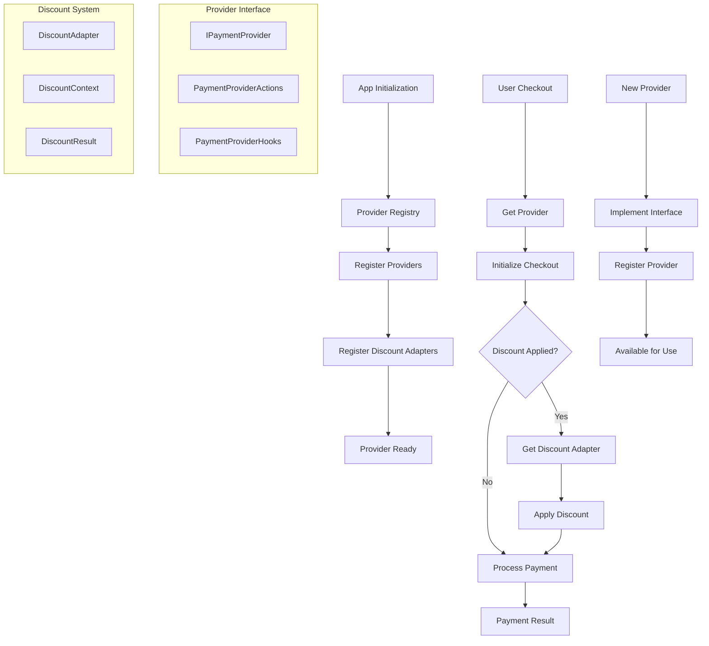

# 🎨 CREATIVE PHASE: FUTURE PROVIDER EXTENSIBILITY

**Project**: XELA Finance Management System  
**Task**: Discount Integration into Payment Providers  
**Creative Phase**: Extensible Architecture Design  
**Date**: Current Session  

---

## 📋 PROBLEM STATEMENT

Design an extensible architecture that allows easy addition of new payment providers with full discount integration support. The system must maintain consistency across providers while accommodating different payment provider APIs, discount application methods, and integration patterns.

### Key Challenges:
1. **Provider Diversity**: Different payment providers have varying APIs and integration patterns
2. **Discount Variations**: Each provider may handle discounts differently (codes, IDs, coupons, etc.)
3. **UI Consistency**: Maintain consistent user experience across all providers
4. **Type Safety**: Ensure full TypeScript support for new providers
5. **Minimal Code Changes**: Adding a new provider should require minimal changes to existing code

---

## 🔍 OPTIONS ANALYSIS

### Option 1: Simple Provider Registry
**Description**: Basic registry pattern where each provider implements a common interface with discount support.

**Pros**:
- Simple to understand and implement
- Clear separation between providers
- Easy to add basic provider support
- Minimal abstraction overhead

**Cons**:
- Limited flexibility for complex provider patterns
- May not handle provider-specific discount features well
- Could lead to code duplication
- No sophisticated provider lifecycle management

**Complexity**: Low  
**Implementation Time**: 2-3 days  

### Option 2: Abstract Provider Factory with Discount Strategy
**Description**: Factory pattern with abstract provider base class and pluggable discount strategies.

**Pros**:
- Good separation of concerns
- Flexible discount handling per provider
- Extensible provider capabilities
- Clear provider instantiation pattern

**Cons**:
- More complex initial setup
- May over-abstract simple use cases
- Requires understanding of factory patterns
- Provider configuration complexity

**Complexity**: Medium  
**Implementation Time**: 4-5 days  

### Option 3: Plugin Architecture with Hooks System
**Description**: Full plugin system where providers are loaded dynamically with lifecycle hooks and discount integration points.

**Pros**:
- Maximum flexibility and extensibility
- Dynamic provider loading
- Rich lifecycle management
- Sophisticated discount integration hooks

**Cons**:
- High implementation complexity
- Over-engineering for current needs
- Potential runtime overhead
- Complex debugging and testing

**Complexity**: High  
**Implementation Time**: 7-10 days  

### Option 4: Modular Provider System with Standardized Interface
**Description**: Modular approach with standardized provider interface, discount adapter pattern, and type-safe provider registration.

**Pros**:
- Balance of flexibility and simplicity
- Type-safe provider system
- Standardized discount integration
- Easy provider addition process
- Good developer experience

**Cons**:
- Medium implementation complexity
- Need to design comprehensive interface
- Requires provider adapter development

**Complexity**: Medium  
**Implementation Time**: 4-6 days  

---

## 🎯 DECISION

**Selected Option**: **Option 4 - Modular Provider System with Standardized Interface**

### Rationale:
1. **Developer Experience**: Clear, type-safe interface for adding new providers
2. **Maintainability**: Standardized patterns make code easier to maintain
3. **Extensibility**: Easy to add new providers without affecting existing ones
4. **Type Safety**: Full TypeScript support with proper type inference
5. **Discount Integration**: Built-in discount support for all providers
6. **Implementation Balance**: Good complexity-to-benefit ratio

---

## 🏗️ IMPLEMENTATION PLAN

### 1. Core Provider Interface

```typescript
interface PaymentProvider {
  readonly id: PaymentProviderType;
  readonly name: string;
  readonly displayName: string;
  readonly supportsDiscounts: boolean;
  readonly supportedDiscountTypes: DiscountApplicationType[];
}

interface PaymentProviderActions {
  initializeCheckout(params: CheckoutInitParams): Promise<CheckoutSession>;
  processPayment(session: CheckoutSession): Promise<PaymentResult>;
  handleDiscount(discount: DiscountContext): Promise<DiscountResult>;
  validateConfiguration(): Promise<ValidationResult>;
}

interface PaymentProviderHooks {
  onCheckoutStart?(session: CheckoutSession): Promise<void>;
  onDiscountApplied?(discount: DiscountContext): Promise<void>;
  onPaymentSuccess?(result: PaymentResult): Promise<void>;
  onPaymentError?(error: PaymentError): Promise<void>;
  onCheckoutCancel?(): Promise<void>;
}

// Complete provider interface
interface IPaymentProvider extends PaymentProvider, PaymentProviderActions, PaymentProviderHooks {}
```

### 2. Discount Integration Framework

```typescript
enum DiscountApplicationType {
  CODE = 'code',           // Discount code/coupon
  ID = 'id',              // Discount ID reference
  AUTOMATIC = 'automatic', // Auto-applied discounts
  SESSION = 'session'      // Session-based discounts
}

interface DiscountContext {
  discount: DiscountValidationResult;
  provider: PaymentProviderType;
  applicationMethod: DiscountApplicationType;
  metadata: Record<string, any>;
}

interface DiscountAdapter {
  canHandle(provider: PaymentProviderType, discount: DiscountContext): boolean;
  apply(provider: IPaymentProvider, discount: DiscountContext): Promise<DiscountResult>;
  remove(provider: IPaymentProvider, discount: DiscountContext): Promise<void>;
}

// Built-in discount adapters
class CodeDiscountAdapter implements DiscountAdapter {
  canHandle(provider: PaymentProviderType, discount: DiscountContext): boolean {
    return discount.applicationMethod === DiscountApplicationType.CODE 
           && discount.discount.discount?.code !== undefined;
  }
  
  async apply(provider: IPaymentProvider, discount: DiscountContext): Promise<DiscountResult> {
    // Apply discount code to provider checkout
  }
}

class IdDiscountAdapter implements DiscountAdapter {
  canHandle(provider: PaymentProviderType, discount: DiscountContext): boolean {
    return discount.applicationMethod === DiscountApplicationType.ID 
           && discount.discount.discount?.id !== undefined;
  }
  
  async apply(provider: IPaymentProvider, discount: DiscountContext): Promise<DiscountResult> {
    // Apply discount ID to provider checkout
  }
}
```

### 3. Provider Registration System

```typescript
class PaymentProviderRegistry {
  private providers = new Map<PaymentProviderType, IPaymentProvider>();
  private discountAdapters: DiscountAdapter[] = [];
  
  register<T extends IPaymentProvider>(provider: T): void {
    this.providers.set(provider.id, provider);
    this.validateProvider(provider);
  }
  
  getProvider(type: PaymentProviderType): IPaymentProvider | undefined {
    return this.providers.get(type);
  }
  
  getSupportedProviders(): PaymentProviderType[] {
    return Array.from(this.providers.keys());
  }
  
  registerDiscountAdapter(adapter: DiscountAdapter): void {
    this.discountAdapters.push(adapter);
  }
  
  getDiscountAdapter(provider: PaymentProviderType, discount: DiscountContext): DiscountAdapter | undefined {
    return this.discountAdapters.find(adapter => adapter.canHandle(provider, discount));
  }
  
  private validateProvider(provider: IPaymentProvider): void {
    // Validate provider implementation
    if (!provider.id || !provider.name) {
      throw new Error(`Invalid provider configuration: ${provider.id}`);
    }
    
    if (provider.supportsDiscounts && provider.supportedDiscountTypes.length === 0) {
      throw new Error(`Provider ${provider.id} claims to support discounts but no types specified`);
    }
  }
}

// Global registry instance
export const paymentProviderRegistry = new PaymentProviderRegistry();
```

### 4. Enhanced Checkout Handler

```typescript
interface ExtensibleCheckoutHandlerReturn {
  handleCheckout: (
    formData: SubscriptionFormData,
    selectedPlan: MembershipPlan,
    appliedDiscount?: DiscountValidationResult | null
  ) => Promise<void>;
  getSupportedProviders: () => PaymentProviderType[];
  getProviderCapabilities: (provider: PaymentProviderType) => ProviderCapabilities;
  loading: boolean;
}

export function useExtensibleCheckoutHandler(): ExtensibleCheckoutHandlerReturn {
  const [loading, setLoading] = useState(false);
  
  const handleCheckout = async (
    formData: SubscriptionFormData,
    selectedPlan: MembershipPlan,
    appliedDiscount?: DiscountValidationResult | null
  ) => {
    setLoading(true);
    
    try {
      // Get provider implementation
      const provider = paymentProviderRegistry.getProvider(formData.paymentProvider);
      if (!provider) {
        throw new Error(`Unsupported payment provider: ${formData.paymentProvider}`);
      }
      
      // Initialize checkout session
      const session = await provider.initializeCheckout({
        plan: selectedPlan,
        billingInterval: formData.billingInterval,
        userId: user?.id
      });
      
      // Apply discount if provided
      if (appliedDiscount && provider.supportsDiscounts) {
        const discountContext: DiscountContext = {
          discount: appliedDiscount,
          provider: formData.paymentProvider,
          applicationMethod: determineApplicationMethod(provider, appliedDiscount),
          metadata: {}
        };
        
        const discountAdapter = paymentProviderRegistry.getDiscountAdapter(
          formData.paymentProvider, 
          discountContext
        );
        
        if (discountAdapter) {
          await discountAdapter.apply(provider, discountContext);
        }
      }
      
      // Process payment
      const result = await provider.processPayment(session);
      
      // Handle success
      await provider.onPaymentSuccess?.(result);
      
    } catch (error) {
      await provider.onPaymentError?.(error);
      throw error;
    } finally {
      setLoading(false);
    }
  };
  
  const getSupportedProviders = () => paymentProviderRegistry.getSupportedProviders();
  
  const getProviderCapabilities = (provider: PaymentProviderType) => {
    const impl = paymentProviderRegistry.getProvider(provider);
    return {
      supportsDiscounts: impl?.supportsDiscounts ?? false,
      supportedDiscountTypes: impl?.supportedDiscountTypes ?? [],
      displayName: impl?.displayName ?? provider
    };
  };
  
  return {
    handleCheckout,
    getSupportedProviders,
    getProviderCapabilities,
    loading
  };
}
```

### 5. Provider Implementation Examples

#### Paddle Provider:
```typescript
class PaddleProvider implements IPaymentProvider {
  readonly id = PaymentProviderType.Paddle;
  readonly name = 'paddle';
  readonly displayName = 'Paddle';
  readonly supportsDiscounts = true;
  readonly supportedDiscountTypes = [
    DiscountApplicationType.CODE,
    DiscountApplicationType.ID
  ];
  
  async initializeCheckout(params: CheckoutInitParams): Promise<CheckoutSession> {
    return {
      provider: this.id,
      sessionId: generateSessionId(),
      checkoutOptions: {
        items: [{ priceId: params.plan.priceId, quantity: 1 }],
        customData: { userId: params.userId }
      }
    };
  }
  
  async processPayment(session: CheckoutSession): Promise<PaymentResult> {
    const { openCheckout } = usePaddleCheckout();
    return openCheckout(session.checkoutOptions);
  }
  
  async handleDiscount(discount: DiscountContext): Promise<DiscountResult> {
    const options = discount.metadata.checkoutOptions;
    
    if (discount.applicationMethod === DiscountApplicationType.CODE) {
      options.discountCode = discount.discount.discount?.code;
    } else if (discount.applicationMethod === DiscountApplicationType.ID) {
      options.discountId = discount.discount.discount?.id;
    }
    
    return { success: true, appliedDiscount: discount.discount };
  }
  
  async validateConfiguration(): Promise<ValidationResult> {
    // Validate Paddle configuration
    return { isValid: true };
  }
}
```

#### MetaMask Provider:
```typescript
class MetaMaskProvider implements IPaymentProvider {
  readonly id = PaymentProviderType.Metamask;
  readonly name = 'metamask';
  readonly displayName = 'MetaMask';
  readonly supportsDiscounts = true;
  readonly supportedDiscountTypes = [
    DiscountApplicationType.SESSION
  ];
  
  async initializeCheckout(params: CheckoutInitParams): Promise<CheckoutSession> {
    return {
      provider: this.id,
      sessionId: generateSessionId(),
      paymentData: {
        planId: params.plan.id,
        amount: params.plan.amount,
        currency: 'USD'
      }
    };
  }
  
  async processPayment(session: CheckoutSession): Promise<PaymentResult> {
    const { create } = useCreateMetaMaskSubscription();
    return create(session.paymentData);
  }
  
  async handleDiscount(discount: DiscountContext): Promise<DiscountResult> {
    // Apply discount to payment data before processing
    const paymentData = discount.metadata.paymentData;
    paymentData.discountCode = discount.discount.discount?.code;
    paymentData.discountId = discount.discount.discount?.id;
    paymentData.amount = parseFloat(discount.discount.finalAmount || paymentData.amount);
    
    return { success: true, appliedDiscount: discount.discount };
  }
  
  async validateConfiguration(): Promise<ValidationResult> {
    // Validate MetaMask configuration
    return { isValid: true };
  }
}
```

### 6. Provider Registration and Initialization

```typescript
// providers/index.ts
export function initializePaymentProviders() {
  // Register built-in providers
  paymentProviderRegistry.register(new PaddleProvider());
  paymentProviderRegistry.register(new MetaMaskProvider());
  
  // Register discount adapters
  paymentProviderRegistry.registerDiscountAdapter(new CodeDiscountAdapter());
  paymentProviderRegistry.registerDiscountAdapter(new IdDiscountAdapter());
  paymentProviderRegistry.registerDiscountAdapter(new SessionDiscountAdapter());
  
  // Validate all providers
  const providers = paymentProviderRegistry.getSupportedProviders();
  console.log(`Initialized ${providers.length} payment providers:`, providers);
}

// Call during app initialization
initializePaymentProviders();
```

### 7. Adding New Providers - Developer Guide

```typescript
// Example: Adding Stripe provider
class StripeProvider implements IPaymentProvider {
  readonly id = PaymentProviderType.Stripe; // Add to enum
  readonly name = 'stripe';
  readonly displayName = 'Stripe';
  readonly supportsDiscounts = true;
  readonly supportedDiscountTypes = [DiscountApplicationType.CODE];
  
  async initializeCheckout(params: CheckoutInitParams): Promise<CheckoutSession> {
    // Stripe-specific initialization
  }
  
  async processPayment(session: CheckoutSession): Promise<PaymentResult> {
    // Stripe payment processing
  }
  
  async handleDiscount(discount: DiscountContext): Promise<DiscountResult> {
    // Stripe discount application
  }
  
  async validateConfiguration(): Promise<ValidationResult> {
    // Stripe configuration validation
  }
}

// Registration (in providers/index.ts)
paymentProviderRegistry.register(new StripeProvider());
```

---

## 📊 EXTENSIBILITY ARCHITECTURE



---

## 🎨 CREATIVE CHECKPOINT: EXTENSIBLE ARCHITECTURE DESIGNED

### Provider Extensibility Benefits:
1. **Easy Provider Addition**: New providers require only interface implementation
2. **Type Safety**: Full TypeScript support with proper type inference
3. **Discount Consistency**: Standardized discount handling across all providers
4. **Developer Experience**: Clear patterns and comprehensive examples
5. **Maintainability**: Centralized provider management with clear separation
6. **Testing**: Each provider can be tested independently

### Adding New Provider Checklist:
- [ ] Implement `IPaymentProvider` interface
- [ ] Define supported discount types
- [ ] Implement discount handling logic
- [ ] Add provider to registry
- [ ] Update TypeScript types
- [ ] Write provider tests
- [ ] Update documentation

---

🎨🎨🎨 EXITING CREATIVE PHASE - EXTENSIBILITY ARCHITECTURE DESIGNED 🎨🎨🎨 