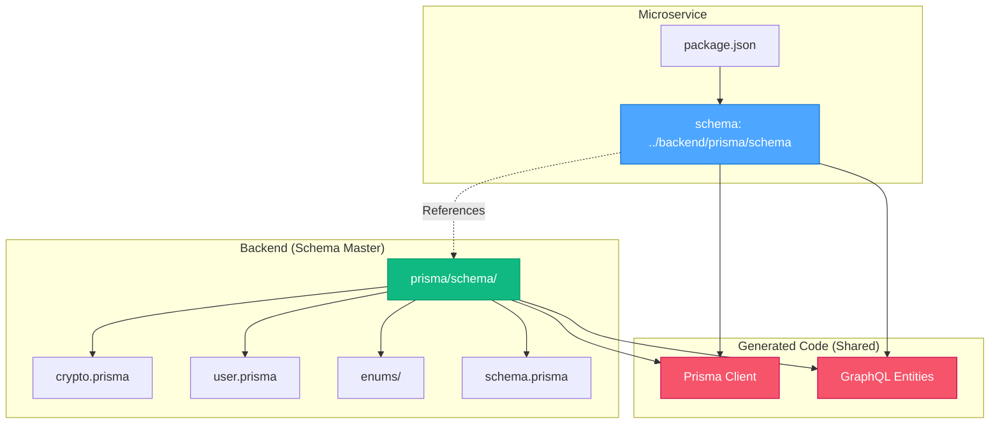

# 🎨 CREATIVE PHASE: SHARED PRISMA SCHEMA ARCHITECTURE

## Problem Statement
Both the microservice and the main backend need to access the same database models and maintain schema consistency. Initially, duplicating the Prisma schema created maintenance issues and violated DRY principles.

## Options Analysis

### Option 1: Symbolic Link ❌
- **Pros**: Single source of truth, automatic sync
- **Cons**: Deployment complexity, tight coupling
- **Verdict**: Too complex for production deployment

### Option 2: Shared NPM Package ❌
- **Pros**: Proper dependency management
- **Cons**: Added package management complexity
- **Verdict**: Overkill for this use case

### Option 3: Direct Path Reference ✅ SELECTED
- **Pros**: Simple development, leverages existing structure
- **Cons**: Directory structure dependency
- **Verdict**: Optimal balance of simplicity and functionality

## DECISION: Shared Schema with Relative Path Reference

**Implementation**:
```json
// microservice package.json
{
  "prisma": {
    "schema": "../backend/prisma/schema"
  }
}
```

**Dependencies Required**:
- `prisma-nestjs-graphql@21.0.2` (matching backend version)
- Shared access to backend's distributed schema structure

## Architecture Benefits

### ✅ Single Source of Truth
- Backend maintains master schema in `prisma/schema/`
- Microservice references same schema files directly
- Zero schema duplication or drift

### ✅ Automatic Synchronization  
- Schema changes in backend automatically available to microservice
- No manual sync processes required
- Consistent model definitions across services

### ✅ Shared Code Generation
- Prisma client generated in backend's node_modules
- GraphQL entities generated in backend's src/entities
- Both services access same generated code

### ✅ Development Simplicity
- Local development works seamlessly
- Standard Prisma commands work normally
- No special build scripts required

## Implementation Validation

**Tests Passed**:
- ✅ `npx prisma generate` successful
- ✅ Prisma client generation works
- ✅ GraphQL entities generated
- ✅ TypeScript build successful
- ✅ No schema duplication

**Generated Outputs**:
- Prisma Client: `../backend/node_modules/@prisma/client`
- GraphQL Entities: `../backend/src/entities`

## Architecture Diagram



## Success Metrics Achieved

1. **Zero Schema Duplication**: ✅ Single schema source
2. **Automatic Sync**: ✅ Changes propagate automatically  
3. **Consistent Generation**: ✅ Same entities and client
4. **Build Success**: ✅ Both services compile
5. **Development Workflow**: ✅ Standard Prisma commands work

## Next Steps

- ✅ Shared schema architecture implemented
- ✅ Dependencies aligned with backend
- ✅ Code generation validated
- → Ready to implement `nestjs-prisma` integration
- → Ready to extract portfolio services with shared database access

**Result**: Perfect foundation for microservice development with zero schema maintenance overhead. 