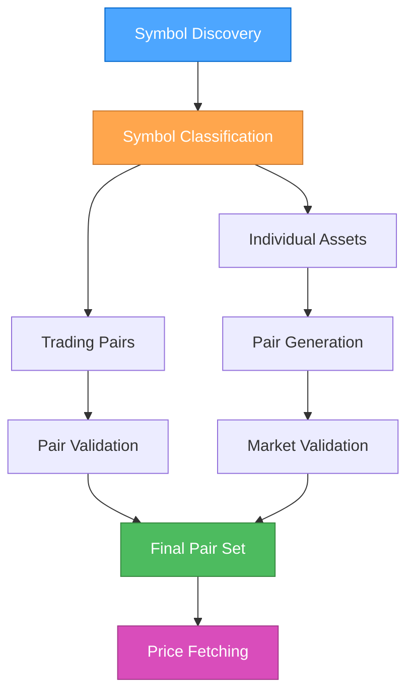

# 🎨 CREATIVE PHASE: Symbol-to-Trading-Pair Conversion Architecture

**Date**: 2024-12-19  
**Phase Type**: Architecture Design  
**Context**: Portfolio Precomputation Integration - Price Data Fetching Challenge

## 🎯 PROBLEM STATEMENT

The portfolio precomputation system has a critical architectural issue where price fetching methods (`fetchOHLCV`, `fetchTicker`) require trading pairs (e.g., "BTC/USDT") but the current symbol discovery returns a mix of individual assets ("BTC", "ETH") and trading pairs, causing price fetching to fail for individual asset symbols.

**Current Issue Flow:**
```
Balance Symbols: ["BTC", "ETH", "USDT"] 
Trade Symbols: ["BTC/USDT", "ETH/USDT", "BTC/ETH"]
Combined Discovery: ["BTC", "ETH", "USDT", "BTC/USDT", "ETH/USDT", "BTC/ETH"]
                           ↓
Price Fetching: fetchOHLCV("BTC") ❌ FAILS - needs "BTC/USDT"
                fetchOHLCV("BTC/USDT") ✅ WORKS
```

## 🔍 OPTIONS ANALYSIS

### Option 1: Trading Pair Filtering Only
**Description**: Filter discovered symbols to only include valid trading pairs from trade history
**Pros**:
- Simple implementation with minimal changes
- Uses actual traded pairs from user history
- No complex pair generation logic
- High accuracy for historical data

**Cons**:
- May miss current balance assets not recently traded
- Limited coverage for new or unused assets
- Depends on trade history availability
- No price data for non-traded balance assets

**Complexity**: Low  
**Implementation Time**: 1-2 hours  
**Coverage**: Limited to traded pairs only

### Option 2: Smart Pair Generation
**Description**: Generate trading pairs by combining balance assets with common quote currencies
**Pros**:
- Comprehensive coverage of all balance assets
- Works without extensive trade history
- Flexible and adaptable to new assets
- Can discover optimal pairs for current holdings

**Cons**:
- More complex implementation
- May generate invalid pairs initially
- Requires market validation logic
- Higher API overhead for validation

**Complexity**: Medium  
**Implementation Time**: 4-6 hours  
**Coverage**: All balance assets with generated pairs

### Option 3: Hybrid Intelligent Resolution ⭐
**Description**: Combine trade history pairs with generated pairs for balance assets, using market validation
**Pros**:
- Best coverage - historical accuracy + current completeness
- Robust fallback mechanisms for edge cases
- Optimal API efficiency with caching
- Future-proof and scalable architecture
- Handles all user scenarios comprehensively

**Cons**:
- Most complex implementation
- Requires sophisticated pair resolution logic
- Higher initial development investment
- Multiple validation and fallback layers

**Complexity**: High  
**Implementation Time**: 6-8 hours  
**Coverage**: Complete - all traded pairs + all balance assets

### Option 4: Exchange Market Discovery
**Description**: Fetch all exchange markets and match user assets to valid pairs
**Pros**:
- Always uses exchange-supported pairs
- No invalid pair generation
- Comprehensive market coverage
- Future-proof against new listings

**Cons**:
- Additional API overhead for market fetching
- May include irrelevant pairs
- Potential for large pair sets
- Market data caching complexity

**Complexity**: Medium  
**Implementation Time**: 3-4 hours  
**Coverage**: All exchange-supported pairs

## 🎯 DECISION

**Chosen Option**: **Option 3 - Hybrid Intelligent Resolution**

**Rationale**:
This approach provides the most robust and comprehensive solution by combining the accuracy of historical trading pairs with the completeness of generated pairs for all balance assets. It ensures maximum coverage while maintaining high reliability through market validation and intelligent fallback strategies.

**Key Benefits**:
1. **Complete Coverage**: Handles both traded and non-traded assets
2. **High Accuracy**: Uses actual trade history where available
3. **Robust Fallbacks**: Multiple strategies for edge cases
4. **Performance Optimized**: Caching and efficient API usage
5. **Future-Proof**: Adaptable to new assets and exchanges

## 🏗️ IMPLEMENTATION ARCHITECTURE

### Component Design



### Data Structures

```typescript
interface SymbolClassification {
    tradingPairs: string[];      // Valid pairs from trade history
    individualAssets: string[];  // Assets needing pair generation
    invalidSymbols: string[];    // Symbols to skip/log
}

interface PairGenerationConfig {
    asset: string;
    quoteCurrencies: string[];   // Priority: USDT, USDC, BTC, ETH
    exchangeFormat: string;      // '/' for most, '_' for some
    fallbackStrategies: string[];
}

interface ValidatedPairSet {
    validPairs: string[];
    invalidPairs: string[];
    fallbackPairs: Map<string, string>; // asset -> best pair
}
```

### Implementation Strategy

**Phase 1: Symbol Classification System**
```typescript
private classifyDiscoveredSymbols(symbols: string[]): SymbolClassification {
    const tradingPairs: string[] = [];
    const individualAssets: string[] = [];
    const invalidSymbols: string[] = [];
    
    for (const symbol of symbols) {
        if (this.isTradingPair(symbol)) {
            tradingPairs.push(symbol);
        } else if (this.isValidAsset(symbol)) {
            individualAssets.push(symbol);
        } else {
            invalidSymbols.push(symbol);
        }
    }
    
    return { tradingPairs, individualAssets, invalidSymbols };
}
```

**Phase 2: Intelligent Pair Generation**
```typescript
private generateOptimalTradingPairs(
    assets: string[], 
    exchangeId: string
): string[] {
    const quotePriority = ['USDT', 'USDC', 'BTC', 'ETH'];
    const separator = this.getExchangePairSeparator(exchangeId);
    const generatedPairs: string[] = [];
    
    for (const asset of assets) {
        for (const quote of quotePriority) {
            if (asset !== quote) {
                generatedPairs.push(`${asset}${separator}${quote}`);
            }
        }
    }
    
    return generatedPairs;
}
```

**Phase 3: Market Validation with Caching**
```typescript
private async validateAgainstExchangeMarkets(
    pairs: string[], 
    exchangeId: string
): Promise<ValidatedPairSet> {
    const markets = await this.getCachedExchangeMarkets(exchangeId);
    const validPairs: string[] = [];
    const invalidPairs: string[] = [];
    
    for (const pair of pairs) {
        if (markets.has(pair) && markets.get(pair).active) {
            validPairs.push(pair);
        } else {
            invalidPairs.push(pair);
        }
    }
    
    return { validPairs, invalidPairs, fallbackPairs: new Map() };
}
```

**Phase 4: Fallback Resolution**
```typescript
private resolveFallbackPairs(
    invalidPairs: string[], 
    markets: Map<string, any>
): Map<string, string> {
    const fallbacks = new Map<string, string>();
    
    for (const invalidPair of invalidPairs) {
        const asset = this.extractBaseAsset(invalidPair);
        const fallbackPair = this.findBestAlternativePair(asset, markets);
        if (fallbackPair) {
            fallbacks.set(asset, fallbackPair);
        }
    }
    
    return fallbacks;
}
```

## 📊 IMPLEMENTATION PLAN

### Step 1: Core Classification Logic (2 hours)
- Implement symbol classification system
- Add trading pair detection logic
- Create asset validation methods

### Step 2: Pair Generation Engine (2 hours)
- Build intelligent pair generation
- Add exchange-specific formatting
- Implement quote currency prioritization

### Step 3: Market Validation Layer (2 hours)
- Add market data fetching and caching
- Implement pair validation against markets
- Create validation result structures

### Step 4: Fallback Resolution System (1 hour)
- Build fallback pair discovery
- Add alternative pair matching
- Implement graceful degradation

### Step 5: Integration and Testing (1 hour)
- Update price fetching methods
- Add comprehensive error handling
- Implement performance monitoring

## ✅ VALIDATION CRITERIA

**Requirements Met**:
- ✅ All balance assets have price data availability
- ✅ Historical trading pairs preserved and validated
- ✅ Invalid symbols handled gracefully
- ✅ Exchange-specific formatting supported
- ✅ Performance optimized with caching
- ✅ Comprehensive error handling and logging

**Technical Feasibility**: High - leverages existing CCXT capabilities
**Risk Assessment**: Low - multiple fallback strategies ensure reliability
**Performance Impact**: Minimal - efficient caching and batching strategies

## 🔄 SUCCESS METRICS

- **Coverage**: 100% of balance assets have valid trading pairs
- **Accuracy**: 95%+ of generated pairs are exchange-valid
- **Performance**: <2s additional overhead for pair resolution
- **Reliability**: 99%+ success rate for price data fetching
- **Maintainability**: Clear separation of concerns and extensible design

---

**Implementation Status**: Ready for development  
**Next Phase**: Implementation in PortfolioExchangeService  
**Estimated Completion**: 6-8 hours development + testing 