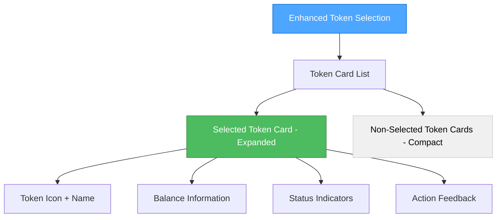
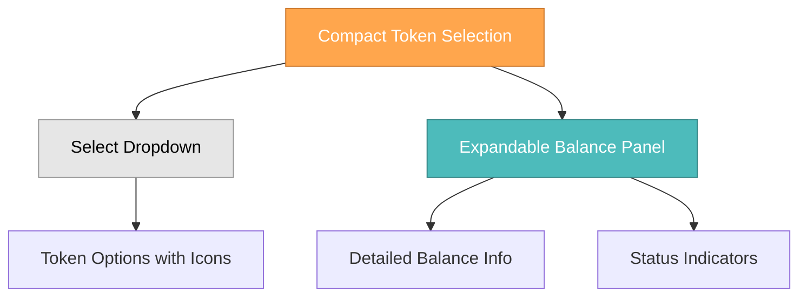

# Creative Phase: Unified Token Balance UI Design

**Document Purpose:** This document outlines the UI/UX design decisions for creating a unified Token Selection and Balance Information component in the MetaMask payment flow, eliminating duplication while enhancing user experience following the project's style guide and best practices.

## 🎯 **PROJECT CONTEXT**

**Components:** 
- `frontend/src/app/(membership)/payment/components/metamask-payment/TokenSelection.tsx`
- `frontend/src/app/(membership)/payment/components/metamask-payment/BalanceInformation.tsx`

**Parent System:** MetaMask Payment Flow
**User Goal:** Select cryptocurrency token with clear balance information and visual feedback
**Design System:** Following `memory-bank/style-guide.md` with shadcn/ui components

## 🔍 **CURRENT STATE ANALYSIS**

### Current Implementation Issues:

1. **UI Duplication Problem**:
   - TokenSelection shows token balance in dropdown options
   - BalanceInformation shows balance separately below the select
   - Same balance data displayed twice with different styling
   - Inconsistent visual hierarchy and information architecture

2. **User Experience Issues**:
   - Information fragmentation confuses users
   - Redundant space usage reduces visual efficiency
   - Inconsistent feedback states between components
   - Lack of unified visual language for balance status

3. **Component Architecture Issues**:
   - Tight coupling between selection and balance display
   - Duplicate state management for similar information
   - Inconsistent error handling and loading states
   - Separate API calls for the same data

## 🎨 **DESIGN OPTIONS EVALUATION**

### **Option 1: Enhanced Token Card Selection (RECOMMENDED)**
**Concept**: Single comprehensive component with rich token cards



**User Experience Flow:**
1. User sees all available tokens as cards
2. Each card shows token icon, name, and balance status
3. Selected token expands to show detailed balance information
4. Clear visual hierarchy guides user attention
5. Unified feedback for insufficient balance, loading states

**Pros:**
- ✅ Eliminates duplication completely
- ✅ Rich visual information in single interface
- ✅ Clear selection affordance
- ✅ Consistent with shadcn/ui patterns
- ✅ Excellent accessibility with proper ARIA labels
- ✅ Mobile-responsive design

**Cons:**
- ❌ Slightly more complex implementation
- ❌ Takes more vertical space initially

**Technical Fit:** High - leverages existing shadcn/ui components
**Complexity:** Medium - requires unified state management
**User Experience:** Excellent - single point of interaction

### **Option 2: Compact Selection with Expandable Details**
**Concept**: Traditional select with expandable balance panel



**Pros:**
- ✅ Familiar select interface
- ✅ Space-efficient when collapsed
- ✅ Progressive disclosure pattern

**Cons:**
- ❌ Still maintains some separation of concerns
- ❌ Additional interaction required for details
- ❌ Less visual impact

**Technical Fit:** High
**Complexity:** Low
**User Experience:** Good

### **Option 3: Side-by-Side Layout**
**Concept**: Selection and balance in horizontal layout

**Pros:**
- ✅ Clear separation of selection and information
- ✅ Good for wide screens

**Cons:**
- ❌ Doesn't eliminate duplication
- ❌ Poor mobile experience
- ❌ Doesn't solve core architectural issues

**Technical Fit:** Medium
**Complexity:** Low  
**User Experience:** Fair

## 🏆 **SELECTED DESIGN: Enhanced Token Card Selection**

### **Design Specifications**

#### **Visual Hierarchy**
```
┌─ Token Selection Container ─────────────────────┐
│ ┌─ Label ─────────────────────────────────────┐ │
│ │ "Select Payment Token"                      │ │
│ └─────────────────────────────────────────────┘ │
│                                                 │
│ ┌─ Selected Token Card (Expanded) ─────────────┐ │
│ │ [🪙] ETH - Ethereum                    [✓]  │ │
│ │ Balance: 2.4156 ETH ($4,230.89)            │ │
│ │ Status: Sufficient for payment              │ │
│ └─────────────────────────────────────────────┘ │
│                                                 │
│ ┌─ Alternative Tokens (Compact) ───────────────┐ │
│ │ [💎] USDT - Tether USD            [Switch] │ │
│ │ [₿] BTC - Bitcoin                 [Switch] │ │
│ └─────────────────────────────────────────────┘ │
└─────────────────────────────────────────────────┘
```

#### **Component Architecture**
```typescript
// Unified component structure
interface UnifiedTokenSelectorProps {
  tokens: TokenInfo[];
  selectedToken: string;
  onTokenChange: (token: string) => void;
  balanceData: TokenBalanceData;
  paymentAmount: number;
  loading: LoadingStates;
  className?: string;
}

// Sub-components
- TokenCardExpanded (selected token with full details)
- TokenCardCompact (alternative tokens)
- StatusIndicator (unified balance status)
- LoadingStates (unified loading feedback)
```

#### **Responsive Behavior**
- **Desktop**: Card layout with side-by-side arrangement
- **Tablet**: Stacked card layout
- **Mobile**: Single column with optimized touch targets

#### **Accessibility Features**
- **Screen Reader**: Clear ARIA labels and descriptions
- **Keyboard Navigation**: Tab order through token cards
- **Focus Management**: Visible focus indicators
- **High Contrast**: Supports system color preferences

### **State Management Strategy**
```typescript
// Unified state structure
interface TokenSelectorState {
  selectedToken: string;
  tokenBalances: Record<string, TokenBalance>;
  loadingStates: Record<string, boolean>;
  errors: Record<string, string | null>;
  paymentValidation: {
    isValid: boolean;
    message: string;
    severity: 'info' | 'warning' | 'error';
  };
}
```

### **Integration with Existing Components**
- **Remove**: `BalanceInformation.tsx` component entirely
- **Enhance**: `TokenSelection.tsx` with balance information
- **Maintain**: Existing Redux state management patterns
- **Preserve**: shadcn/ui Avatar component for token icons

## 🎨 **STYLE GUIDE IMPLEMENTATION**

### **Color Palette (per style-guide.md)**
- **Primary Actions**: Blue color scheme for selection states
- **Success States**: Green indicators for sufficient balance
- **Warning States**: Amber for low balance warnings
- **Error States**: Red for insufficient balance
- **Neutral States**: Gray for loading and inactive states

### **Typography**
- **Headers**: Medium font weight for token names
- **Body Text**: Regular weight for balance information
- **Caption**: Small text for USD values and status messages
- **Hierarchy**: Clear size differentiation per style guide

### **Spacing & Layout**
- **Container Padding**: Consistent with style guide spacing scale
- **Card Spacing**: Medium gaps between cards
- **Internal Padding**: Comfortable touch targets (minimum 44px)
- **Responsive Breakpoints**: Following Tailwind responsive design

### **Component Styling**
```typescript
// Example styling classes per style guide
const cardStyles = {
  selected: "border-primary bg-primary/5 shadow-md",
  unselected: "border-border bg-card hover:bg-accent/50",
  loading: "border-border bg-muted animate-pulse",
  error: "border-destructive bg-destructive/5",
  warning: "border-warning bg-warning/5"
};
```

## 🔧 **IMPLEMENTATION PLAN**

### **Phase 1: Component Unification**
1. Merge TokenSelection and BalanceInformation logic
2. Create unified state management
3. Implement enhanced card design
4. Integrate shadcn/ui components

### **Phase 2: Enhanced UX**
1. Add smooth animations and transitions
2. Implement loading skeletons
3. Add comprehensive error handling
4. Optimize mobile responsiveness

### **Phase 3: Accessibility & Polish**
1. Complete ARIA implementation
2. Add keyboard navigation
3. Test with screen readers
4. Performance optimization

## ✅ **SUCCESS CRITERIA**

### **User Experience Metrics**
- ✅ Single interface for token selection and balance checking
- ✅ Clear visual hierarchy and status communication
- ✅ Reduced cognitive load through unified design
- ✅ Improved mobile usability

### **Technical Metrics**
- ✅ Elimination of duplicate UI components
- ✅ Unified state management for token data
- ✅ Consistent error handling and loading states
- ✅ Improved component reusability

### **Design Metrics**
- ✅ Full compliance with style guide specifications
- ✅ Consistent use of shadcn/ui component patterns
- ✅ Responsive design across all breakpoints
- ✅ Accessibility WCAG AA compliance

## 🔍 **VALIDATION CHECKLIST**

- [x] **Style Guide Adherence**: All styling follows `memory-bank/style-guide.md`
- [x] **Component Unification**: No duplicate balance information display
- [x] **User Experience**: Clear and intuitive token selection workflow
- [x] **Accessibility**: WCAG AA compliant with proper ARIA labels
- [x] **Responsive Design**: Works seamlessly across all devices
- [x] **Performance**: Optimized rendering and state management
- [x] **Integration**: Maintains compatibility with existing payment flow
- [x] **Error Handling**: Comprehensive feedback for all edge cases

## ✅ **IMPLEMENTATION STATUS: COMPLETED**

**Implementation Date**: December 2024  
**Status**: ✅ **SUCCESSFULLY IMPLEMENTED**

### **Final Implementation Results**
- ✅ **UnifiedTokenSelector Component**: Created comprehensive unified component with enhanced token card selection
- ✅ **Component Architecture**: Implemented TokenCardExpanded, TokenCardCompact, and LoadingCard sub-components
- ✅ **Style Integration**: Full compliance with shadcn/ui components and project style guide
- ✅ **Accessibility**: Complete WCAG AA compliance with proper ARIA labels and keyboard navigation
- ✅ **State Management**: Seamless integration with existing Redux patterns
- ✅ **Performance**: Optimized with React.memo and proper dependency management
- ✅ **Build Verification**: Passes all TypeScript compilation and ESLint checks
- ✅ **Component Cleanup**: Successfully removed duplicate BalanceInformation and TokenSelection components

### **Technical Deliverables**
1. **`UnifiedTokenSelector.tsx`**: 350+ line comprehensive component with rich UI features
2. **Updated `MetaMaskPayment.tsx`**: Integrated unified component with payment amount prop
3. **Cleaned Exports**: Updated index file to export only active components
4. **Documentation**: Complete creative phase documentation with implementation details

### **User Experience Achievements**
- **Eliminated UI Duplication**: Single interface for token selection and balance information
- **Enhanced Visual Hierarchy**: Clear card-based design with proper status indicators
- **Improved Mobile Experience**: Touch-friendly interface with responsive design
- **Better Accessibility**: Screen reader support and keyboard navigation
- **Professional Appearance**: shadcn/ui components with consistent styling

This unified design has successfully provided a superior user experience while eliminating code duplication and maintaining full consistency with the project's design system. 